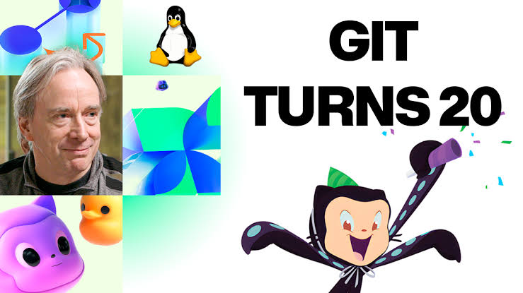
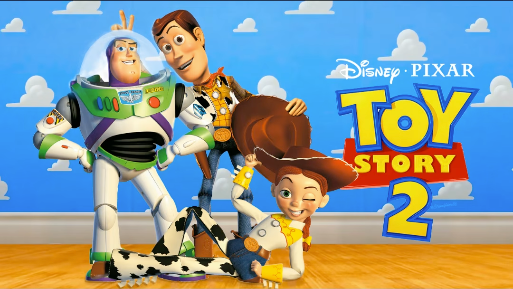
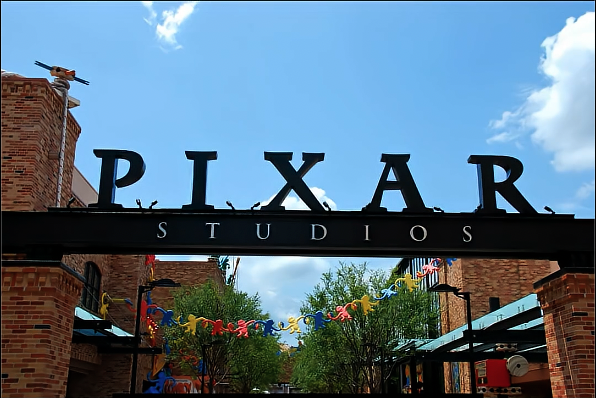
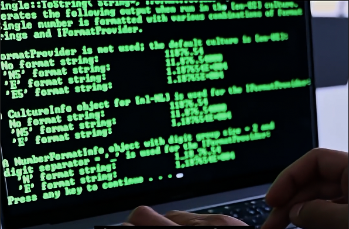
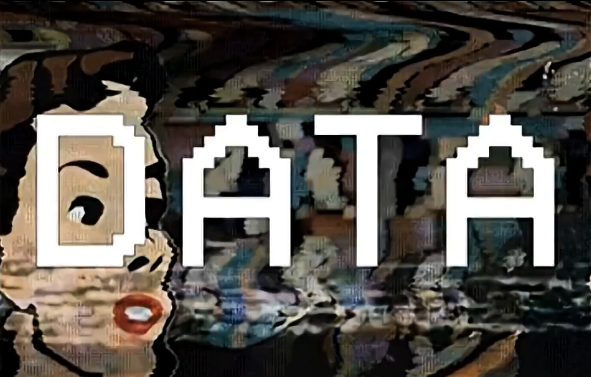
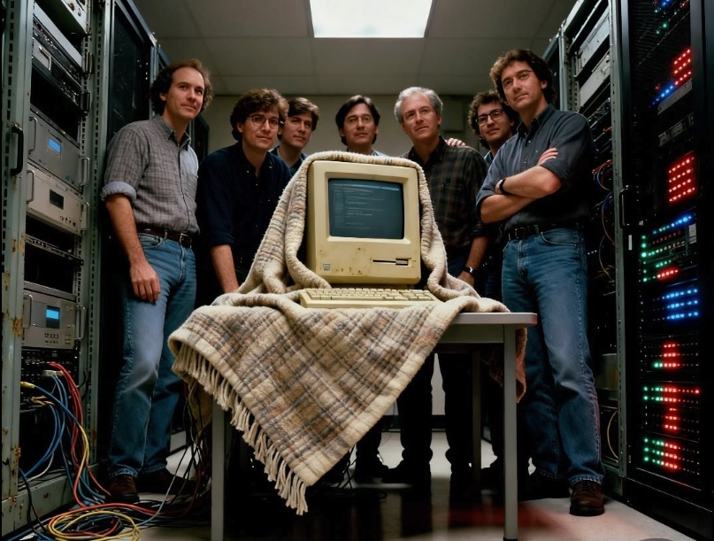

# ▸ git-github-101

브라우저에서 배우는 Git & GitHub 입문

<div class="pt-8 font-mono text-sm opacity-70">
$ git init
</div>

<!--
안녕하세요, Git과 GitHub 입문 강의를 시작하겠습니다.

오늘 목표는 두 가지입니다. 왜 지금 Git을 배워야 하는지 스스로 납득하는 것, 그리고 브라우저 터미널에서 직접 손으로 익혀보는 것입니다.

설치할 것은 아무것도 없습니다. 브라우저만 있으면 바로 실습할 수 있으니 부담 없이 따라오시면 됩니다.
-->

---

# Git이 어려운 건 여러분 탓이 아닙니다

<div class="text-xl opacity-75 -mt-2 pb-4">
그림 없이 명령어부터 외우면 누구나 헤맵니다
</div>

<v-clicks>

- 대부분 이렇게 배웁니다: `add`, `commit`, `push`... **주문처럼 외우기**
- 머릿속에 **그림(멘탈 모델)** 이 없으면, 왜 쓰는지도 무엇이 좋은지도 보이지 않습니다
- 그래서 오늘은 명령어가 아니라 **그림부터** 그립니다

</v-clicks>

<!--
시작하기 전에 하나 여쭤볼게요. Git을 배우다가 포기해본 분, 계시죠? 괜찮습니다. 여러분 잘못이 아니에요.

[click] Git을 처음 배울 때 대부분 명령어부터 만납니다. add 치고, commit 치고, push 치고. 뜻도 모른 채 주문처럼 외우죠. 외운 대로 될 때는 괜찮은데, 조금만 벗어나면 바로 막힙니다.

[click] 문제는 명령어가 아니라 그림입니다. 이 도구가 뒤에서 무슨 일을 하는지 대강 그려지는 그림, 멘탈 모델이 없으면 Git을 왜 쓰는지, 이게 가져다주는 진짜 장점과 매력이 뭔지 알 길이 없습니다. 그러니 어렵고 재미없게 느껴질 수밖에요.

[click] 그래서 오늘 강의는 순서를 뒤집습니다. 명령어 암기가 아니라 그림부터 그립니다. 그림이 잡히면 명령어는 따라옵니다.

첫 번째 그림을 그리러, 일단 Git이 없는 세상부터 보겠습니다.
-->

---

# 우리는 이미 버전 관리를 하고 있습니다

<div class="text-xl opacity-75 -mt-2 pb-4">
다만, 아주 고통스러운 방식으로
</div>

<div class="font-mono leading-loose">
<v-clicks>

<div>📄 발표자료.pptx</div>
<div>📄 발표자료_수정.pptx</div>
<div>📄 발표자료_자료조사보강.pptx</div>
<div>📄 발표자료_최종.pptx</div>
<div>📄 발표자료_최종_발표자_hotfix.pptx</div>
<div style="color: var(--lane-main)">📄 발표자료_최종_진짜최종2_제발마지막.pptx</div>

</v-clicks>
</div>

<div v-click class="pt-6 text-lg">
어느 게 진짜 최종일까요? <span style="color: var(--lane-main)">지난주 버전으로 돌아갈 수 있나요?</span>
</div>

<!--
본격적으로 시작하기 전에, 장면 하나 보여드리겠습니다.

[click] 발표자료를 하나 만듭니다.

[click] 피드백을 받아서 수정본을 저장합니다.

[click] 자료조사가 부족하다고 해서 보강합니다.

[click] 통과됐으니 이제 최종.

[click] 그런데 발표 직전에 발표자가 급하게 몇 장을 고칩니다. hotfix죠.

[click] 그리고 대망의 "진짜최종2_제발마지막". 다들 이런 폴더 하나쯤 있으시죠? 이게 바로 버전 관리입니다. 우리 모두 이미 하고 있어요.

[click] 그런데 두 가지 질문에는 답하기 어렵습니다. 어느 게 진짜 최종인지, 그리고 지난주 버전으로 돌아갈 수 있는지. 이 두 질문에 제대로 답하게 해주는 도구가 오늘 배울 Git입니다.
-->

---

# Git 특징 1: 우아하게 버전 관리하기

<div class="text-xl opacity-75 -mt-2 pb-2">
파일을 늘리는 대신, 기록을 쌓습니다
</div>

```mermaid {scale: 0.6, theme: 'base', themeVariables: {git0: '#f5a524', gitBranchLabel0: '#ffffff', commitLabelFontSize: '13px'}}
gitGraph
  commit id: "발표자료 작성"
  commit id: "피드백 반영"
  commit id: "자료조사 보강"
  commit id: "발표자 hotfix"
  commit id: "최종 완성"
```

<div v-click class="pt-2">

```text
commit a1b2c3d (HEAD -> main)
Author: 김발표 <presenter@example.com>
Date:   Mon Jul 6 14:32:11 2026 +0900

    자료조사 보강
```

</div>

<div v-click class="pt-3 text-sm">
파일 여섯 개 대신 이력 한 줄. <span style="color: var(--lane-main)">누가, 언제, 왜</span> 바꿨는지까지 남습니다
</div>

<!--
아까 그 여섯 개의 파일, Git으로 관리하면 이렇게 됩니다. 파일은 발표자료.pptx 하나뿐이고, 수정·보강·hotfix의 각 시점이 이력 위의 점, 즉 커밋으로 남습니다.

[click] 각 커밋에는 이런 정보가 자동으로 붙습니다. git log 명령으로 확인할 수 있는데, 누가(Author), 언제(Date), 무엇을 바꿨는지(메시지)가 전부 기록됩니다. "이 최종본 누가 언제 고친 거야?"라는 질문에 파일명을 뒤지는 대신 로그를 읽으면 됩니다.

[click] 정리하면 이겁니다. 파일 여섯 개 대신 이력 한 줄. 파일명 짓기 고민이 커밋 메시지 한 줄로 바뀌는 거죠. 그런데 이 우아한 도구가 어떻게 태어났는지, 잠깐 역사를 보고 가겠습니다.
-->

---

# Git은 이제 갓 스무 살입니다

<div class="text-xl opacity-75 -mt-2 pb-4">
리눅스를 만들다가 태어난 도구
</div>

<div class="grid grid-cols-2 gap-6 items-center">



<div>
<v-clicks>

- **1991** 리누스 토발즈, 리눅스 시작. 전 세계 개발자의 패치를 이메일로 받아 손으로 합침
- **2002** 상용 도구 **BitKeeper** 도입. 당시 대세는 CVS·SVN 같은 중앙 서버 방식
- **2005** BitKeeper 무료 사용 종료. 리누스가 **2주 남짓 만에 Git 초판**을 직접 개발

</v-clicks>
</div>

</div>

<!--
잠깐 역사 이야기를 하겠습니다. 사진의 주인공은 리누스 토발즈. 리눅스를 만든 사람이자, Git을 만든 사람입니다.

[click] 1991년에 리눅스를 시작했는데, 규모가 커지면서 전 세계 수천 명이 보내는 수정본을 이메일로 받아 손으로 합치고 있었습니다. 방금 본 파일명 지옥의 초대형판이죠.

[click] 2002년부터는 BitKeeper라는 상용 버전 관리 도구를 썼습니다. 당시 무료 도구는 CVS나 SVN 같은 중앙 서버 방식뿐이었는데, 리누스는 그 방식을 너무 싫어해서 상용 도구를 택했을 정도였어요.

[click] 그런데 2005년, BitKeeper를 무료로 쓸 수 없게 됩니다. 리누스의 선택은 놀랍게도 직접 만들기였고, 2주 남짓 만에 Git의 첫 버전이 나왔습니다. 그게 2005년이니 Git은 이제 갓 스무 살, 생각보다 젊은 도구입니다. 그리고 리누스가 Git에 심은 가장 중요한 설계가 하나 있는데, 그게 다음 장입니다.

이미지: GitHub의 Git 20주년 아트워크
-->

---

# Git 특징 2: 모두가 완전한 사본을 갖습니다

<div class="text-xl opacity-75 -mt-2 pb-4">
분산 버전 관리 시스템(DVCS)이라고 부릅니다
</div>

<div class="grid grid-cols-2 gap-4">

<div v-click class="rounded-lg border border-gray-400/30 p-4">
<div class="font-bold">중앙집중식</div>
<div class="text-xs opacity-70 pb-2">SVN(서브버전) · CVS</div>
<div class="text-2xl pb-2">💻 💻 💻 → 🏢</div>
<div class="text-sm opacity-80">이력은 서버 한 곳에만 있습니다.<br>서버가 죽으면 이력도 끝입니다.</div>
</div>

<div v-click class="rounded-lg border p-4" style="border-color: var(--lane-main)">
<div class="font-bold pb-2" style="color: var(--lane-main)">분산식 = Git</div>
<div class="text-2xl pb-2">💻📚 💻📚 💻📚</div>
<div class="text-sm opacity-80">clone하는 순간, 각자가 커밋 이력<br>전체의 완전한 사본을 갖습니다.</div>
</div>

</div>

<div v-click class="pt-6 text-lg">
서버가 통째로 사라져도, <span style="color: var(--lane-main)">팀원 한 명의 컴퓨터에 전부</span> 남아 있습니다
</div>

<!--
리누스가 심은 그 설계가 바로 이겁니다. Git은 분산 버전 관리 시스템입니다.

[click] 옛날 방식의 버전 관리는 중앙집중식이었습니다. 대표가 SVN, 우리말로 서브버전이라고 부르는 도구와 그 이전의 CVS입니다. 아까 리누스가 싫어했다던 바로 그 도구들이죠. 모든 이력이 중앙 서버 한 곳에만 있고, 각자의 컴퓨터에는 지금 작업하는 파일만 있습니다. 서버가 죽으면? 이력이 통째로 사라집니다. 참고로 SVN은 지금도 쓰는 회사가 있어서, 언젠가 이 이름을 만날 수 있습니다.

[click] Git은 다릅니다. 저장소를 clone하는 순간, 여러분 컴퓨터에는 최신 파일만 오는 게 아니라 첫 커밋부터 지금까지의 이력 전체가 통째로 복사됩니다. 팀원이 다섯이면 완전한 사본이 다섯 개인 셈입니다.

[click] 그래서 이런 일이 가능해집니다. 서버가 통째로 사라져도, 팀원 한 명의 컴퓨터에 모든 게 남아 있습니다. 말이 되나 싶으시죠? 그런데 정말 그런 일이 있었습니다. 픽사에서요.
-->

---

# 픽사도 겪은 일입니다

<div class="text-xl opacity-75 -mt-2 pb-3">
1998년, Toy Story 2가 통째로 사라질 뻔한 날
</div>

<v-switch>
<template #0>
<div class="h-56 flex items-center justify-center"></div>
<div class="pt-3 text-center opacity-90">1998년, 개봉을 앞둔 Toy Story 2</div>
</template>
<template #1>
<div class="h-56 flex items-center justify-center"></div>
<div class="pt-3 text-center opacity-90">3D 애니메이션의 선두 주자 픽사, Toy Story 2 제작 2년차에 접어들 무렵이었습니다</div>
</template>
<template #2>
<div class="h-56 flex items-center justify-center"></div>
<div class="pt-3 text-center opacity-90">누군가 서버에서 실수로 <span class="font-mono" style="color: var(--lane-main)">rm -rf *</span> (전체 삭제)를 실행합니다.</div>
</template>
<template #3>
<div class="h-56 flex items-center justify-center"></div>
<div class="pt-3 text-center opacity-90">2년치 작업의 <span style="color: var(--lane-main)">90%가 사라졌지만</span>, 안타깝게도 백업 시스템은 정상이 아니었습니다.</div>
</template>
<template #4>
<div class="h-56 flex items-center justify-center"></div>
<div class="pt-3 text-center opacity-90">중앙의 원본이 사라진 지금, 유일한 희망은 재택근무 중이던 기술 감독 <span style="color: var(--lane-main)">Galyn Susman의 집 컴퓨터</span></div>
</template>
<template #5>
<div class="h-56 flex items-center justify-center"></div>
<div class="pt-3 text-center opacity-90">우여곡절 끝에 사본을 담은 컴퓨터를 무사히 운반했고, 영화는 기간 내에 완성됐습니다</div>
</template>
</v-switch>

<!--
방금 말씀드린 "서버가 사라지는 날"의 실화입니다. 1998년 픽사에서 있었던 일이에요.

Toy Story 2가 개봉을 앞두고 있었습니다.

[click] 당시 픽사는 3D 애니메이션의 선두 주자였고, Toy Story 2 제작 2년차에 접어들고 있었습니다.

[click] 그런데 어느 날, 누군가 영화 에셋이 담긴 서버에서 삭제 명령을 실행합니다. 우디의 모자가 사라지고, 우디가 사라지고, 폴더가 눈앞에서 하나씩 증발하기 시작했습니다.

[click] 2년치 작업의 90%가 몇 분 만에 사라졌습니다. 백업이 있으니 괜찮다고 생각했는데, 확인해보니 백업 시스템이 한 달째 조용히 실패하고 있었습니다. "백업이 있다"와 "복구할 수 있다"는 다른 말이었던 거죠.

[click] 중앙에 모여 있던 원본이 전부 사라진 상황. 유일한 희망은 기술 감독 Galyn Susman이었습니다. 출산 직후 재택근무를 하느라 집 컴퓨터에 영화 전체 사본을 갖고 있었거든요.

[click] 그 컴퓨터를 담요에 싸서 조심조심 픽사까지 운반했고, 우여곡절 끝에 영화는 개봉 일정 안에 완성됐습니다. 여기서 기억할 것 하나. 영화를 구한 건 백업 시스템이 아니라 "전체 사본을 가진 또 한 사람"이었습니다. 아까 본 분산 버전 관리가 바로 이 장면입니다. Susman의 집 컴퓨터가 해준 일을, Git에서는 clone 한 번이 해줍니다. 나중에 원격 저장소를 배울 때 이 장면을 다시 떠올리게 될 겁니다.

출처: 픽사 공식 영상 "Studio Stories: The Movie Vanishes", 에드 캣멀 『Creativity, Inc.』
-->

---

# 만약 픽사에 Git이 있었다면 어땠을까요?

<v-clicks>

- 픽사 사고의 본질: 프로젝트의 **원본이 단 한 곳**에 있었다는 것
- Git이 있었다면: clone한 **모든 컴퓨터가 전체 이력을 담은 완전한 사본**

</v-clicks>

<div v-click class="pt-10 text-xl leading-relaxed">

> Git은 실수를 막는 도구가 아니라,<br>실수가 재앙이 되지 않게 만드는 <span style="color: var(--lane-main)">**안전장치**</span>입니다

</div>

<!--
질문을 하나 바꿔보겠습니다. 만약 그때 픽사에 Git이 있었다면 어땠을까요?

[click] 먼저 사고의 본질부터 다시 봅시다. 삭제 명령이 문제가 아니라, 프로젝트의 원본이 서버 단 한 곳에 있었다는 게 본질입니다. 원본이 하나뿐이면 실수 한 번이 곧 전부의 손실이 됩니다. 아까 본 "진짜최종2_제발마지막.pptx" 폴더도 정확히 같은 상태고요.

[click] Git이 있었다면 이야기가 다릅니다. clone한 모든 컴퓨터가 첫 커밋부터의 전체 이력을 담은 완전한 사본이니까, 팀원 전원의 컴퓨터가 Susman의 집 컴퓨터인 셈입니다. 담요에 싸서 컴퓨터를 나르는 대신, clone 한 번이면 끝났겠죠.

[click] 다만 오해하면 안 되는 게, Git이 실수 자체를 없애주지는 않습니다. 실수는 앞으로도 계속 납니다. 저도 내고, 픽사도 냈으니까요. 그래서 오늘의 첫 번째 결론입니다. Git은 실수를 막는 도구가 아니라, 실수가 재앙이 되지 않게 만드는 안전장치입니다.
-->

---

# 버전 관리는 이제 기본기입니다

<div class="text-xl opacity-75 -mt-2 pb-4">
빠르게 바꿀수록, 안전하게 되돌릴 수 있어야 합니다
</div>

<v-clicks>

- 개발은 계속 **수정하고 검증하는 과정**입니다
- Git은 변경사항을 **기록하고 비교**하게 해줍니다
- 문제가 생기면 언제든 **안전하게 되돌릴 수 있습니다**

</v-clicks>

<!--
방금 본 두 장면, 파일명 지옥과 픽사 사건에 이름을 붙이면 전부 버전 관리 문제입니다. 왜 이게 기본기인지 짚고 가겠습니다.

[click] 개발은 한 번에 끝나지 않습니다. 고치고, 확인하고, 다시 고치는 과정의 반복이죠.

[click] Git은 그 변경사항을 전부 기록해두고, 무엇이 달라졌는지 비교할 수 있게 해줍니다.

[click] 그리고 무엇보다, 문제가 생기면 언제든 이전 상태로 안전하게 되돌릴 수 있습니다. "되돌릴 수 있다"는 오늘 계속 반복될 핵심 단어입니다.

그래서 많은 회사가 변경 이력을 관리하고 다른 사람과 충돌 없이 협업하는 능력을 기본기로 요구합니다.
-->

---

# 하지만 협업이 전부가 아닙니다

AI 코딩 에이전트가 널리 쓰이는 시대, 이제 AI는:

<v-clicks>

- 기능을 **구현**하고
- 버그를 **수정**하고
- 테스트 코드를 **작성**하고
- 문서까지 **고쳐줍니다**

</v-clicks>

<div v-click class="pt-6 text-lg">
그렇다면 Git이 필요한 이유는 뭘까요?
</div>

<!--
그런데 협업 때문에만 Git이 필요한 건 아닙니다. 요즘은 AI 코딩 에이전트가 일상이 됐죠.

[click] 이제 AI는 기능을 구현해주고

[click] 버그도 잡아주고

[click] 테스트 코드까지 대신 써줍니다.

[click] 심지어 문서까지 고쳐주죠.

[click] 그럼 여기서 질문 하나 드리겠습니다. AI가 이렇게 다 해주는데, 우리가 Git을 배워야 하는 이유는 뭘까요? 잠깐만 각자 생각해보세요.
-->

---

# 문제는 속도가 아니라 통제입니다

<div class="pt-4 text-xl leading-relaxed">

AI가 코드를 빠르게 만든다는 사실 자체가 문제가 아닙니다.

<span v-click style="color: var(--lane-main)">**그 결과물을 사람이 어떻게 검토하고 통제할 것인가.**</span><span v-click> 그것이 진짜 문제입니다.</span>

</div>

<!--
AI가 코드를 빠르게 만들어내는 것 자체는 문제가 아닙니다. 오히려 좋은 일이죠.

[click] 진짜 문제는 이겁니다. 그 결과물을 사람이 어떻게 검토하고 통제할 것인가.

[click] 속도는 AI가 내지만, 방향과 책임은 여전히 사람의 몫입니다. 그 통제 수단이 바로 Git입니다.
-->

---

# Git을 모르면 vs 알면

<div class="pt-1 pb-3 opacity-70">
모르면 AI가 만든 코드를 그대로 믿거나, 어디서부터 잘못됐는지 추적하기 어렵습니다.<br>
알면 AI의 결과물을 이렇게 다룹니다:
</div>

````md magic-move
```bash
# 1. AI가 방금 코드를 잔뜩 고쳤습니다. 무엇이 바뀌었을까요?
git diff
```

```bash
# 2. 확인했으면 본진(main)을 지키면서 안전하게 실험합니다
git diff
git checkout -b experiment
```

```bash
# 3. 결과가 마음에 들면, 단위별로 기록합니다
git diff
git checkout -b experiment
git commit -m "AI 제안 적용: 검색 성능 개선"
```

```bash
# 4. 문제가 생기면? 본진으로 돌아가면 그만입니다
git diff
git checkout -b experiment
git commit -m "AI 제안 적용: 검색 성능 개선"
git checkout main   # 실험이 실패해도 본진은 그대로
```
````

<!--
Git을 모르면 AI가 만든 코드를 그대로 믿는 수밖에 없습니다. 뭔가 잘못됐을 때 어디서부터 꼬였는지 찾기도 어렵죠. 알면 이렇게 다룹니다.

첫 번째, AI가 코드를 잔뜩 고쳐놨다면 git diff로 무엇이 바뀌었는지부터 눈으로 확인합니다.

[click] 두 번째, 괜찮아 보이면 브랜치를 하나 만듭니다. 본진인 main을 지키면서 안전하게 실험하는 거죠.

[click] 세 번째, 결과가 마음에 들면 commit으로 작업 단위마다 기록해둡니다.

[click] 마지막으로, 문제가 생기면 main으로 돌아가면 그만입니다. 실험이 실패해도 본진은 그대로니까요.

확인, 실험, 기록, 복귀. 이 네 동작을 오늘 전부 직접 실습합니다.
-->

---
layout: center
---

# AI가 속도라면,<br>Git은 브레이크와 핸들입니다

<div class="pt-4 opacity-70">
속도를 안전하게 다루는 도구
</div>

<!--
오늘 강의를 한 문장으로 줄이면 이겁니다. AI가 속도라면, Git은 브레이크와 핸들입니다.

빨리 달리는 차일수록 브레이크와 핸들이 좋아야 합니다. 마찬가지로 코드가 빨리 만들어질수록, 멈추고 되돌리고 방향을 잡는 도구가 중요해집니다.

오늘 다른 건 다 잊으셔도 이 문장 하나만 기억하시면 됩니다.
-->

---

# Git은 개발자만의 것이 아닙니다

이 강의는 이런 분들을 위해 준비했습니다:

<div class="grid grid-cols-3 gap-3 pt-6 text-center">
<v-clicks>

<div class="rounded-lg border border-gray-400/30 p-3">👩‍💻 개발자</div>
<div class="rounded-lg border border-gray-400/30 p-3">📊 데이터 분석가</div>
<div class="rounded-lg border border-gray-400/30 p-3">📋 기획자</div>
<div class="rounded-lg border border-gray-400/30 p-3">📈 퍼포먼스 마케터</div>
<div class="rounded-lg border border-gray-400/30 p-3">🎨 UI/UX 디자이너</div>
<div class="rounded-lg border p-3" style="border-color: var(--lane-main); color: var(--lane-main)">배우고 싶은 모든 분</div>

</v-clicks>
</div>

<!--
그래서 Git은 더 이상 개발자만의 도구가 아닙니다.

[click] 개발자는 물론이고

[click] 데이터를 다루는 분석가

[click] 문서 작업이 많은 기획자

[click] 퍼포먼스 마케터

[click] UI/UX 디자이너까지, 변경되는 산출물을 다루는 모든 직군에 쓸모가 있습니다.

[click] 그리고 직군과 상관없이 배우고 싶은 마음만 있다면 누구든 환영입니다. 이 강의는 처음 배울 때 다들 헷갈려하는 지점을 중심으로 진행합니다.
-->

---

# 시작 전에, 나는 어디쯤일까요?

<v-clicks>

- ☐ `git init` `add` `commit` `status`로 단순한 버전 관리가 가능하다
- ☐ working directory, staging area, repository 개념을 알고 있다
- ☐ branch, merge, push, pull을 능숙하게 사용할 수 있다
- ☐ conflict 해결, rebase, pull request 협업 흐름을 이해하고 쓴다

</v-clicks>

<div v-click class="pt-6 text-sm opacity-80">
하나도 체크하지 못했어도 괜찮습니다. 이 강의는 <span class="font-mono" style="color: var(--lane-main)">git init</span>부터 함께 시작합니다.<br>
네 가지 모두 익숙하다면 이 강의는 너무 쉬울 수 있어요.
</div>

<!--
본격적으로 시작하기 전에, 지금 내가 어디쯤인지 가볍게 점검해봅시다. 네 가지 질문에 마음속으로 체크해보세요.

[click] 첫째, git init, add, commit, status로 단순한 버전 관리를 할 수 있는가.

[click] 둘째, working directory, staging area, repository 개념을 알고 있는가.

[click] 셋째, branch, merge, push, pull을 능숙하게 쓰는가.

[click] 넷째, conflict 해결과 rebase, pull request 협업 흐름까지 이해하고 있는가.

[click] 하나도 체크하지 못하셨어도 전혀 괜찮습니다. 이 강의는 git init부터 함께 시작하니까요. 반대로 네 가지가 전부 익숙하다면 오늘 강의는 좀 쉬울 수 있습니다.

이 네 항목은 OT 자가진단으로 한 번 더 쓰이니, 지금의 상태를 기억해두세요.
-->

---
dragPos:
  split: 300,318,150,_
  merge: 555,120,190,_
---

# 커리큘럼: 브랜치가 갈라졌다 합쳐지는 여정

```mermaid {scale: 0.55, theme: 'base', themeVariables: {git0: '#f5a524', git1: '#7c3aed', gitBranchLabel0: '#ffffff', gitBranchLabel1: '#ffffff', commitLabelFontSize: '14px'}}
gitGraph
  commit id: "01 Git이란?"
  commit id: "02 첫 번째 저장소"
  commit id: "03 첫 번째 커밋"
  commit id: "04 커밋 히스토리"
  commit id: "05 수정과 비교"
  branch feature
  commit id: "06 브랜치"
  commit id: "07 머지"
  commit id: "08 충돌 해결"
  checkout main
  merge feature id: "09 GitHub란?"
  commit id: "10 원격 저장소"
  commit id: "11 Pull Request"
```

<v-drag pos="split" class="text-xs font-mono">
↑ 06에서 갈라지고
</v-drag>

<v-drag pos="merge" class="text-xs font-mono" style="color: var(--lane-main)">
↓ 09에서 다시 합쳐집니다
</v-drag>

<div class="pt-4 text-sm opacity-70">
기초(01–05)는 <span class="font-mono" style="color: var(--lane-main)">main</span>에서,
브랜치 실습(06–08)은 <span class="font-mono">feature</span>에서.
그리고 09강에서 실제로 머지됩니다.
</div>

<!--
오늘의 커리큘럼입니다. 그림이 좀 특이하죠? 커리큘럼 자체를 커밋 그래프로 그렸습니다.

기초 다섯 강은 주황색 main 레인에서 진행합니다. 그러다 6강에서 보라색 feature 브랜치로 갈라지고, 브랜치와 머지, 충돌 해결을 익힌 다음 9강에서 다시 main으로 합쳐집니다.

지금은 이 그림이 낯설어도 괜찮습니다. 여러분이 8강까지 마치면 바로 이 그림을 여러분 손으로 직접 만들게 되니까요. 튜토리얼 사이트의 레슨 내비게이션도 이 구조 그대로입니다.
-->

---

# 커밋은 세이브 포인트

파일의 변경사항을 저장소에 기록하는 행위

```bash
touch hello.txt        # 파일 만들기
git add hello.txt      # 스테이징
git commit -m "첫 커밋" # 기록
```

<div class="pt-4 opacity-70">
게임의 세이브 포인트처럼, 그 시점으로 언제든 돌아올 수 있습니다.
</div>

<!--
첫 실습에서 만날 세 가지 명령입니다. 파일을 만들고, git add로 스테이징하고, git commit으로 기록합니다. 지금은 외우지 않으셔도 됩니다. 곧 직접 쳐볼 거니까요.

커밋은 게임의 세이브 포인트라고 생각하시면 됩니다. 보스전 앞에서 세이브해두면 져도 거기서 다시 시작할 수 있잖아요. 커밋도 똑같습니다. 기록해둔 시점으로 언제든 돌아올 수 있습니다.
-->

---

# 커밋은 단체사진입니다

<div class="text-xl opacity-75 -mt-2 pb-4">
add는 사진에 들어갈 파일을 무대에 올리는 일, commit은 셔터를 누르는 일
</div>

```mermaid {scale: 0.7, theme: 'base', themeVariables: {primaryColor: '#27272a', primaryTextColor: '#ffffff', primaryBorderColor: '#f5a524', lineColor: '#f5a524', edgeLabelBackground: '#27272a', tertiaryTextColor: '#ffffff', clusterBkg: '#18181b', clusterBorder: '#f5a524', fontSize: '15px'}, themeCSS: 'foreignObject { overflow: visible; } .labelBkg { background: transparent !important; } span.edgeLabel { display: inline-block; padding: 4px 12px; border-radius: 8px; transform: translate(-12px, -4px); } .cluster-label { color: #f5a524; }'}
flowchart LR
  subgraph proj["&nbsp;📁 내 프로젝트 폴더 = 작업 디렉터리 (working directory)&nbsp;"]
    direction LR
    W["작업 파일들<br/><small>&nbsp;대기실&nbsp;</small>"]
    subgraph git["&nbsp; .git = 로컬 저장소 (local repository)&nbsp;"]
      direction LR
      S["스테이징 영역<br/><small>&nbsp;staging area · 무대 위&nbsp;</small>"]
      R["커밋 히스토리<br/><small>&nbsp;repository · 앨범&nbsp;</small>"]
      S -- "git commit" --> R
    end
    W -- "git add" --> S
  end
```

<v-clicks>

- 커밋은 **단체사진**입니다. 그 순간을 통째로 찍는 스냅샷이죠
- `git add`는 사진에 들어갈 파일을 **무대에 올리는** 일입니다
- 셔터를 누르면, 바꾼 것 전부가 아니라 **무대에 올린 것만** 찍힙니다

</v-clicks>

<!--
방금 명령이 두 줄이었죠. add, 그리고 commit. 왜 굳이 두 단계일까요? 이 그림이 Git의 핵심 구조입니다. 모든 일은 내 프로젝트 폴더 안에서 벌어집니다. 우리가 파일을 만들고 고치는 이 폴더 전체가 작업 디렉터리이고, 그 안에 숨어 있는 .git 폴더가 로컬 저장소입니다. git init이 만드는 게 바로 이 .git 폴더고요. 파일은 작업 공간에서 스테이징 영역을 거쳐 커밋 히스토리에 기록됩니다.

[click] 커밋은 단체사진이라고 생각하세요. 그 순간의 모습을 통째로 찍는 스냅샷입니다.

[click] git add는 사진에 들어갈 파일을 무대에 올리는 일입니다. 스테이징(staging)이라는 이름 그대로요. 아직 찍힌 게 아니라, 찍힐 준비를 시킨 겁니다.

[click] 그리고 이게 스테이징 영역이 존재하는 이유인데, 셔터를 누르면 바꾼 것 전부가 아니라 무대에 올린 것만 찍힙니다. 오늘 한 작업이 뒤죽박죽 열 가지여도, 의미 있는 것만 골라 깔끔하게 기록할 수 있는 거죠.

아까 자가진단 두 번째 항목이 바로 이 세 단어였습니다. 작업 디렉터리, 스테이징 영역, 저장소. 오늘 실습을 마치면 이 항목에 체크할 수 있게 됩니다.

(Git 로고: Jason Long 作, CC BY 3.0)
-->

---
layout: center
---

# 직접 해보세요

튜토리얼과 함께 브라우저 터미널에서 바로 실습할 수 있습니다

<div class="font-mono pt-4">git-github-101 · /lessons/what-is-git</div>

<!--
설명은 여기까지입니다. 이제 직접 해볼 차례입니다.

설치도 계정도 필요 없습니다. 브라우저에서 튜토리얼 사이트를 열어주세요. 첫 레슨부터 저와 함께 진행하겠습니다.
-->
