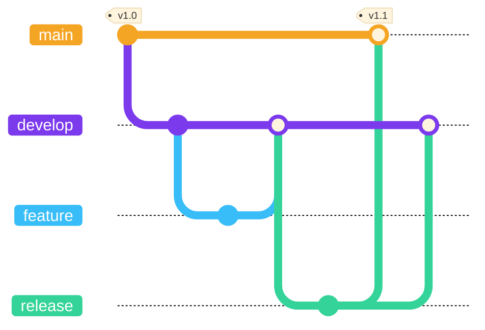

# ▸ 2회차: Git 심화와<br>협업 워크플로우

어제 따라 한 모든 동작, 오늘은 이해하고 스스로

<div class="pt-8 font-mono text-sm opacity-70">
$ git remote add upstream ...
</div>

<!--
인사 / 관통 서사 선언: 어제 first-contributions에서 따라 한 동작들의 실체를 오늘 전부 공개

오늘 청중은 개발자 위주 → 어제보다 밀도 올라간다고 예고
-->

---

# 목차

<div class="text-xl opacity-75 -mt-2 pb-6">
복기부터 다음 걸음까지
</div>

<SectionToc />

<!--
오늘 하루의 지도 먼저 펼치기 (어제 왔던 분들이라 "오늘 뭐 하나" 궁금)

오늘의 흐름: 복기 → 원리 → 워크플로우 → 협업 → 기록 → 다음 걸음

막이 바뀔 때마다 이 지도를 다시 꺼내 "지금 여기"를 짚어줌

→ 시작: 어제 만든 PR
-->

---

# 어제 PR, 정확히 무슨 일이 일어난 걸까?

<div class="text-xl opacity-75 -mt-2 pb-3">
first-contributions에서 우리가 따라 한 흐름
</div>

```mermaid {scale: 0.72, theme: 'base', themeVariables: {primaryColor: '#27272a', primaryTextColor: '#ffffff', primaryBorderColor: '#f5a524', lineColor: '#f5a524', edgeLabelBackground: '#27272a', tertiaryTextColor: '#ffffff', clusterBkg: '#18181b', clusterBorder: '#f5a524', fontSize: '14px'}, themeCSS: 'foreignObject { overflow: visible; } .labelBkg { background: transparent !important; } span.edgeLabel { display: inline-block; padding: 3px 10px; border-radius: 8px; transform: translate(-10px, -4px); }'}
flowchart RL
  subgraph gh["&nbsp;☁️ GitHub (원격)&nbsp;"]
    direction TB
    U["원본 저장소"]
    O["내 사본"]
  end
  subgraph local["&nbsp;💻 내 컴퓨터 (로컬)&nbsp;"]
    W["③ 작업 후 커밋"]
  end
  U -- "① Fork" --> O
  O -- "② Clone" --> W
  W -- "④ Push" --> O
  O -- "⑤ Pull Request" --> U
```

<div v-click class="pt-2 text-sm">
원본을 내 사본으로 복제해 내 컴퓨터에서 고친 뒤, 다시 원본에 반영을 제안한 과정입니다
</div>

<!--
훅: 어제 다들 진짜 PR을 하나씩 만들었음 (축하 다시 한번)

다이어그램 = 로컬과 원격을 넘나든 다섯 단계: 원본을 Fork(원격) → 내 컴퓨터로 Clone(원격→로컬) → 작업·커밋(로컬) → Push(로컬→원격) → 원본에 Pull Request(원격)

[click] 단계별 미스터리 짚기: Fork(왜 눌렀나) / Clone(그 주소는 누구 저장소) / Push(어디로 올라갔나) / Pull Request(누구에게 뭘 제안)

[click] 흐름 한 줄 요약: 복제 → 로컬 수정 → 원본에 제안

→ 첫 막: Git의 원리
-->

---
layout: center
---

<div class="text-sm opacity-60 font-mono pb-2">SECTION 02</div>

# Git의 원리

<div class="opacity-75 pb-8 -mt-1">해시, HEAD, 이름표, 되돌리기</div>

<SectionToc :current="2" class="max-w-md" />

<!--
어제가 "그림 그리기"였다면 오늘은 그 그림의 속을 뜯어보는 막

지도에서 두 번째 순서 (복기는 지나옴)

→ 커밋의 정체부터
-->

---

# 커밋 복습: 스냅샷과 지문

<div class="text-xl opacity-75 -mt-2 pb-2">
어제 본 git log 출력을 다시 짚고 갑니다
</div>

```text
commit a1b2c3d (HEAD -> main)
Author: 김발표 <presenter@example.com>
Date:   Mon Jul 6 14:32:11 2026 +0900

    자료조사 보강
```

<v-clicks>

- 커밋 = 그 순간 프로젝트 전체의 **스냅샷**
- 해시 = 그 스냅샷을 가리키는 **고유 지문**
- 부모 커밋을 따라 **사슬처럼** 이어집니다

</v-clicks>

<div v-click class="pt-3 text-sm">
오늘 필요한 건 하나: <span style="color: var(--lane-main)">커밋은 사슬 위의 한 점</span>입니다
</div>

<!--
어제 git log에서 본 전체 출력을 회수

[click] 커밋은 diff가 아니라 그 시점 프로젝트 전체 사진

[click] 해시는 그 사진을 다시 찾는 지문. 긴 해시 전체를 다 외울 필요는 없고 보통 앞 7자만 봄

[click] 부모 커밋으로 이어진 사슬이라는 점만 남기기

[click] 다음 HEAD 설명으로 연결: HEAD는 이 사슬 위에서 지금 내가 선 점을 가리킴

→ 다음: 브랜치 바꾸면 파일이 사라지는 현상 (HEAD 궁금증)
-->

---
layout: center
---

# HEAD와 포인터

<div class="text-xl opacity-75 pt-2 pb-6">
Git은 "지금 어디"인지 포인터로 기억합니다
</div>

<v-clicks>

- 포인터 = 값을 직접 담지 않고, 무언가를 <strong>가리키기만</strong> 하는 표시
- <span style="color: var(--lane-main)">HEAD</span>는 그런 포인터. 지금 내가 선 <strong>커밋</strong>을 가리킵니다

</v-clicks>

<!--
HEAD 개념 도입: 포인터부터

[click] 포인터 = 값이 아니라 "가리킴" (Git 곳곳에 등장, 브랜치·태그도 포인터)

[click] HEAD = 그 포인터, 지금 선 커밋을 가리킴

→ 다음: 그 커밋 사슬에서 HEAD~1, HEAD~2
-->

---

# HEAD: 지금 내가 선 커밋

<div class="text-xl opacity-75 -mt-2 pb-2">
지금 커밋에서 과거를 세는 HEAD~1
</div>

```mermaid {scale: 0.62, theme: 'base', themeVariables: {primaryColor: '#27272a', primaryTextColor: '#ffffff', primaryBorderColor: '#f5a524', lineColor: '#f5a524', edgeLabelBackground: '#27272a', tertiaryTextColor: '#ffffff', fontSize: '14px'}, themeCSS: 'foreignObject { overflow: visible; } .labelBkg { background: transparent !important; } span.edgeLabel { display: inline-block; padding: 3px 10px; border-radius: 8px; transform: translate(-10px, -4px); }'}
flowchart RL
  C3["지금 커밋<br/><small>&nbsp;HEAD&nbsp;</small>"] -- "부모" --> C2["한 칸 전<br/><small>&nbsp;HEAD~1&nbsp;</small>"] -- "부모" --> C1["두 칸 전<br/><small>&nbsp;HEAD~2&nbsp;</small>"]
```

<v-clicks>

- HEAD는 보통 `main` 같은 **브랜치를 거쳐** 지금 커밋을 가리킵니다
- `HEAD~1`은 **한 칸 전(부모)**, `HEAD~2`는 두 칸 전. HEAD에서 거슬러 세는 표기

</v-clicks>

<!--
앞 장에서 "HEAD는 포인터"까지 왔으니, 여기선 사슬 위 상대 표기(HEAD~N)

[click] HEAD는 보통 브랜치를 거쳐 가리킴 / 새 커밋 쌓이는 지점

[click] HEAD~1 = 부모, HEAD~2 = 두 칸 전 (HEAD 기준 상대 표기) → 곧 reset --hard HEAD~1에서 씀

→ 다음: 커밋을 가리키는 이름표, 브랜치
-->

---

# 브랜치의 정체: 이름 붙은 포인터

<div class="text-xl opacity-75 -mt-2 pb-2">
커밋을 가리키는 움직이는 이름표
</div>

```mermaid {scale: 0.6, theme: 'base', themeVariables: {git0: '#f5a524', git1: '#7c3aed', gitBranchLabel0: '#ffffff', gitBranchLabel1: '#ffffff', commitLabelFontSize: '13px'}}
gitGraph
  commit id: "c1"
  commit id: "c2"
  branch feature
  commit id: "c3"
```

<v-clicks>

- 브랜치 = 특정 커밋을 가리키는 **이름 붙은 포인터**
- 새 커밋을 쌓으면 브랜치 포인터가 최신 커밋으로 이동
- `HEAD`는 보통 `main` 같은 브랜치를 거쳐 커밋을 가리킵니다

</v-clicks>

<div v-click class="pt-3 text-sm">
결론: <span style="color: var(--lane-main)">브랜치는 커밋 복사가 아니라 포인터 하나 추가입니다</span>
</div>

<!--
어제 "가지" 비유의 실체 공개 / 그래프의 main·feature 라벨이 바로 이름 붙은 포인터

[click] 브랜치도 포인터라고 봐도 됨. 특정 커밋을 가리키는 이름 붙은 포인터

[click] 새 커밋을 만들면 커밋이 복사되는 게 아니라 브랜치 포인터가 앞으로 이동

[click] HEAD와 연결: 보통 HEAD → main → 최신 커밋 구조로 이해하면 충분

[click] 결론 강조: 브랜치 생성은 커밋 복사가 아니라 포인터 하나 추가라 가볍다

→ 다음: 안 움직이는 이름표, 태그
-->

---

# 태그: 고정된 이름표

<div class="text-xl opacity-75 -mt-2 pb-2">
브랜치가 따라 움직인다면, 태그는 한 지점에 박아둡니다
</div>

<v-clicks>

- 브랜치는 새 커밋을 쌓으면 이동, **태그는 특정 커밋에 고정**됩니다
- 주 용도: **릴리스 지점 표시** (`v1.0.0`, `v1.1.0` 같은 버전 이름)

</v-clicks>

<div v-click class="pt-2">

```bash
git tag v1.0.0
git push origin v1.0.0
```

</div>

<div v-click class="pt-3 text-sm">
GitHub에서 태그는 곧 <span style="color: var(--lane-main)">Release</span>입니다. 3일차 CI에서 자동 릴리스로 다시 만납니다
</div>

<!--
브랜치 바로 뒤, 같은 "이름표" 개념으로 연결

[click] 움직이는 이름표(브랜치) vs 박아두는 이름표(태그)

[click] 용도: 릴리스 지점 (시맨틱 버저닝 v1.0.0)

[click] 명령 시연 (annotated·lightweight 구분은 생략, 물으면 구두로)

[click] GitHub Release로 이어짐 + 3일차 자동화 예고

→ 다음: 되돌리기 (reset vs revert)
-->

---

# 되돌리기: reset vs revert

<div class="text-xl opacity-75 -mt-2 pb-2">
"되돌릴 수 있다"를 실제 명령으로 보면
</div>

<div class="grid grid-cols-2 gap-4">

<div v-click class="rounded-lg border border-gray-400/30 p-3">
<div class="font-bold text-sm pb-1">reset · 이력을 지운다</div>

```bash
git reset --hard HEAD~1
```

<div class="text-xs opacity-80 pt-1">HEAD를 과거로 끌어내림.<br>이후 커밋은 이력에서 사라짐.<br><strong>push 전 로컬에서만</strong></div>
</div>

<div v-click class="rounded-lg border border-gray-400/30 p-3">
<div class="font-bold text-sm pb-1">revert · 되돌림을 기록한다</div>

```bash
git revert HEAD
```

<div class="text-xs opacity-80 pt-1">반대 내용의 <strong>새 커밋</strong>을 쌓음.<br>이력이 보존됨.<br><strong>공유한 이력에도 안전</strong></div>
</div>

</div>

<div v-click class="pt-3 text-sm">
커밋을 되돌릴 땐: <span style="color: var(--lane-main)">push 전이면 reset, 이미 push했다면 revert</span>
</div>

<div v-click class="pt-2 text-xs opacity-70">
이력 <strong>중간</strong>의 커밋을 골라 빼거나 고칠 땐 <code>git rebase -i</code> (reset처럼 이력 재작성이라 로컬 전용)
</div>

<!--
1일차에 말했던 "되돌릴 수 있다"를 이제 실제 명령으로 풀어봅니다.

[click] reset: HEAD를 옮기는 방식의 응용입니다. --hard는 작업 내용까지 날릴 수 있으니 꼭 위험하다고 짚습니다.

[click] revert: 이력을 지우지 않고, "되돌렸다"는 사실을 새 커밋으로 남깁니다.

[click] 커밋을 되돌리는 상황으로 범위를 좁히면 기준은 단순합니다. push 전이면 reset, push 후에는 revert. reset은 스테이징 취소나 브랜치 되감기에도 쓰이지만, 이 장에서는 커밋 되돌리기만 다룹니다. Q: 왜 push 후에는 revert일까? 남이 이미 그 이력 위에서 작업하고 있을 수 있기 때문입니다.

[click] rebase -i는 이력 "중간"의 커밋을 골라 drop하거나 edit할 때 씁니다. reset이 맨 끝에서 물러나는 방식이라면, rebase -i는 중간 커밋만 집어서 빼거나 고칠 수 있습니다. 다만 이것도 이력 재작성입니다. 로컬 전용이고, 이미 push한 이력에는 쓰지 않는다고 못박습니다. 2일차에는 개념만 소개하고 실습은 뒤 회차로 넘깁니다.

→ 다음: 지우지도 커밋하지도 않고 잠깐 치워두기
-->

---

# stash: 잠깐 치워두기

<div class="text-xl opacity-75 -mt-2 pb-2">
커밋하기엔 애매한 작업이 있을 때
</div>

```bash
git stash        # 1. 하던 작업을 선반에 올려두고
git checkout main   # 2. 급한 일을 처리한 뒤
git stash pop    # 3. 선반에서 다시 꺼낸다
```

<v-clicks>

- 시나리오: 작업이 반쯤 됐는데 **급하게 다른 브랜치로** 가야 할 때
- 커밋은 완성된 시점의 기록, stash는 **미완성 작업의 임시 보관**

</v-clicks>

<div v-click class="pt-3 text-sm">
지저분한 상태를 억지로 커밋하지 않아도 됩니다. <span style="color: var(--lane-main)">치워두는 선반</span>이 따로 있습니다
</div>

<!--
현실적인 상황으로 시작합니다. 작업하던 도중에 긴급 수정 요청이 들어온 경우입니다.

[click] 브랜치를 바꿔야 하는데, 아직 끝나지 않은 변경이 발목을 잡는 상황을 떠올리게 합니다.

[click] 커밋과 stash를 구분합니다. 커밋은 완성된 시점의 기록이고, stash는 아직 덜 끝난 작업을 잠깐 치워두는 임시 보관입니다.

[click] 그래서 "wip 커밋"을 억지로 남기지 않아도 된다는 팁으로 연결합니다.

→ 다음: stash를 안전하게 다시 꺼내는 법
-->

---

# stash는 목록으로 관리합니다

<div class="text-xl opacity-75 -mt-2 pb-2">
pop만 외우면 나중에 헷갈리기 쉽습니다
</div>

```bash
git stash push -m "검색 UI 작업 중"  # 이름 붙여 보관
git stash list                     # 선반 목록 확인
git stash show -p stash@{0}        # 무엇이 들어갔는지 확인
git stash apply stash@{0}          # 꺼내되 목록에는 남김
git stash drop stash@{0}           # 다 확인했으면 삭제
```

<v-clicks>

- `pop`은 `apply` + `drop`. 처음에는 `apply`가 더 안전합니다
- 새로 만든 파일까지 넣으려면 `git stash -u`

</v-clicks>

<div v-click class="pt-3 text-sm">
실무 팁: <span style="color: var(--lane-main)">메시지를 붙이고, 꺼내기 전 확인</span>하세요
</div>

<!--
앞 장이 "왜 쓰는가"였다면, 이 장은 "어떻게 안전하게 쓰는가"입니다.

[click] 메시지를 붙이는 이유부터 말합니다. stash가 여러 개 쌓이면 stash@{0}만 보고는 무엇이었는지 기억하기 어렵습니다.

[click] list와 show -p로 꺼내기 전에 무엇을 되살릴지 먼저 확인합니다.

[click] apply는 적용해도 목록에 남고, drop은 직접 지울 때 씁니다. pop은 적용과 삭제를 한 번에 하므로 처음에는 실수 여지가 있습니다.

[click] 새 파일, 즉 untracked 파일은 기본 stash에 빠질 수 있습니다. 그때는 -u 옵션을 붙입니다.

[click] 안전한 습관은 간단합니다. 이름을 붙이고, 꺼내기 전에 확인합니다.

→ 3막: 이제 규칙 이야기 (실무 워크플로우)
-->

---
layout: center
---

<div class="text-sm opacity-60 font-mono pb-2">SECTION 03</div>

# 실무 워크플로우

<div class="opacity-75 pb-8 -mt-1">원리를 팀의 규칙으로</div>

<SectionToc :current="3" class="max-w-md" />

<!--
2막(원리) 닫고 3막 진입

실무에서 매일 도는 흐름: 원격과 주고받기(fetch/pull), 원격 이름표(origin/upstream), 브랜치 전략, 커밋 규격

→ 원격과 주고받기부터 (fetch)
-->

---

# fetch: 원격을 먼저 확인하기

<div class="text-xl opacity-75 -mt-2 pb-2">
내 파일은 그대로 두고, 원격의 최신 상태만 가져옵니다
</div>

```mermaid {scale: 0.54, theme: 'base', themeVariables: {primaryColor: '#27272a', primaryTextColor: '#ffffff', primaryBorderColor: '#f5a524', lineColor: '#f5a524', edgeLabelBackground: '#27272a', tertiaryTextColor: '#ffffff', fontSize: '14px'}, themeCSS: 'foreignObject { overflow: visible; } .labelBkg { background: transparent !important; } span.edgeLabel { display: inline-block; padding: 3px 10px; border-radius: 8px; transform: translate(-10px, -4px); }'}
flowchart LR
  R["원격<br/><small>&nbsp;origin&nbsp;</small>"] -- "git fetch" --> T["origin/main<br/><small>&nbsp;원격 추적 브랜치&nbsp;</small>"]
  T -- "log / diff로 확인" --> D["내 판단"]
  D -- "merge할지 결정" --> B["내 브랜치<br/><small>&nbsp;main&nbsp;</small>"]
```

<div class="grid grid-cols-2 gap-3">

<div v-click class="rounded-lg border border-gray-400/30 p-3">
<div class="font-bold text-sm pb-1">언제 쓰나</div>
<div class="text-xs opacity-80">push·PR 전 원격 변화 확인<br>pull 전에 충돌 가능성 점검<br>협업 중 원격 최신 상태 파악</div>
</div>

<div v-click class="rounded-lg border border-gray-400/30 p-3">
<div class="font-bold text-sm pb-1">어떻게 쓰나</div>

```bash
git fetch origin
git log --oneline main..origin/main
git diff main..origin/main
```

</div>

</div>

<div v-click class="pt-2 text-sm">
fetch 후에도 <code>main</code>과 작업 디렉터리는 그대로입니다. 확인한 다음 merge할지 결정합니다
</div>

<!--
원격과 주고받는 흐름의 출발점입니다. 여기서 origin은 내가 clone한 그 원격을 가리킵니다. 어제 여러분이 clone한 주소가 곧 origin이었습니다. fetch는 이 origin에서 새 커밋만 조용히 받아오는 명령입니다.

핵심 그림 하나: 내 로컬 안에는 origin/main 같은 "원격 추적 브랜치"가 따로 있습니다. 이건 내가 마지막으로 본 원격의 상태를 적어둔 북마크입니다. git fetch는 이 북마크만 최신으로 갱신할 뿐, 내 main과 작업 디렉터리는 건드리지 않습니다. 참고로 git 명령 대부분은 로컬에서만 도는데, fetch는 실제로 네트워크를 타는 몇 안 되는 순간입니다.

[click] 언제 쓰나: 내 브랜치에 섞기 전에 원격에 새 커밋이 있는지 먼저 보고 싶을 때 씁니다. push하려는데 누가 먼저 올렸는지, PR 전 기준 브랜치가 움직였는지, pull하기 전에 충돌이 날지 미리 확인하는 습관을 들이면 사고가 줄어듭니다.

[click] 어떻게 쓰나: git fetch origin으로 받아오면 결과가 origin/main에 쌓입니다. git log --oneline main..origin/main은 "내 main에는 없고 origin/main에만 있는 커밋", 즉 새로 올라온 것만 콕 집어 보여줍니다. git diff로 내용 차이까지 미리 열어볼 수 있습니다. 두 점(..) 표기는 앞 HEAD 장에서 본 상대 표기와 같은 결입니다.

[click] 핵심 안전장치: fetch만으로는 현재 브랜치도 작업 디렉터리도 바뀌지 않습니다. "받아왔다"와 "합쳤다"는 다릅니다. 흔한 오해가 "fetch하면 내 파일이 바뀐다"인데, 바뀌지 않습니다. 받아서 눈으로 확인한 다음 merge할지, 아직 두고 볼지는 내가 정합니다.

→ 다음: pull은 이 확인 단계와 merge를 한 번에 하는 명령
-->

---

# pull: fetch + merge를 한 번에

<div class="text-xl opacity-75 -mt-2 pb-2">
확인 단계를 건너뛰고 바로 내 브랜치에 합칩니다
</div>

```mermaid {scale: 0.56, theme: 'base', themeVariables: {primaryColor: '#27272a', primaryTextColor: '#ffffff', primaryBorderColor: '#f5a524', lineColor: '#f5a524', edgeLabelBackground: '#27272a', tertiaryTextColor: '#ffffff', fontSize: '14px'}, themeCSS: 'foreignObject { overflow: visible; } .labelBkg { background: transparent !important; } span.edgeLabel { display: inline-block; padding: 3px 10px; border-radius: 8px; transform: translate(-10px, -4px); }'}
flowchart LR
  R["원격<br/><small>&nbsp;GitHub&nbsp;</small>"] -- "fetch" --> T["origin/main<br/><small>&nbsp;원격 추적 브랜치&nbsp;</small>"] -- "merge" --> B["내 브랜치<br/><small>&nbsp;main&nbsp;</small>"]
```

<div class="grid grid-cols-2 gap-3">

<div v-click class="rounded-lg border border-gray-400/30 p-3">
<div class="font-bold text-sm pb-1">신중한 순서</div>

```bash
git fetch origin
git log --oneline main..origin/main
git merge origin/main
```

</div>

<div v-click class="rounded-lg border border-gray-400/30 p-3">
<div class="font-bold text-sm pb-1">빠른 순서</div>

```bash
git pull origin main
```

<div class="text-xs opacity-80 pt-1">위 명령 하나가 fetch와 merge를 이어서 실행합니다</div>
</div>

</div>

<div v-click class="pt-2 text-sm opacity-80">
수업과 협업에서는 <code>fetch → 확인 → merge</code>를 먼저 익히고, 익숙해지면 <code>pull</code>을 씁니다
</div>

<!--
fetch를 자세히 본 뒤 pull을 비교합니다. 한 문장으로 못박기: pull = fetch + merge. 앞 장에서 둘로 나눠 본 단계를 pull이 한 번에 처리합니다.

[click] 신중한 순서: fetch로 원격 추적 브랜치를 갱신하고, log나 diff로 확인한 다음 merge합니다. 어디서 충돌이 날지 미리 예측할 수 있어 마음이 편합니다.

[click] 빠른 순서: pull은 fetch와 merge를 한 번에 합니다. 편하지만 명령 직후 내 브랜치가 곧바로 바뀝니다. 충돌은 대부분 이 merge 단계에서 터지는데, pull은 그 순간을 눈앞에서 건너뛰기 때문에 초보자는 갑자기 충돌 화면을 만나 당황하기 쉽습니다.

[click] 초보자와 수업에서는 fetch → 확인 → merge를 먼저 권합니다. pull은 구조를 이해한 뒤 빠르게 쓰는 축약으로 소개합니다. 한 가지 더: git pull --rebase는 merge 대신 rebase로 합치는 변형인데, 그 차이는 잠시 뒤 merge vs rebase 장에서 다룹니다.

→ 다음: 원격 이름표, origin과 upstream
-->

---

# origin과 upstream

<div class="text-xl opacity-75 -mt-2 pb-2">
fork 협업에서 가장 헷갈리는 두 이름
</div>

```mermaid {scale: 0.62, theme: 'base', themeVariables: {primaryColor: '#27272a', primaryTextColor: '#ffffff', primaryBorderColor: '#f5a524', lineColor: '#f5a524', edgeLabelBackground: '#27272a', tertiaryTextColor: '#ffffff', clusterBkg: '#18181b', clusterBorder: '#f5a524', fontSize: '15px'}, themeCSS: 'foreignObject { overflow: visible; } .labelBkg { background: transparent !important; } span.edgeLabel { display: inline-block; padding: 4px 12px; border-radius: 8px; transform: translate(-12px, -4px); }'}
flowchart LR
  L["💻 내 컴퓨터<br/><small>&nbsp;로컬 저장소&nbsp;</small>"] -- "git push" --> O
  subgraph gh["&nbsp;☁️ GitHub&nbsp;"]
    direction LR
    O["내 fork<br/><small>&nbsp;origin&nbsp;</small>"] -- "Pull Request" --> U["원본 저장소<br/><small>&nbsp;upstream&nbsp;</small>"]
  end
```

<div v-click class="pt-2">
<table class="w-full border-collapse text-xs">
  <thead>
    <tr class="border-b border-gray-400/30 text-left opacity-80">
      <th class="py-1 pr-3 font-semibold">이름</th>
      <th class="py-1 pr-3 font-semibold">가리키는 곳</th>
      <th class="py-1 font-semibold">주로 하는 일</th>
    </tr>
  </thead>
  <tbody>
    <tr class="border-b border-gray-400/20">
      <td class="py-1 pr-3 font-mono" style="color: var(--lane-main)">origin</td>
      <td class="py-1 pr-3">내 fork</td>
      <td class="py-1">내 작업 브랜치를 push하는 곳</td>
    </tr>
    <tr>
      <td class="py-1 pr-3 font-mono" style="color: var(--lane-main)">upstream</td>
      <td class="py-1 pr-3">원본 저장소</td>
      <td class="py-1">원본 최신 변경을 fetch하고 PR을 보내는 곳</td>
    </tr>
  </tbody>
</table>
</div>

<div v-click class="pt-2 text-sm">
push는 <code>origin</code>으로, 최신 원본 확인은 <code>upstream</code>에서, PR은 origin의 브랜치를 upstream에 제안합니다
</div>

<!--
지금까지 원격은 origin 하나였습니다. 그런데 어제처럼 남의 저장소에 fork로 기여할 때는 원격이 둘이 됩니다. 그 둘의 이름이 origin과 upstream입니다.

remote는 거창한 개념이 아니라 원격 저장소 주소에 붙인 별명(북마크)입니다. git remote -v로 지금 내 저장소에 어떤 원격이 연결됐는지 볼 수 있습니다. 새로 clone하면 그 주소가 자동으로 origin이라는 이름을 얻습니다. 어제 clone한 주소가 바로 origin이었죠.

[click] 표로 차이를 못박기: origin은 내가 clone한 내 fork로, 내가 push하는 곳입니다. upstream은 원본 저장소로, 나에게 직접 push 권한은 없는 곳입니다. upstream은 clone할 때 자동으로 안 생기고, git remote add upstream 주소로 내가 직접 추가해줍니다.

[click] 흐름 정리: 내 작업은 origin으로 push하고, 원본이 바뀌면 앞서 배운 fetch를 upstream에 그대로 써서(git fetch upstream) 원본 최신 변경을 따라잡습니다. 최종 반영은 origin의 브랜치를 upstream에 PR로 제안하는 것입니다. 어제 눌렀던 Pull Request 버튼이 정확히 이 방향이었습니다.

→ 다음: 브랜치 전략 (GitHub Flow)
-->

---

# branch 전략: GitHub Flow

<div class="text-xl opacity-75 -mt-2 pb-2">
요즘 많은 팀이 쓰는 단순한 규칙
</div>

```mermaid {scale: 0.55, theme: 'base', themeVariables: {git0: '#f5a524', git1: '#7c3aed', gitBranchLabel0: '#ffffff', gitBranchLabel1: '#ffffff', commitLabelFontSize: '13px'}}
gitGraph
  commit id: "배포 v1"
  branch feature-search
  commit id: "검색 개발"
  commit id: "검색 완성"
  checkout main
  merge feature-search id: "PR 머지"
  commit id: "배포 v2"
```

<v-clicks>

- **main은 항상 배포 가능** 상태로 지킨다
- 모든 작업은 **브랜치에서**, 합류는 **PR로**
- 브랜치 전략은 팀마다 다릅니다. 더 구조적인 `Git Flow`도 있죠

</v-clicks>

<!--
규칙은 단 두 줄 (main 보호 + 브랜치 작업)

[click] main = 언제든 배포 가능 (어제 "본진" 비유의 실무 버전)

[click] PR이 유일한 합류 경로 → 그래서 PR이 중요 문서가 됨

[click] 정답은 없음 / 팀마다 다름 → 대비되는 Git Flow는 다음 장에서 자세히

→ 다음: 또 다른 전략, Git Flow
-->

---

# 또 다른 전략: Git Flow

<div class="text-xl opacity-75 -mt-2 pb-2">
정해진 주기로 버전을 내는 팀의 방식
</div>



<v-clicks>

- `develop`이 다음 릴리스를 모으고, `main`엔 **완성된 버전만** 태그와 함께 올라갑니다
- 여기에 `release/*` · `hotfix/*`까지, **역할별 브랜치**가 더 많습니다

</v-clicks>

<div v-click class="pt-3 text-sm">
지속 배포 웹 서비스는 <span style="color: var(--lane-main)">GitHub Flow</span>, 버전 단위로 내는 팀은 <span style="color: var(--lane-main)">Git Flow</span>를 즐겨 씁니다
</div>

<!--
GitHub Flow와 대비되는 무거운 전략

다이어그램: main(배포된 버전만, 태그) / develop(다음 릴리스 통합) / feature / release

[click] 역할별 브랜치: feature(기능) · release(출시 준비) · hotfix(긴급 수정) → 규칙이 GitHub Flow보다 많음

[click] 누가 쓰나: 지속 배포(웹) → GitHub Flow / 버전 단위 배포(앱·패키지·여러 버전 유지) → Git Flow

2일차는 "이런 것도 있다" 수준, 실무 적용은 팀 상황에서

→ 다음: 커밋 작명 규칙 (conventional commits)
-->

---

# conventional commits

<div class="text-xl opacity-75 -mt-2 pb-2">
커밋 메시지의 공용어
</div>

```text
feat: 검색 자동완성 추가
fix: 로그인 실패 시 무한 로딩 수정
docs: README 설치 절차 갱신
refactor: 결제 모듈 중복 로직 정리
chore: 의존성 버전 올림
```

<v-clicks>

- 형식은 `타입: 요약`. 타입은 feat / fix / docs / refactor / test / chore
- 왜 쓰나: **히스토리 검색**, **자동 체인지로그**, 팀의 공용어

</v-clicks>

<div v-click class="pt-3 text-sm">
<code>git log --oneline</code>이 <span style="color: var(--lane-main)">그대로 읽히는 문서</span>가 됩니다
</div>

<!--
어제 "커밋 메시지 한 줄" 이야기의 실무 규격

[click] 타입 6개만 (scope 등 확장 문법은 존재만 언급)

[click] 효용 3개: fix만 골라 검색 / 릴리스 노트 자동 생성 / 리뷰어가 제목만 봐도 성격 파악

[click] log --oneline 시연 큐

→ 다음: 한 커밋에 담을 양
-->

---

# 좋은 커밋의 단위

<div class="text-xl opacity-75 -mt-2 pb-2">
판별법: 메시지에 "그리고"가 들어가면 쪼개세요
</div>

```text
❌ fix: 로그인 버그 수정 그리고 버튼 색 변경 그리고 오타 수정

✅ fix: 로그인 실패 시 무한 로딩 수정
✅ style: 로그인 버튼 색상을 브랜드 컬러로 변경
✅ docs: 로그인 안내 문구 오타 수정
```

<v-clicks>

- 한 커밋 = **한 가지 의도** (원자적 커밋)
- 스테이징이 존재하는 이유가 이것: **골라서 무대에 올리니까**

</v-clicks>

<!--
나쁜 예 먼저 읽고 웃기 (다들 해봤을 것)

[click] 원자적 = 되돌리기도, 리뷰도, cherry-pick도 단위가 깔끔

[click] 단체사진 회수: add로 골라 담는 습관이 원자적 커밋을 만든다

→ 4막: 협업의 구조 (권한 이야기)
-->

---
layout: center
---

<div class="text-sm opacity-60 font-mono pb-2">SECTION 04</div>

# 협업의 구조

<div class="opacity-75 pb-8 -mt-1">여럿이 한 저장소에서 일하는 법</div>

<SectionToc :current="4" class="max-w-md" />

<!--
3막(워크플로우) 닫고 4막 진입

여기서 어제의 fork·PR 미스터리가 전부 풀림 (1막 훅 회수 예고)

→ 권한 이야기부터
-->

---

# 권한이 협업 방식을 가른다

<div class="text-xl opacity-75 -mt-2 pb-2">
fork 버튼을 눌러야 했던 진짜 이유
</div>

<div class="grid grid-cols-2 gap-4">

<div v-click class="rounded-lg border border-gray-400/30 p-4">
<div class="font-bold">write 권한이 있다</div>
<div class="text-xs opacity-70 pb-2">팀 저장소 · collaborator</div>
<div class="text-sm opacity-80">같은 저장소에 브랜치를 만들고<br>직접 push합니다</div>
</div>

<div v-click class="rounded-lg border border-gray-400/30 p-4">
<div class="font-bold">write 권한이 없다</div>
<div class="text-xs opacity-70 pb-2">남의 저장소 · 오픈소스</div>
<div class="text-sm opacity-80"><strong>fork</strong>로 내 사본을 만들어 작업하고<br>PR로 제안합니다</div>
</div>

</div>

<div v-click class="pt-4 text-sm">
어제 fork를 눌렀던 이유: <span style="color: var(--lane-main)">first-contributions에 write 권한이 없었으니까</span>
</div>

<!--
훅 질문 1번(왜 fork?)의 답

[click] 팀: 권한 있음 → fork 불필요, 브랜치로 충분

[click] 오픈소스: 권한 없음 → 내 사본(fork)에서 작업

[click] 어제의 경험 회수 / read/write/admin 3단계는 말로만

→ 다음: 팀 저장소의 집, Organization
-->

---

# GitHub Organization: 팀의 집

<div class="text-xl opacity-75 -mt-2 pb-2">
개인 계정이 사람이면, Organization은 팀의 계정입니다
</div>

<v-clicks>

- **저장소를 모으는 공간**: 동아리, 회사, 팀 프로젝트를 한곳에 둡니다
- **권한을 나누는 단위**: 멤버와 팀별로 읽기, 쓰기, 관리 권한을 줍니다
- **협업의 공식 주소**: `github.com/org-name/repo-name`이 프로젝트의 대표 위치가 됩니다

</v-clicks>

<div v-click class="pt-4 text-sm">
팀 프로젝트라면 <span style="color: var(--lane-main)">개인 저장소</span>보다 Organization 저장소가 협업의 기준점이 됩니다
</div>

<!--
개인 계정은 사람의 공간, Organization은 팀의 공간입니다.

[click] 저장소를 모으는 공간: 수업 팀, 동아리, 회사 프로젝트처럼 여러 저장소를 한 이름 아래에 둘 수 있습니다.

[click] 권한을 나누는 단위: 특정 개인에게만 모든 권한이 묶이지 않고, 멤버와 팀별로 읽기, 쓰기, 관리 권한을 나눌 수 있습니다.

[click] 협업의 공식 주소: 팀 프로젝트가 특정 개인 계정에만 있으면 소유권과 권한 관리가 애매해집니다. Organization은 저장소, 멤버, 팀, 권한을 함께 관리하는 그릇입니다.

[click] 팀 프로젝트라면 개인 저장소보다 Organization 저장소가 협업의 기준점이 됩니다.

→ 다음: 여럿이 브랜치를 합칠 때, merge와 rebase
-->

---

# merge vs rebase: 합치는 방법이 다릅니다

<div class="text-xl opacity-75 -mt-2 pb-2">
둘 다 브랜치를 최신 흐름에 맞추지만, 기록 방식이 다릅니다
</div>

<div class="grid grid-cols-2 gap-3">

<div v-click class="rounded-lg border border-gray-400/30 p-3">
<div class="font-bold text-sm pb-1">merge · 기록을 보존한다</div>

```bash
git merge origin/main
```

<div class="text-sm opacity-85">
갈라진 흐름을 <strong>merge commit</strong>으로 묶음.<br>
언제 갈라지고 합쳐졌는지 남음.<br>
<strong>공유 브랜치에 안전</strong>
</div>
</div>

<div v-click class="rounded-lg border border-gray-400/30 p-3">
<div class="font-bold text-sm pb-1">rebase · 내 커밋을 다시 쌓는다</div>

```bash
git rebase main
```

<div class="text-sm opacity-85">
내 커밋을 최신 main 위에 재적용.<br>
히스토리가 일직선처럼 보임.<br>
<strong>나만 가진 브랜치에서만</strong>
</div>
</div>

</div>

<div v-click class="pt-3 text-sm">
기준: <span style="color: var(--lane-main)">공유된 이력은 merge, 내 로컬 작업 정리는 rebase</span>
</div>

<!--
팀으로 일하면 여러 브랜치를 하나로 합쳐야 할 때가 옵니다. 합치는 방식이 merge와 rebase 둘이라는 점을 짚습니다. 앞서 fetch/pull에서 이미 만난 merge가 그중 한 축입니다.

[click] merge는 실제 협업의 흔적을 남깁니다. 기록이 갈라졌다가 합쳐진 모양이 보이기 때문에, 언제 어떤 브랜치가 합쳐졌는지 추적하기 좋습니다.

[click] rebase는 내 커밋을 최신 main 위에 다시 쌓아 히스토리를 직선처럼 보이게 합니다. 대신 커밋 해시가 바뀌는 이력 재작성입니다.

[click] 이미 push해서 다른 사람이 볼 수 있는 커밋에는 rebase를 쓰지 않습니다. 수업에서는 fetch → 확인 → merge를 먼저 익히고, rebase는 나 혼자 가진 작업을 정리할 때만 사용한다고 정리합니다.

→ 다음: 이 구조 위에서 일감이 도는 방식 (관리 루프)
-->

---

# GitHub 프로젝트 관리 루프

<div class="text-xl opacity-75 -mt-2 pb-2">
실무의 일감은 이 궤도를 돕니다
</div>

```mermaid {scale: 0.55, theme: 'base', themeVariables: {primaryColor: '#27272a', primaryTextColor: '#ffffff', primaryBorderColor: '#f5a524', lineColor: '#f5a524', edgeLabelBackground: '#27272a', tertiaryTextColor: '#ffffff', fontSize: '15px'}, themeCSS: 'foreignObject { overflow: visible; } .labelBkg { background: transparent !important; } span.edgeLabel { display: inline-block; padding: 4px 12px; border-radius: 8px; transform: translate(-12px, -4px); }'}
flowchart LR
  I["Issue"] --> B["브랜치"] --> C["커밋"] --> P["PR"] --> M["머지"]
  M -- "다음 일감" --> I
```

<v-clicks>

- 일감 하나 = 이슈 하나 = 브랜치 하나 = PR 하나, 머지되면 다시 다음 이슈로
- PR 설명에 `Fixes #12`를 쓰면 머지될 때 **이슈가 자동으로 닫힙니다**

</v-clicks>

<div v-click class="pt-3">
<div class="text-sm opacity-80 pb-2">팀에 따라 이슈를 별도 트래커에서 관리하고 GitHub와 연동하기도 합니다</div>
<div class="flex items-center gap-3">
<div class="bg-white rounded-md px-3 py-1.5 flex items-center"></div>
<div class="bg-white rounded-md px-3 py-1.5 flex items-center"></div>
<div class="bg-white rounded-md px-3 py-1.5 flex items-center"></div>
</div>
</div>

<!--
"프로젝트 관리 도구 따로 안 써도 GitHub 안에 다 있다" / 이 루프가 계속 돈다(사이클)

[click] 1:1:1:1 대응이 추적성의 핵심 (누가 왜 바꿨는지 이슈까지 거슬러 올라감) / 머지 후 다음 이슈로 반복

[click] Fixes #N 매직 키워드 → 머지 시 이슈 자동 닫힘

[click] 이슈 트래커 연동: 큰 팀은 Jira·Linear·Notion에서 이슈를 관리하고 GitHub 커밋·PR과 엮음 (여기선 개념만)

→ 다음: 이 루프의 중심 문서, PR
-->

---

# PR이라는 문서

<div class="text-xl opacity-75 -mt-2 pb-2">
리뷰어가 읽는 순서대로 쓰세요
</div>

```text
제목:  feat: 검색 자동완성 추가

## 무엇을 / 왜
검색 입력 시 자동완성 표시 (Fixes #12)

## 확인 방법
"git" 입력 → 하단에 제안 5개 표시
```

<v-clicks>

- 제목은 conventional commits 규격 그대로. 본문은 **무엇을 / 왜 / 확인 방법**
- 어제 만든 PR의 정체: <span style="color: var(--lane-main)">origin의 브랜치를 upstream에 제안하는 문서</span>였습니다

</v-clicks>

<!--
1막 훅 질문이 여기서 완전히 풀림 (수미상관 지점)

[click] 제목 규격 = 커밋 규격 재사용

[click] 3문단 템플릿 / "리뷰어가 코드를 열기 전에 읽는 것"

[click] 훅 회수 선언 + 리뷰 왕복은 내일(3일차) 예고

→ 다음: 빨리 리뷰받는 PR
-->

---

# 빨리 리뷰받는 PR

<div class="text-xl opacity-75 -mt-2 pb-2">
리뷰어의 수고를 줄이면 피드백이 빨라집니다
</div>

<v-clicks>

- **작게 쪼개기**: 작은 PR일수록 빨리 읽히고 빨리 머지됩니다
- **올리기 전 셀프리뷰**: 내 diff를 먼저 한 번 읽고 다듬습니다
- **봐달라 지점 명시**: 설명에 "어디를 집중해서 볼지"를 적어둡니다

</v-clicks>

<div v-click class="pt-3 text-sm">
리뷰어 지정, CI 통과 확인 같은 <span style="color: var(--lane-main)">리뷰 자동화</span>는 3일차에서 다룹니다
</div>

<!--
PR을 "잘 쓰는 것"에서 "빨리 리뷰받는 것"으로 한 걸음 (작성자가 할 수 있는 몫)

[click] 작게: 좋은 커밋의 단위와 같은 원리 / 큰 PR은 리뷰가 밀림

[click] 셀프리뷰: 올리기 전 내가 먼저 diff 훑기로 사소한 실수 미리 제거

[click] 봐달라 지점: "이 함수 로직만 봐주세요" 한 줄이 왕복을 줄임

[click] 리뷰어 지정·CI·팔로업은 3일차(코드 리뷰)에서 본격적으로

→ 5막: 이 기록들이 자산이 되는 이야기
-->

---
layout: center
---

<div class="text-sm opacity-60 font-mono pb-2">SECTION 05</div>

# 기록이 자산이 된다

<div class="opacity-75 pb-8 -mt-1">남긴 것이 곧 이력서가 된다</div>

<SectionToc :current="5" class="max-w-md" />

<!--
4막(협업) 닫고 5막 진입

지금까지 만든 커밋·PR이 그냥 사라지지 않고 자산으로 쌓인다는 관점 전환

→ GitHub 계정부터
-->

---

# GitHub 계정은 개발자의 공개 신분증

<div class="text-xl opacity-75 -mt-2 pb-2">
코드, 협업, 신뢰가 한곳에 쌓입니다
</div>

<v-clicks>

- **작업 기록**: 커밋, PR, 이슈가 시간순으로 남습니다
- **협업 방식**: 메시지, 설명, 리뷰 대화에서 일하는 태도가 보입니다
- **기회의 주소**: 채용, 오픈소스, 팀 프로젝트가 이 프로필로 연결됩니다

</v-clicks>

<div v-click class="pt-4 text-sm">
GitHub 계정은 <span style="color: var(--lane-main)">코드를 올리는 곳</span>을 넘어, 개발자로 일한 흔적이 누적되는 공개 프로필입니다
</div>

<!--
개발자는 말보다 기록으로 신뢰를 얻습니다.

[click] 작업 기록: 커밋, PR, 이슈가 시간순으로 남으니 "무엇을 해봤는가"가 말이 아니라 기록으로 보입니다.

[click] 협업 방식: 커밋 메시지, PR 설명, 이슈 대화, 리뷰 답변에서 작업 습관과 태도가 드러납니다. 잔디 자체보다 이 품질이 더 중요합니다.

[click] 기회의 주소: 포트폴리오, 협업 이력, 오픈소스 참여, 팀 프로젝트 초대가 이 프로필로 연결됩니다.

[click] GitHub 계정은 포트폴리오, 협업 이력, 작업 습관이 동시에 보이는 공개 프로필입니다.

→ 다음: 그 프로필에서 사람들이 처음 읽는 README
-->

---

# README.md: 프로젝트의 얼굴

<div class="text-xl opacity-75 -mt-2 pb-2">
저장소에서 사람들이 처음 읽는 단 하나의 문서
</div>

<v-clicks>

- **무엇을** 하는 프로젝트인가 (한 문장)
- **왜** 만들었나 (문제와 동기)
- **설치**: 따라 치면 되는 명령
- **사용법**: 가장 흔한 사용 예 1개

</v-clicks>

<div v-click class="pt-4 text-sm">
기준: <span style="color: var(--lane-main)">처음 온 사람이 5분 안에 실행</span>할 수 있는가
</div>

<!--
저장소 열면 자동으로 보이는 유일한 문서

[click]x4: 필수 4섹션 (스크린샷·배지 등 꾸미기는 4일차)

[click] 5분 기준 / 나쁜 README = 빈 파일 or 프레임워크 기본 문구 방치

→ 6막: 실전 준비
-->

---
layout: center
---

<div class="text-sm opacity-60 font-mono pb-2">SECTION 06</div>

# 다음 걸음

<div class="opacity-75 pb-8 -mt-1">배운 걸로 무엇을 만들까</div>

<SectionToc :current="6" class="max-w-md" />

<!--
5막(기록) 닫고 마지막 막 진입

여정의 종착지 = 앞으로 무엇을 만들지 스스로 정하기 (인증 설정은 맨 끝 참고 장에)

→ 무엇을 만들까
-->

---

# 무엇을 만들어볼까?

<div class="text-xl opacity-75 -mt-2 pb-2">
오늘 배운 워크플로우를 어디에 써볼지 정합니다
</div>

<v-clicks>

- 평소 **불편했던 것**: 자주 쓰는 도구의 버그, 문서 오타
- **만들어보고 싶던 것**: 작은 스크립트, 예제, 나만의 저장소
- 관심 있는 **오픈소스**: 눈에 띄던 프로젝트의 good first issue

</v-clicks>

<div v-click class="pt-4 text-sm">
조건은 하나, <span style="color: var(--lane-main)">작게</span>. 오늘 정한 주제가 4일차에 실제 기여로 이어집니다
</div>

<!--
어제 PR 버튼은 눌러봤으니, "무엇을" 할지는 이제 여러분 몫

[click]x3: 주제를 찾는 세 갈래 (불편함 / 만들고 싶음 / 오픈소스 good first issue)

[click] 스코프 강조: 작게 / 오늘은 결정만, 실행은 4일차

지금 이 자리에서 하나 정해보기 (옆 사람과 이야기해도 좋음)

→ 마무리
-->

---
layout: center
---

# 오늘 남긴 것

이해한 협업 워크플로우, 스스로 정한 다음 주제

<div class="pt-4 opacity-70 text-sm">
내일: 코드가 올라올 때마다 기계가 대신 검사하는 CI/CD
</div>

<!--
정리: 어제의 모든 동작 설명 가능 + 오늘 배운 협업 워크플로우 + 다음에 만들 주제 결정

3일차 예고: 반복 검사·빌드를 기계에게 맡기는 GitHub Actions (CI/CD)

수고 인사
-->

---

# Git과 GitHub 연결

<div class="text-xl opacity-75 -mt-2 pb-2">
push에서 막히면 십중팔구 인증 문제입니다
</div>

<div class="grid grid-cols-2 gap-4">

<div v-click class="rounded-lg border border-gray-400/30 p-3">
<div class="font-bold text-sm">HTTPS</div>
<div class="text-xs opacity-70 pb-2">https://github.com/...</div>
<div class="text-xs opacity-80">PAT 토큰 발급 → 첫 push 때 입력<br><strong>credential helper</strong>가 기억해줌<br>시작이 쉬움</div>
</div>

<div v-click class="rounded-lg border border-gray-400/30 p-3">
<div class="font-bold text-sm">SSH</div>
<div class="text-xs opacity-70 pb-2">git@github.com:...</div>
<div class="text-xs opacity-80">키 생성 → GitHub에 공개키 등록<br>이후 <strong>비밀번호 없이</strong> push<br>한 번 고생, 오래 편함</div>
</div>

</div>

<div v-click class="pt-4 text-sm">
오늘은 <span style="color: var(--lane-main)">HTTPS + credential helper</span>로 갑니다. SSH는 익숙해지면 전환
</div>

<!--
참고용 마지막 장 (push 막히면 이 장으로 돌아오기)

GitHub는 계정 비밀번호로 push 불가 (2021년부터) → 토큰 or 키

[click] HTTPS: PAT 발급 경로 안내 (Settings > Developer settings) / helper가 저장

[click] SSH: ssh-keygen → 공개키 등록 (설정 가이드 링크 제공)

[click] 오늘의 선택 고지 / "push 401·403 뜨면 이 장으로"
-->
