# ▸ 3회차: 안전한 변경과<br>자동화 루프

되돌릴 수 있게 만들고, 반복 검사는 기계에게 맡기기

<div class="pt-8 font-mono text-sm opacity-70">
$ git reflog
</div>

<!--
3회차를 시작하겠습니다.

오늘의 흐름은 GitHub Actions로 바로 뛰어드는 것이 아니라, 먼저 Git을 안전하게 다루는 법을 정리한 뒤 자동화와 리뷰로 넘어갑니다.

핵심 문장: 안전하게 되돌리고, 반복 검사는 기계에게 맡기고, 판단은 사람이 한다.
-->

---

# 오늘의 지도

<div class="text-xl opacity-75 -mt-2 pb-6">
Git 안전장치에서 CI/CD, 리뷰, worktree까지 이어갑니다
</div>

<Session3Toc />

<!--
오늘 하루의 전체 지도를 먼저 보여줍니다.

앞부분은 Git 실무 안전장치입니다. reset, restore, reflog, tag, rebase 같은 도구를 "언제 쓰면 위험하고 언제 유용한가" 기준으로 정리합니다.

중간에는 저장소의 약속 파일과 PR 루프를 다시 불러옵니다.

후반에는 CI/CD와 GitHub Actions, 코드 리뷰, 릴리스, worktree로 넘어가 4일차 오픈소스 기여와 AI 병렬 작업으로 연결합니다.
-->

---
layout: center
---

<div class="text-sm opacity-60 font-mono pb-2">SECTION 01</div>

# 되돌리기와 이력 정리

<div class="opacity-75 pb-8 -mt-1">reset, restore, reflog, tag, rebase -i를 실무 기준으로 복습</div>

<Session3Toc :current="1" class="max-w-2xl" />

<!--
SECTION 01은 2일차 Git 원리를 실무 명령어로 다시 잡는 구간입니다.

핵심은 명령어 암기가 아니라 "어떤 상태를 보존하고 어떤 상태를 버리는가"입니다.

이 섹션을 지나면 reset, restore, reflog, tag, rebase -i를 무섭게 외우는 대신 상황별로 고를 수 있어야 합니다.
-->

---

# Git의 세 공간

<div class="grid grid-cols-3 gap-4 pt-6">
  <div class="s3-card s3-card--amber p-5">
    <div class="font-mono text-sm opacity-60 pb-2">working tree</div>
    <div class="text-2xl font-bold">작업 디렉터리</div>
    <div class="opacity-75 pt-3">파일을 직접 고치는 곳</div>
  </div>
  <div class="s3-card s3-card--violet p-5">
    <div class="font-mono text-sm opacity-60 pb-2">staging area</div>
    <div class="text-2xl font-bold">스테이징 영역</div>
    <div class="opacity-75 pt-3">커밋 후보를 고르는 곳</div>
  </div>
  <div class="s3-card s3-card--sky p-5">
    <div class="font-mono text-sm opacity-60 pb-2">repository</div>
    <div class="text-2xl font-bold">저장소</div>
    <div class="opacity-75 pt-3">커밋 이력이 남는 곳</div>
  </div>
</div>

<!--
reset 옵션을 보기 전에 Git의 세 공간을 먼저 다시 잡습니다.

작업 디렉터리는 지금 편집 중인 실제 파일입니다. 스테이징 영역은 다음 커밋에 넣겠다고 고른 변경입니다. 저장소는 커밋으로 남은 이력입니다.

오늘 나오는 되돌리기 명령은 결국 이 세 공간 중 어디를 보존하고 어디를 되돌릴지 고르는 문제입니다.
-->

---

# reset: HEAD 이동

<div class="text-2xl leading-relaxed pt-4">
과거 커밋으로 <span class="font-bold text-amber-300">커밋 포인터를 되감고</span>,<br>
옵션에 따라 staging과 파일 변경을 남기거나 버립니다.
</div>

```bash
git reset <옵션> <커밋>
```

<div class="pt-4 opacity-75">
기본 옵션은 <code>--mixed</code>입니다.
</div>

<!--
reset은 파일 하나를 고치는 명령이라기보다 HEAD, 즉 현재 브랜치가 가리키는 커밋을 옮기는 명령으로 이해하는 편이 안전합니다.

중요한 질문은 "커밋만 풀 것인가, staging도 풀 것인가, 파일 변경까지 되돌릴 것인가"입니다.

옵션을 생략하면 git reset은 --mixed로 동작합니다. 이 기본값은 뒤 비교표에서 다시 확인합니다.
-->

---

# `reset --soft`: 커밋만 되돌리기

<div class="text-2xl leading-relaxed pt-4">
커밋은 되감지만,<br>
스테이징과 파일 변경은 그대로 둡니다.
</div>

```bash
git reset --soft HEAD~1
```

<div class="pt-4 opacity-75">
커밋 메시지를 다시 쓰거나, 방금 한 커밋을 다시 묶을 때 유용합니다.
</div>

<!--
--soft는 가장 덜 건드리는 reset입니다.

방금 만든 커밋만 취소하고, 그 커밋에 들어 있던 변경은 여전히 staged 상태로 남습니다. 그래서 바로 다시 commit 할 수 있습니다.

예를 들어 커밋 메시지를 잘못 썼거나, 방금 커밋한 내용을 다음 커밋과 합치고 싶을 때 쓸 수 있습니다.
-->

---

# `reset --mixed`: staging까지 되돌리기

<div class="text-2xl leading-relaxed pt-4">
커밋과 staging은 되감고,<br>
파일 변경은 작업 디렉터리에 남깁니다.
</div>

```bash
git reset --mixed HEAD~1
# 옵션 생략 시 기본값
git reset HEAD~1
```

<div class="pt-4 opacity-75">
커밋을 풀고 변경 파일을 다시 고르고 싶을 때 씁니다.
</div>

<!--
--mixed는 reset의 기본 동작입니다. 옵션을 쓰지 않으면 이 모드로 동작합니다.

커밋은 취소되고, 그 커밋에 들어 있던 변경은 staged가 아니라 unstaged 변경으로 돌아옵니다.

즉 파일 내용은 남아 있으니 다시 add할 파일을 고르고, 커밋을 새로 만들 수 있습니다.
-->

---

# `reset --hard`: 파일 변경까지 되돌리기

<div class="text-2xl leading-relaxed pt-4">
커밋, staging, 작업 디렉터리를<br>
지정한 커밋 상태로 맞춥니다.
</div>

```bash
git reset --hard HEAD~1
```

<div class="pt-4 text-amber-300 font-bold">
아직 저장하지 않은 파일 변경이 사라질 수 있습니다.
</div>

<!--
--hard는 가장 위험한 reset입니다.

커밋 포인터만 옮기는 것이 아니라 staging과 작업 디렉터리의 파일 상태까지 지정한 커밋에 맞춥니다. 그래서 커밋하지 않은 변경이 사라질 수 있습니다.

원칙적으로 로컬에서 결과를 완전히 이해할 때만 사용합니다. 이미 공유된 이력에 대해 --hard로 맞추고 강제 push하는 흐름은 팀 저장소에서 큰 사고가 될 수 있습니다.
-->

---

# reset 옵션: 보존 범위 비교

| 옵션 | 커밋 이력 | staging | 작업 디렉터리 |
|---|---|---|---|
| `--soft` | 되감음 | 유지 | 유지 |
| `--mixed` | 되감음 | 되돌림 | 유지 |
| `--hard` | 되감음 | 되돌림 | 되돌림 |

<div class="pt-4 opacity-75">
기본값은 <code>--mixed</code>, 가장 조심할 옵션은 <code>--hard</code>입니다.
</div>

<!--
이 표를 기준으로 reset 옵션을 정리합니다.

--soft는 커밋만 풉니다. --mixed는 커밋과 staging을 풉니다. --hard는 파일 변경까지 되돌립니다.

여러분이 외워야 하는 것은 옵션 이름 자체보다 "내가 지금 보존하고 싶은 변경이 어디에 있는가"입니다. 작업 디렉터리에 남겨야 할 변경이 있다면 --hard를 쓰면 안 됩니다.
-->

---

# `restore`: 파일 단위 되돌리기

<div class="grid grid-cols-2 gap-6 pt-4">
  <div>
    <div class="font-bold text-xl pb-3">파일 변경 취소</div>

```bash
git restore app.js
```

  </div>
  <div>
    <div class="font-bold text-xl pb-3">staging 취소</div>

```bash
git restore --staged app.js
```

  </div>
</div>

<div class="pt-6 opacity-75">
커밋 이력을 옮기지 않고, 필요한 파일만 다룹니다.
</div>

<!--
파일 하나를 되돌리고 싶을 때마다 reset을 떠올릴 필요는 없습니다.

git restore app.js는 작업 디렉터리의 파일 변경을 되돌립니다. git restore --staged app.js는 스테이징만 취소하고 파일 변경은 남깁니다.

즉 restore는 파일 단위 undo를 더 명확하게 표현하는 명령입니다. 커밋 포인터를 움직이는 reset과 역할을 구분해서 봅니다.
-->

---

# push 전과 후는 기준이 다르다

<div class="grid grid-cols-2 gap-6 pt-4">
  <div class="s3-card s3-card--emerald p-5">
    <div class="font-mono text-sm opacity-60 pb-2">before push</div>
    <div class="text-2xl font-bold">reset 가능</div>
    <div class="opacity-75 pt-3">아직 내 로컬 이력입니다</div>
  </div>
  <div class="s3-card s3-card--rose p-5">
    <div class="font-mono text-sm opacity-60 pb-2">after push</div>
    <div class="text-2xl font-bold">revert 우선</div>
    <div class="opacity-75 pt-3">공유된 이력은 남기고 되돌립니다</div>
  </div>
</div>

```bash
git revert <커밋>
```

<!--
reset을 쓸지 revert를 쓸지는 push 전후가 큰 기준입니다.

아직 push하지 않은 로컬 커밋이라면 reset으로 커밋을 정리해도 다른 사람에게 영향이 없습니다.

이미 push한 커밋은 누군가가 가져갔을 수 있습니다. 이때는 이력을 지우기보다 되돌리는 새 커밋을 만드는 git revert를 우선합니다.
-->

---

# `reflog`: HEAD의 발자국

<div class="text-2xl leading-relaxed pt-4">
내 로컬에서 HEAD가 어디를 지나갔는지<br>
시간순으로 보여줍니다.
</div>

```bash
git reflog
git reset --hard HEAD@{1}
```

<div class="pt-4 opacity-75">
복구 단서가 될 수 있지만, 영구 백업은 아닙니다.
</div>

<!--
reflog는 내 로컬 저장소에서 HEAD가 어디를 가리켰는지 남기는 기록입니다.

reset이나 rebase 후 "방금 전 커밋이 어디였지"를 찾는 단서가 될 수 있습니다. 그래서 사고가 났을 때 git reflog부터 보는 습관이 도움이 됩니다.

다만 reflog는 로컬 기록이고 보관 기간과 정리 정책의 영향을 받습니다. 원격 백업이나 안전한 릴리스 기록을 대신하는 보장된 백업으로 설명하면 안 됩니다.
-->

---

# 태그: 고정된 이름표

<div class="text-2xl leading-relaxed pt-4">
특정 커밋에 <span class="font-bold text-amber-300">v1.0.0</span> 같은<br>
릴리스 이름을 붙입니다.
</div>

```bash
git tag v1.0.0
git push origin v1.0.0
```

<div class="pt-4 opacity-75">
커밋 해시 대신 사람이 읽는 기준점을 만듭니다.
</div>

<!--
tag는 브랜치처럼 계속 움직이는 이름이 아니라 특정 커밋에 붙이는 고정된 이름표로 소개합니다.

릴리스, 배포, 수업 실습 완료 지점처럼 나중에 다시 찾아야 하는 기준점에 이름을 붙입니다.

후반부 CD와 릴리스 섹션에서 이 tag가 다시 등장한다는 연결도 짧게 예고할 수 있습니다.
-->

---

# tag 이름은 재사용 불가

<div class="text-2xl leading-relaxed pt-4">
한 저장소 안에서 tag 이름은 유일합니다.
</div>

```bash
git tag v1.0.0
git tag v1.0.0
# fatal: tag 'v1.0.0' already exists
```

<div class="pt-4 opacity-75">
같은 이름표를 두 커밋에 동시에 붙일 수 없습니다.
</div>

<!--
tag 이름은 같은 저장소 안에서 중복 생성할 수 없습니다.

이미 v1.0.0이라는 tag가 있으면 같은 이름의 tag를 다시 만드는 명령은 실패합니다.

이 성질 때문에 tag는 릴리스 기준점으로 쓸 수 있습니다. 이름이 겹치지 않기 때문에 v1.0.0이 무엇을 뜻하는지 저장소 안에서 하나로 정해집니다.
-->

---

# 공개 tag 변경은 신중히

<div class="text-2xl leading-relaxed pt-4">
이미 push한 tag는 릴리스, 빌드, 패키지의<br>
참조 기준점이 되었을 수 있습니다.
</div>

```bash
git tag -f v1.0.0 <다른-커밋>
git push --force origin v1.0.0
```

<div class="pt-4 text-amber-300 font-bold">
공개된 이름표를 옮기면 팀과 자동화가 흔들릴 수 있습니다.
</div>

<!--
tag는 기술적으로 삭제하거나 강제로 옮길 수 있지만, 공개한 tag를 바꾸는 일은 별개의 문제입니다.

누군가 그 tag를 기준으로 배포 파일을 받았거나, CI/CD가 그 tag를 보고 릴리스를 만들었거나, 문서가 그 tag를 가리킬 수 있습니다.

그래서 공개된 tag를 바꿔야 한다면 혼자 처리하지 않고 팀과 영향 범위를 확인한 뒤 진행해야 합니다.
-->

---

# `rebase -i`: 로컬 커밋 정리

<div class="text-2xl leading-relaxed pt-4">
PR을 올리기 전에<br>
커밋을 합치거나 메시지를 다듬습니다.
</div>

```bash
git rebase -i HEAD~3
```

<div class="pt-4 opacity-75">
작업 내용은 유지하고, 읽기 좋은 이력으로 정리합니다.
</div>

<!--
interactive rebase는 커밋 여러 개를 다시 배열하고 정리하는 도구입니다.

PR을 올리기 전 로컬 커밋을 squash해서 하나로 묶거나, 커밋 메시지를 고치거나, 실수 커밋을 정리할 때 사용합니다.

여기서는 세부 명령어를 깊게 외우기보다 "PR 전 로컬 이력 정리 도구"라는 위치를 잡는 것이 목표입니다.
-->

---

# 공유 이력은 함부로 고치지 않는다

<div class="text-2xl leading-relaxed pt-4">
reset과 rebase는 이력을 다시 쓰는 도구입니다.<br>
이미 push한 커밋에는 더 신중해야 합니다.
</div>

<div class="pt-6 text-xl opacity-80">
공유 전: 정리해도 됨<br>
공유 후: 팀 규칙과 영향 범위부터 확인
</div>

<!--
SECTION 01의 마지막 안전 규칙입니다.

reset과 rebase는 로컬에서 PR을 준비할 때는 매우 유용합니다. 하지만 이미 push해서 다른 사람이 볼 수 있는 이력을 바꾸면, 다른 사람의 브랜치와 자동화가 꼬일 수 있습니다.

그래서 공유 전에는 reset과 rebase로 깔끔하게 정리하고, 공유 후에는 revert처럼 이력을 남기는 방식이나 팀 규칙을 우선합니다.
-->

---
layout: center
---

<div class="text-sm opacity-60 font-mono pb-2">SECTION 02</div>

# 저장소의 약속 파일들

<div class="opacity-75 pb-8 -mt-1">.gitignore, .github, 템플릿, CODEOWNERS</div>

<Session3Toc :current="2" class="max-w-2xl" />

<!--
이 섹션은 SECTION 01에서 Git 상태와 이력의 안전장치를 복습한 뒤 이어집니다.

개인의 명령어 습관을 넘어 저장소 차원의 약속을 파일로 남기는 흐름으로 연결합니다.

핵심은 저장소에는 코드만 들어가는 것이 아니라, 무엇을 추적하고 어떻게 다루고 누가 확인할지도 함께 기록된다는 점입니다.
-->

---

# `.gitignore`: 새 파일 추적 규칙

<div class="text-2xl leading-relaxed pt-4">
Git이 아직 추적하지 않는 파일 중<br>
커밋하지 않을 파일을 정합니다.
</div>

```text
node_modules/
.env
dist/
*.log
```

<div class="pt-4 opacity-75">
이미 커밋된 파일을 자동으로 지워주지는 않습니다.
</div>

<!--
.gitignore는 "저 파일은 앞으로 Git이 새로 추적하지 말자"는 규칙입니다.

중요한 caveat는 새 파일에 대한 규칙이라는 점입니다. 이미 Git이 추적 중인 파일은 .gitignore에 추가해도 계속 추적됩니다.

그래서 .gitignore를 청소 도구처럼 설명하면 안 됩니다. 커밋 대상에 들어오기 전에 막아주는 필터에 가깝습니다.
-->

---

# `.gitignore`: 생성물과 비밀 제외

<div class="grid grid-cols-2 gap-4 pt-4">
  <div class="s3-card s3-card--amber p-4">
    <div class="font-bold text-xl">의존성</div>
    <div class="font-mono opacity-75 pt-2">node_modules/</div>
  </div>
  <div class="s3-card s3-card--rose p-4">
    <div class="font-bold text-xl">비밀값</div>
    <div class="font-mono opacity-75 pt-2">.env, *.pem</div>
  </div>
  <div class="s3-card s3-card--sky p-4">
    <div class="font-bold text-xl">빌드 결과</div>
    <div class="font-mono opacity-75 pt-2">dist/, .next/</div>
  </div>
  <div class="s3-card s3-card--violet p-4">
    <div class="font-bold text-xl">로컬 잡음</div>
    <div class="font-mono opacity-75 pt-2">*.log, .DS_Store</div>
  </div>
</div>

<!--
.gitignore에 자주 들어가는 범주를 네 가지로 정리합니다.

첫째, node_modules처럼 다시 설치할 수 있는 의존성입니다. 둘째, .env나 pem 파일처럼 저장소에 올라가면 안 되는 비밀값입니다.

셋째, dist나 .next처럼 빌드해서 다시 만들 수 있는 결과물입니다. 넷째, 로그 파일이나 .DS_Store처럼 개인 환경에서 생기는 잡음입니다.
-->

---

# 늦은 `.gitignore`: 추적 끊기

<div class="text-2xl leading-relaxed pt-4">
이미 추적 중인 파일은<br>
index에서 직접 빼야 합니다.
</div>

```bash
git rm --cached .env
git commit -m "Stop tracking local env file"
```

<div class="pt-4 text-amber-300 font-bold">
비밀값이 커밋됐다면 삭제가 아니라 회전·폐기가 필요합니다.
</div>

<!--
이미 Git이 추적 중인 파일은 .gitignore만 추가해도 빠지지 않습니다.

이때 git rm --cached 파일명을 쓰면 작업 디렉터리의 파일은 남기고, Git의 추적 대상에서는 제거합니다. 그 다음 .gitignore 규칙을 함께 커밋합니다.

단, 토큰이나 비밀번호 같은 비밀값이 한 번 커밋됐다면 저장소에서 지웠다고 끝나지 않습니다. 이미 노출된 값으로 보고 해당 키를 revoke하거나 rotate해야 합니다.
-->

---

# `.github/`: GitHub 운영 폴더

<div class="grid grid-cols-2 gap-5 pt-4">
  <div>
    <div class="font-bold text-xl pb-3">자동화</div>

```text
.github/workflows/ci.yml
```

  </div>
  <div>
    <div class="font-bold text-xl pb-3">협업 양식</div>

```text
.github/pull_request_template.md
.github/ISSUE_TEMPLATE/bug_report.md
```

  </div>
</div>

<div class="pt-4 opacity-75">
Git 자체가 아니라 GitHub가 읽는 저장소 메타데이터입니다.
</div>

<!--
.github 폴더는 GitHub가 읽는 운영 메타데이터를 모아두는 곳입니다.

대표적으로 .github/workflows 안에는 GitHub Actions 워크플로 파일이 들어갑니다. push나 PR 때 어떤 자동 검사를 돌릴지 여기서 정합니다.

또 PR 템플릿과 이슈 템플릿처럼 협업 입력 양식도 이 폴더 아래에 둡니다. Git은 그냥 파일로 보지만, GitHub는 이 위치를 특별하게 해석합니다.
-->

---

# 템플릿: 빠뜨릴 질문 줄이기

<div class="text-2xl leading-relaxed pt-4">
PR과 Issue에 필요한 정보를<br>
같은 형식으로 받습니다.
</div>

```md
## 변경 내용
## 확인 방법
## 리뷰어가 볼 부분
```

<div class="pt-4 opacity-75">
좋은 템플릿은 리뷰어의 되묻는 시간을 줄입니다.
</div>

<!--
PR 템플릿과 Issue 템플릿은 문서 장식이 아니라 협업 비용을 줄이는 장치입니다.

예를 들어 변경 내용, 확인 방법, 리뷰어가 집중해서 볼 부분을 항상 적게 하면 리뷰어가 맥락을 되묻는 시간이 줄어듭니다.

Issue도 재현 방법, 기대 결과, 실제 결과 같은 항목을 고정해두면 문제 보고의 품질이 일정해집니다.
-->

---

# CODEOWNERS: 리뷰 책임 자동화

<div class="text-2xl leading-relaxed pt-4">
경로별 담당자를 정해<br>
변경이 생기면 리뷰어를 자동으로 붙입니다.
</div>

```text
# .github/CODEOWNERS
/docs/ @docs-team
/src/payments/ @payments-team
```

<div class="pt-4 opacity-75">
작은 팀에서는 선택 사항이지만, 영역이 나뉘면 강력합니다.
</div>

<!--
CODEOWNERS는 특정 경로를 누가 책임지고 리뷰할지 저장소에 남기는 파일입니다.

예를 들어 docs 아래 변경은 문서 담당자에게, 결제 코드 변경은 결제 팀에게 자동으로 리뷰 요청이 가게 만들 수 있습니다.

모든 프로젝트에 꼭 필요한 것은 아니지만, 코드 영역이 나뉘고 리뷰 누락 비용이 커질수록 효과가 큽니다.
-->

---
layout: center
---

<div class="text-sm opacity-60 font-mono pb-2">SECTION 03</div>

# 고급 명령어 지도

<div class="opacity-75 pb-8 -mt-1">깊게 외우기보다 상황별로 떠올릴 Git 도구 목록</div>

<Session3Toc :current="3" class="max-w-2xl" />

<!--
이 섹션은 고급 명령어를 모두 깊게 설명하는 곳이 아닙니다.

나중에 문제가 생겼을 때 "이럴 때 찾을 이름"을 남기는 지도로 설계합니다.

tag와 rebase -i는 앞 섹션에서 이미 다뤘으니 여기서는 반복하지 않습니다. worktree도 이름만 예고하고 후반부에서 따로 다룹니다.
-->

---

# 고급 명령어: 상황으로 기억

<div class="grid grid-cols-2 gap-4 pt-4 text-xl">
  <div class="s3-card s3-card--sky p-4"><code>log/show/diff</code><br><span class="opacity-70">먼저 읽을 때</span></div>
  <div class="s3-card s3-card--emerald p-4"><code>switch</code><br><span class="opacity-70">브랜치를 바꿀 때</span></div>
  <div class="s3-card s3-card--amber p-4"><code>cherry-pick</code><br><span class="opacity-70">커밋 하나만 가져올 때</span></div>
  <div class="s3-card s3-card--violet p-4"><code>bisect</code> / <code>blame</code><br><span class="opacity-70">원인을 좁힐 때</span></div>
</div>

<!--
이 슬라이드는 SECTION 03의 사용법을 정합니다.

목표는 고급 명령어를 지금 모두 훈련하는 것이 아니라, 나중에 문제를 만났을 때 "아, 이런 이름의 도구가 있었지"라고 떠올리게 만드는 것입니다.

그래서 각 명령어는 상세 옵션보다 상황 이름으로 기억합니다. 읽기, 이동, 일부 가져오기, 원인 좁히기 정도의 지도만 잡고 넘어갑니다.
-->

---

# 행동 전에 먼저 읽는다

<div class="grid grid-cols-3 gap-4 pt-5">
  <div>
    <div class="font-bold text-xl pb-2">흐름 보기</div>

```bash
git log --oneline --graph
```

  </div>
  <div>
    <div class="font-bold text-xl pb-2">커밋 열기</div>

```bash
git show <커밋>
```

  </div>
  <div>
    <div class="font-bold text-xl pb-2">차이 보기</div>

```bash
git diff
```

  </div>
</div>

<div class="pt-5 opacity-75">
잘 읽는 습관이 reset보다 먼저입니다.
</div>

<!--
Git에서 위험한 명령을 줄이는 가장 쉬운 방법은 먼저 읽는 것입니다.

git log는 커밋 흐름을 보고, git show는 특정 커밋 하나를 열어보고, git diff는 아직 커밋하지 않은 차이를 확인할 때 씁니다.

초보자는 되돌리기 명령부터 외우려 하지만, 실무에서는 읽는 명령이 먼저입니다. 읽고 나서 움직이면 사고 범위가 줄어듭니다.
-->

---

# `switch`: 브랜치 이동 전용

<div class="text-2xl leading-relaxed pt-4">
브랜치를 바꾸거나 새 브랜치를 만들 때<br>
checkout보다 의도가 잘 드러납니다.
</div>

```bash
git switch main
git switch -c feature/login
```

<div class="pt-4 opacity-75">
"파일 되돌리기"와 "브랜치 이동"을 분리해서 생각합니다.
</div>

<!--
git checkout은 역사적으로 브랜치 이동과 파일 복원을 모두 맡았습니다. 그래서 처음 배우는 사람에게는 의미가 넓고 헷갈릴 수 있습니다.

git switch는 브랜치를 바꾸거나 새 브랜치를 만들 때 쓰는 명령으로 기억하면 됩니다.

파일을 되돌릴 때는 restore, 브랜치를 옮길 때는 switch라고 역할을 나누면 앞 섹션의 restore 설명과도 자연스럽게 연결됩니다.
-->

---

# `cherry-pick`: 커밋 하나 가져오기

<div class="text-2xl leading-relaxed pt-4">
다른 브랜치 전체가 아니라<br>
필요한 커밋만 현재 브랜치에 적용합니다.
</div>

```bash
git cherry-pick <커밋>
```

<div class="pt-4 opacity-75">
핫픽스, 누락된 작은 수정, 실습용 커밋 이동에 떠올립니다.
</div>

<!--
cherry-pick은 다른 브랜치의 모든 변경을 합치는 merge가 아닙니다.

특정 커밋 하나를 현재 브랜치 위에 다시 적용하는 명령입니다. 예를 들어 긴 기능 브랜치 안에 작은 버그 수정 커밋이 있고, 그 수정만 main이나 release 브랜치에 먼저 가져와야 할 때 떠올릴 수 있습니다.

여기서는 충돌 처리까지 깊게 들어가지 않습니다. "커밋 하나만 골라 가져오는 도구"라는 위치만 남깁니다.
-->

---

# `bisect`: 문제 커밋 이분 탐색

<div class="text-2xl leading-relaxed pt-4">
어느 순간부터 깨졌는지 모를 때<br>
좋은 커밋과 나쁜 커밋 사이를 이진 탐색합니다.
</div>

```bash
git bisect start
git bisect bad
git bisect good <정상-커밋>
```

<div class="pt-4 opacity-75">
긴 이력에서 "언제부터?"를 찾는 도구입니다.
</div>

<!--
bisect는 Git 이력을 반씩 나누어 문제를 만든 커밋을 찾는 도구입니다.

현재 상태가 bad이고, 과거의 어떤 커밋은 good이라고 알려주면 Git이 중간 커밋을 체크아웃해 줍니다. 사용자는 그 상태가 좋은지 나쁜지만 계속 알려주면 됩니다.

테스트가 자동화되어 있으면 더 강력하지만, 오늘은 명령을 깊게 훈련하지 않고 "언제부터 깨졌는지 찾는 이름"으로만 기억합니다.
-->

---

# `blame`: 탓이 아니라 맥락 조회

<div class="text-2xl leading-relaxed pt-4">
한 줄이 언제, 어떤 커밋에서 바뀌었는지<br>
추적할 때 씁니다.
</div>

```bash
git blame app.js
git show <커밋>
```

<div class="pt-4 opacity-75">
작성자를 몰아붙이는 도구가 아니라 변경 배경을 찾는 도구입니다.
</div>

<!--
git blame이라는 이름은 공격적으로 들리지만, 수업에서는 절대 사람을 탓하는 도구로 설명하지 않습니다.

실무적인 용도는 특정 줄이 언제 어떤 커밋에서 들어왔는지 보고, 그 커밋의 메시지와 PR 맥락을 찾아가는 것입니다.

즉 blame 다음에는 사람 이름에서 멈추는 것이 아니라 git show나 GitHub PR 링크를 통해 "왜 이 변경이 있었는가"를 확인해야 합니다.
-->

---

# `clean`: untracked 파일 삭제

<div class="text-2xl leading-relaxed pt-4">
untracked 파일과 폴더를 정리할 때 쓰지만,<br>
먼저 미리보기로 확인합니다.
</div>

```bash
git clean -n
git clean -fd
```

<div class="pt-4 text-amber-300 font-bold">
실행 전에는 항상 <code>git clean -n</code>으로 무엇이 지워질지 봅니다.
</div>

<!--
git clean은 Git이 아직 추적하지 않는 파일, 즉 untracked 파일을 지우는 명령입니다.

빌드 결과나 실습 중 생긴 임시 파일을 치울 때 유용하지만, Git이 추적하지 않는 파일이라는 말은 커밋으로 보호되지 않았다는 뜻이기도 합니다.

그래서 실제 삭제 전에 git clean -n으로 미리 보기를 해야 합니다. 무엇이 지워질지 확인한 뒤 필요할 때만 git clean -fd 같은 명령으로 진행합니다.
-->

---

# 오늘은 지도만 남긴다

<div class="grid grid-cols-2 gap-5 pt-4 text-xl">
  <div class="s3-card s3-card--emerald p-5">
    <div class="font-bold pb-2">지금 기억할 것</div>
    <div class="opacity-75"><code>switch</code>, <code>cherry-pick</code>, <code>bisect</code>, <code>blame</code>, <code>clean</code></div>
  </div>
  <div class="s3-card s3-card--amber p-5">
    <div class="font-bold pb-2">다른 곳에서 다룰 것</div>
    <div class="opacity-75"><code>tag</code>, <code>rebase -i</code>, <code>worktree</code></div>
  </div>
</div>

<div class="pt-5 opacity-75">
worktree는 후반부에서 별도 섹션으로 연결합니다.
</div>

<!--
SECTION 03을 닫으면서 범위를 다시 정리합니다.

지금 기억할 것은 상황별로 떠올릴 고급 명령어 이름입니다. switch는 브랜치 이동, cherry-pick은 커밋 하나 가져오기, bisect와 blame은 원인과 맥락 추적, clean은 untracked 정리입니다.

tag와 rebase -i는 SECTION 01에서 이미 다뤘고, worktree는 후반부에서 별도 섹션으로 다룹니다. 여기서 worktree를 깊게 설명하지 않도록 선을 긋습니다.
-->

---
layout: center
---

<div class="text-sm opacity-60 font-mono pb-2">SECTION 04</div>

# 협업 루프 재소환

<div class="opacity-75 pb-8 -mt-1">PR 흐름을 자동 검사와 리뷰의 출발점으로 다시 보기</div>

<Session3Toc :current="4" class="max-w-2xl" />

<!--
2일차 PR 흐름은 3일차 맨 앞 복습이 아니라 CI/CD로 들어가기 전의 다리입니다.

PR이 있어야 자동 검사와 리뷰가 자연스럽게 붙는다는 점을 여기서 다시 꺼냅니다.
-->

---

# 흐름을 정하면 협업이 쉬워진다

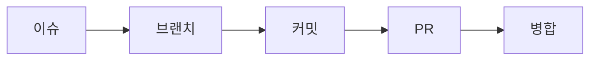

<div class="pt-8 text-xl opacity-75">
작업을 시작하고, 분리하고, 기록하고, 확인한 뒤 합칩니다.
</div>

<!--
여기서 2일차에 배운 협업 루프를 다시 꺼냅니다.

Issue에서 할 일을 잡고, branch로 작업 공간을 분리하고, commit으로 변경을 기록하고, PR에서 확인한 뒤 merge합니다.

중요한 점은 이 흐름을 3일차 시작 복습으로 소비하지 않고, 자동 검사와 리뷰가 어디에 붙는지 설명하는 연결부로 쓴다는 것입니다.
-->

---

# PR: 합쳐 달라는 요청

<div class="grid grid-cols-2 gap-6 pt-6">
  <div class="s3-card s3-card--amber p-5">
    <div class="font-mono text-sm opacity-60 pb-2">merge request</div>
    <div class="text-2xl font-bold">main에 합쳐도 될까요?</div>
  </div>
  <div class="s3-card s3-card--sky p-5">
    <div class="font-mono text-sm opacity-60 pb-2">review document</div>
    <div class="text-2xl font-bold">무엇을 바꿨나요?</div>
  </div>
</div>

<div class="pt-6 opacity-75">
PR은 버튼 하나가 아니라 팀이 변경을 읽는 문서입니다.
</div>

<!--
PR은 두 가지 얼굴이 있습니다.

첫째, main에 합쳐 달라는 merge request입니다. 둘째, 리뷰어가 변경 이유와 확인 방법을 읽는 review document입니다.

그래서 PR 설명, 커밋, 변경 파일, 체크 결과가 모두 한 화면에 모이는 것이 중요합니다. PR을 단순히 merge 버튼으로만 보면 이후의 리뷰와 CI 설명이 약해집니다.
-->

---

# `main`: 팀의 신뢰 기준선

<div class="text-2xl leading-relaxed pt-4">
팀은 <code>main</code>을 기준으로<br>
개발하고, 배포하고, 문제를 되돌아봅니다.
</div>

<div class="grid grid-cols-3 gap-4 pt-7">
  <div class="s3-card s3-card--emerald p-4">
    <div class="font-bold text-xl">작업 시작점</div>
    <div class="opacity-70 pt-2">새 branch의 기준</div>
  </div>
  <div class="s3-card s3-card--violet p-4">
    <div class="font-bold text-xl">공유 상태</div>
    <div class="opacity-70 pt-2">팀이 보는 최신 코드</div>
  </div>
  <div class="s3-card s3-card--sky p-4">
    <div class="font-bold text-xl">릴리스 후보</div>
    <div class="opacity-70 pt-2">배포 판단의 기준</div>
  </div>
</div>

<!--
main은 그냥 기본 브랜치 이름이 아니라 팀이 신뢰하는 기준선입니다.

새 작업은 main에서 branch를 만들고, 팀원들은 main을 최신 공유 상태로 보고, 배포나 릴리스 판단도 main의 건강 상태에 기대게 됩니다.

그래서 main에 들어가는 변경은 "내 컴퓨터에서 됐습니다"보다 더 강한 확인이 필요합니다.
-->

---

# 사람은 반복 검사에 약하다

<div class="text-2xl leading-relaxed pt-4">
리뷰어는 설계와 의도를 봐야 합니다.<br>
반복 검사는 자주 빠지고, 쉽게 흔들립니다.
</div>

<div class="grid grid-cols-3 gap-4 pt-7">
  <div class="s3-card s3-card--rose p-4">
    <div class="font-bold text-xl">빌드</div>
    <div class="opacity-70 pt-2">매번 직접?</div>
  </div>
  <div class="s3-card s3-card--amber p-4">
    <div class="font-bold text-xl">테스트</div>
    <div class="opacity-70 pt-2">빠뜨리기 쉬움</div>
  </div>
  <div class="s3-card s3-card--sky p-4">
    <div class="font-bold text-xl">규칙 검사</div>
    <div class="opacity-70 pt-2">환경마다 다름</div>
  </div>
</div>

<!--
여기서 CI/CD로 넘어갈 이유를 명확히 만듭니다.

사람 리뷰어는 변경 의도, 설계 방향, 사용자 영향 같은 판단을 해야 합니다. 그런데 빌드가 되는지, 테스트가 통과하는지, 포맷이나 타입 규칙을 지켰는지를 매번 손으로 확인하게 하면 쉽게 빠집니다.

반복 검사는 사람이 못해서가 아니라 사람이 계속 붙잡기에는 너무 기계적인 일입니다. 이 지점에서 자동화가 필요해집니다.
-->

---

# PR에 자동 피드백 붙이기

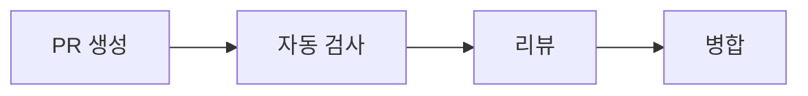

<div class="pt-8 text-xl opacity-75">
기계가 반복 확인을 먼저 하고, 사람은 판단에 집중합니다.
</div>

<!--
SECTION 04의 결론입니다.

이제 협업 흐름은 단순히 PR을 만들고 사람이 보는 구조에서, PR 생성 직후 자동 검사가 먼저 붙는 구조로 확장됩니다.

다음 섹션에서는 이 자동 피드백 루프를 CI/CD라고 부르고, 왜 짧은 피드백 루프가 실무에서 중요한지 설명합니다.
-->

---
layout: center
---

<div class="text-sm opacity-60 font-mono pb-2">SECTION 05</div>

# CI/CD는 짧은 피드백 루프다

<div class="opacity-75 pb-8 -mt-1">반복 검사를 사람이 붙잡지 않도록 자동화하는 이유</div>

<Session3Toc :current="5" class="max-w-2xl" />

<!--
여기서 CI/CD를 YAML 기능이 아니라 피드백 루프의 문제로 소개합니다.

여러분이 "왜 자동 검사가 필요한가"를 납득한 뒤 GitHub Actions 문법으로 넘어가게 합니다.

앞 섹션에서 PR이 합류 요청이자 검토 문서라고 봤습니다. 이제 그 PR에 반복 검사를 자동 피드백으로 붙입니다.
-->

---

# CI/CD는 도구가 아니라 습관

<div class="text-3xl leading-relaxed pt-6">
변경을 작게 만들고,<br>
자동으로 확인하고,<br>
빠르게 고칩니다.
</div>

<div class="pt-6 opacity-75">
GitHub Actions는 이 습관을 GitHub에서 실행하는 방법입니다.
</div>

<!--
CI/CD를 처음부터 GitHub Actions YAML로 설명하면 여러분은 "파일 하나 외우는 일"로 받아들이기 쉽습니다.

먼저 습관으로 잡습니다. 변경을 작게 만들고, 기계가 바로 확인하고, 결과를 보고 빠르게 고치는 흐름입니다.

GitHub Actions는 이 흐름을 GitHub에서 구현하는 대표 도구로 뒤에서 소개합니다.
-->

---

# 수동 검사는 반복에 약하다

<div class="grid grid-cols-3 gap-4 pt-6">
  <div class="s3-card s3-card--rose p-5">
    <div class="text-2xl font-bold">누락</div>
    <div class="opacity-70 pt-3">오늘은 테스트를 깜빡함</div>
  </div>
  <div class="s3-card s3-card--amber p-5">
    <div class="text-2xl font-bold">환경 차이</div>
    <div class="opacity-70 pt-3">내 PC에서는 통과함</div>
  </div>
  <div class="s3-card s3-card--sky p-5">
    <div class="text-2xl font-bold">기록 부재</div>
    <div class="opacity-70 pt-3">무엇을 확인했는지 모름</div>
  </div>
</div>

<div class="pt-6 text-xl opacity-75">
반복 확인은 PR에 자동 피드백으로 붙입니다.
</div>

<!--
SECTION 04에서 사람이 반복 검사에 약하다고 말했습니다. 여기서는 그 약점이 왜 실제 문제인지 구체화합니다.

수동 검사는 빠뜨리기 쉽고, 사람마다 환경이 다르고, 나중에 PR을 열어봤을 때 무엇을 확인했는지 기록이 남지 않습니다.

그래서 반복 검사를 사람의 기억에 맡기지 않고, PR에 자동 피드백으로 붙이는 것이 CI의 출발점입니다.
-->

---

# CI: 합치기 전 상시 확인

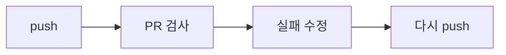

<div class="pt-8 text-xl opacity-75">
문제가 작을 때 발견할수록 고치기 쉽습니다.
</div>

<!--
CI는 Continuous Integration, 지속적 통합입니다.

핵심은 많은 변경을 오래 쌓아두었다가 한 번에 합치는 것이 아니라, 작은 변경을 자주 합치기 전에 자동으로 확인하는 것입니다.

PR 검사에서 실패하면 바로 고치고 다시 push합니다. 이 짧은 반복이 CI의 피드백 루프입니다.
-->

---

# CD: 배포 가능 상태 유지

<div class="grid grid-cols-2 gap-6 pt-6">
  <div class="s3-card s3-card--emerald p-5">
    <div class="font-mono text-sm opacity-60 pb-2">CI</div>
    <div class="text-2xl font-bold">합쳐도 되는가?</div>
    <div class="opacity-70 pt-3">빌드, 테스트, 규칙 검사</div>
  </div>
  <div class="s3-card s3-card--violet p-5">
    <div class="font-mono text-sm opacity-60 pb-2">CD</div>
    <div class="text-2xl font-bold">내보낼 준비가 되었는가?</div>
    <div class="opacity-70 pt-3">배포, 릴리스, 회수</div>
  </div>
</div>

<div class="pt-6 opacity-75">
오늘 실습의 중심은 CI입니다. CD는 뒤에서 릴리스와 연결합니다.
</div>

<!--
CI와 CD를 아주 짧게 구분합니다.

CI는 합치기 전에 이 변경이 기본 기준을 통과하는지 확인합니다. CD는 합쳐진 변경을 언제든 배포하거나 릴리스할 수 있는 상태로 유지하는 쪽입니다.

오늘 실습은 CI가 중심입니다. CD는 후반 릴리스 섹션에서 tag와 함께 다시 회수합니다.
-->

---

# `main`은 자동 검사로 지킨다

<div class="text-2xl leading-relaxed pt-4">
GitHub Flow에서는 <code>main</code>이 늘<br>
배포 가능한 기준선에 가까워야 합니다.
</div>

<div class="pt-6 text-xl">
필수 검사(required checks)가 통과해야 merge할 수 있습니다.
</div>

<!--
GitHub Flow에서는 main이 팀의 기준선이고, 가능하면 항상 배포 가능한 상태에 가까워야 합니다.

그 상태를 사람의 기억에만 맡기면 약합니다. 그래서 branch protection이나 ruleset에서 required checks를 설정해, 정해진 CI가 통과해야 merge할 수 있게 만듭니다.

이 슬라이드는 SECTION 04의 main 기준선 설명과 GitHub Actions를 연결하는 역할입니다.
-->

---
layout: center
---

<div class="text-sm opacity-60 font-mono pb-2">SECTION 06</div>

# 애자일 관행과 자동화

<div class="opacity-75 pb-8 -mt-1">작게 나누고, 자주 확인하고, 팀의 기준을 빠르게 맞추기</div>

<Session3Toc :current="6" class="max-w-2xl" />

<!--
CI/CD를 애자일 실천과 연결하는 구간입니다.

애자일 방법론 전체를 설명하는 시간이 아니라, CI/CD가 왜 작은 변경과 빠른 피드백을 중요하게 보는지 이해시키는 연결부입니다.
-->

---

# 애자일은 긴 계획의 한계를 줄인다

<div class="text-xl opacity-75 -mt-2 pb-4">
요구사항이 바뀌는 환경에서는 늦은 확인이 가장 비쌉니다
</div>

<div class="grid grid-cols-2 gap-5 pt-3">
  <div v-click class="s3-card s3-card--rose p-5">
    <div class="font-bold text-xl pb-3">문제가 컸던 흐름</div>
    <div class="text-lg leading-relaxed opacity-85">
      긴 계획 -> 긴 개발 -> 늦은 확인<br>
      바뀐 요구를 마지막에야 발견<br>
      실패했을 때 되돌리기 어려움
    </div>
  </div>
  <div v-click class="s3-card s3-card--emerald p-5">
    <div class="font-bold text-xl pb-3">애자일이 택한 방향</div>
    <div class="text-lg leading-relaxed opacity-85">
      작게 만들고<br>
      자주 보여주고<br>
      빠르게 고칩니다
    </div>
  </div>
</div>

<div v-click class="pt-5 text-xl opacity-80">
CI/CD는 이 짧은 피드백 주기를 기술로 받쳐주는 장치입니다.
</div>

<!--
애자일을 방법론 이름부터 설명하지 않습니다.

먼저 왜 이런 흐름이 필요했는지 잡습니다. 계획을 길게 세우고, 개발을 오래 진행하고, 마지막에 확인하면 요구사항 변화와 문제를 너무 늦게 발견합니다.

그래서 애자일은 작게 만들고, 자주 보여주고, 빠르게 고치는 방향을 택했습니다.

이제 다음 슬라이드에서 그 핵심을 "짧은 학습 주기"로 정리하고, CI/CD가 그 주기를 어떻게 기술적으로 받쳐주는지 연결합니다.
-->

---

# 애자일의 핵심: 짧은 학습 주기

<div class="grid grid-cols-4 gap-3 pt-6 text-center">
  <div class="s3-card s3-card--amber p-4">
    <div class="font-bold text-xl">작게</div>
    <div class="opacity-70 pt-2">변경</div>
  </div>
  <div class="s3-card s3-card--sky p-4">
    <div class="font-bold text-xl">자주</div>
    <div class="opacity-70 pt-2">통합</div>
  </div>
  <div class="s3-card s3-card--emerald p-4">
    <div class="font-bold text-xl">자동</div>
    <div class="opacity-70 pt-2">검사</div>
  </div>
  <div class="s3-card s3-card--violet p-4">
    <div class="font-bold text-xl">빠르게</div>
    <div class="opacity-70 pt-2">수정</div>
  </div>
</div>

<div class="pt-7 opacity-75">
여기서는 방법론 전체가 아니라 CI/CD를 낳은 실천만 봅니다.
</div>

<!--
애자일을 넓게 설명하기 시작하면 수업의 초점이 흐려집니다.

여기서 필요한 부분만 잡습니다. 변경을 작게 만들고, 자주 통합하고, 자동 검사로 바로 확인하고, 빠르게 수정한다는 흐름입니다.

즉 CI/CD는 애자일 회의 절차가 아니라 짧은 학습 주기를 기술적으로 받쳐주는 장치입니다.
-->

---

# 큰 배치는 늦게 깨진다

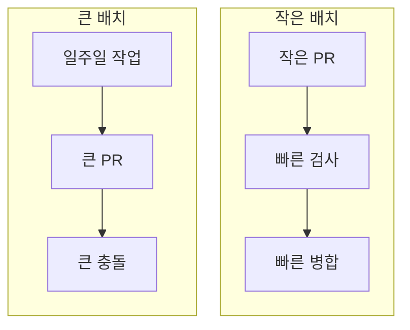

<div class="pt-6 text-xl opacity-75">
작게 나누면 실패도 작게 드러납니다.
</div>

<!--
CI가 왜 작은 PR과 잘 맞는지 설명합니다.

큰 변경을 오래 쌓아두면 충돌도 커지고, 테스트 실패 원인도 넓어지고, 리뷰어가 읽을 양도 많아집니다.

작은 변경을 자주 PR로 올리면 자동 검사가 빨리 돌고, 실패했을 때 원인 범위도 좁습니다.
-->

---

# 자동화: 팀 기준을 한곳에

<div class="text-3xl leading-relaxed pt-6">
"내가 확인했어요"보다<br>
"PR에서 같은 검사가 돌았어요"가 강합니다.
</div>

<div class="pt-6 opacity-75">
CI 결과는 리뷰어와 작성자가 함께 보는 공통 기록입니다.
다음은 이 기준을 GitHub Actions 워크플로로 적어봅니다.
</div>

<!--
자동화의 장점은 일을 덜 하는 것만이 아닙니다.

팀원이 서로 다른 환경에서 서로 다른 명령을 돌리면 결과를 비교하기 어렵습니다. PR에서 같은 워크플로가 돌면 작성자와 리뷰어가 같은 기준을 봅니다.

이 공통 기록이 리뷰 대화를 훨씬 명확하게 만듭니다.

다음 섹션에서는 이 공통 기준을 GitHub Actions 워크플로 파일로 어떻게 표현하는지 봅니다.
-->

---
layout: center
---

<div class="text-sm opacity-60 font-mono pb-2">SECTION 07</div>

# GitHub Actions 구조

<div class="opacity-75 pb-8 -mt-1">workflow, event, job, step을 한 장의 구조로 잡기</div>

<Session3Toc :current="7" class="max-w-2xl" />

<!--
여기서 GitHub Actions의 핵심 구성요소를 소개합니다.

문법을 많이 나열하기보다, 워크플로 파일 하나를 처음 봐도 읽을 수 있게 만드는 것을 목표로 합니다.
-->

---

# Actions: 저장소 안 워크플로 실행

<div class="text-2xl leading-relaxed pt-4">
GitHub는 정해진 위치의 YAML 파일을 읽고<br>
이벤트가 생기면 작업을 실행합니다.
</div>

```text
.github/workflows/ci.yml
```

<div class="pt-5 opacity-75">
파일은 저장소에 남고, 결과는 PR Checks에 남습니다.
</div>

<!--
GitHub Actions의 첫 번째 기준은 파일 위치입니다.

.github/workflows 안의 YAML 파일을 GitHub가 워크플로로 읽습니다. 저장소 파일이므로 PR에서 리뷰할 수 있고, 변경 이력도 남습니다.

자동화 규칙 자체도 팀의 리뷰 대상입니다. 오늘은 실제 파일을 추가하지 않고 덱 안에서 예제로만 다룹니다.
-->

---

# 워크플로: 언제, 어디서, 무엇을

<div class="grid grid-cols-3 gap-4 pt-6">
  <div class="s3-card s3-card--amber p-5">
    <div class="font-mono text-sm opacity-60 pb-2">event</div>
    <div class="text-2xl font-bold">언제?</div>
    <div class="opacity-70 pt-3">push, pull_request</div>
  </div>
  <div class="s3-card s3-card--sky p-5">
    <div class="font-mono text-sm opacity-60 pb-2">runner</div>
    <div class="text-2xl font-bold">어디서?</div>
    <div class="opacity-70 pt-3">ubuntu-latest</div>
  </div>
  <div class="s3-card s3-card--emerald p-5">
    <div class="font-mono text-sm opacity-60 pb-2">steps</div>
    <div class="text-2xl font-bold">무엇을?</div>
    <div class="opacity-70 pt-3">설치, 검사, 빌드</div>
  </div>
</div>

<!--
세부 문법으로 바로 들어가기 전에 큰 질문으로 정리합니다.

event는 언제 실행할지, runner는 어디서 실행할지, steps는 무엇을 실행할지입니다.

이 세 질문을 잡으면 워크플로 파일을 처음 봐도 구조를 읽을 수 있습니다.
-->

---

# job: runner 하나의 작업 묶음

<div class="text-2xl leading-relaxed pt-4">
하나의 workflow 안에 여러 job을 둘 수 있고,<br>
각 job은 지정한 runner에서 step을 실행합니다.
</div>

```yaml
jobs:
  ci:
    runs-on: ubuntu-latest
    steps:
      - run: pnpm build
```

<!--
workflow와 job의 관계를 잡습니다.

workflow는 전체 자동화 파일이고, job은 그 안에서 실행되는 작업 묶음입니다. job마다 runner를 지정하고, 그 안에 step을 순서대로 둡니다.

오늘 예제는 단순하게 ci job 하나만 사용합니다.
-->

---

# step: 순차 실행

<div class="grid grid-cols-2 gap-5 pt-5">
  <div>
    <div class="font-bold text-xl pb-3">action 사용</div>

```yaml
- uses: actions/checkout@v4
```

  </div>
  <div>
    <div class="font-bold text-xl pb-3">명령 실행</div>

```yaml
- run: pnpm test
```

  </div>
</div>

<div class="pt-5 opacity-75">
실패한 step이 있으면 job도 실패합니다.
</div>

<!--
step은 크게 두 종류로 보면 됩니다.

uses는 이미 만들어진 action을 가져다 쓰는 것이고, run은 셸 명령을 직접 실행하는 것입니다.

CI에서는 어느 step이 실패했는지가 로그를 읽는 출발점이 됩니다.
-->

---

# `actions/checkout`: 코드를 runner로

<div class="text-2xl leading-relaxed pt-4">
runner는 빈 실행 환경입니다.<br>
저장소 코드를 쓰려면 먼저 checkout이 필요합니다.
</div>

```yaml
steps:
  - uses: actions/checkout@v4
  - run: pnpm install --frozen-lockfile
```

<!--
초보자가 자주 놓치는 부분이 checkout입니다.

GitHub Actions runner는 GitHub 저장소와 연결되어 있지만, 작업 디렉터리에 코드가 자동으로 들어와 있는 것은 아닙니다. 그래서 actions/checkout으로 현재 커밋의 코드를 내려받아야 합니다.

그 다음에야 package.json을 읽고 의존성을 설치하거나 빌드할 수 있습니다.
-->

---

# 짧은 CI 파일 읽는 법

```yaml
name: CI
on: [pull_request]

jobs:
  ci:
    runs-on: ubuntu-latest
    steps:
      - uses: actions/checkout@v4
      - run: corepack enable
      - run: pnpm install --frozen-lockfile
      - run: pnpm build
```

<!--
처음 보여주는 전체 예제는 짧게 유지합니다.

pull_request 이벤트가 생기면 ci job이 ubuntu runner에서 실행됩니다. checkout으로 코드를 받고, corepack으로 pnpm을 준비하고, lockfile 기준으로 설치한 뒤 build를 실행합니다.

실제 프로젝트에서는 lint나 test를 더할 수 있지만, 한 슬라이드에서는 구조가 보이는 정도로 제한합니다.
-->

---
layout: center
---

<div class="text-sm opacity-60 font-mono pb-2">SECTION 08</div>

# CI 실습: 자동 검사 붙이기

<div class="opacity-75 pb-8 -mt-1">저장소에 테스트 또는 빌드 확인을 붙이고 PR Checks에서 확인하기</div>

<Session3Toc :current="8" class="max-w-2xl" />

<!--
이 섹션은 GitHub Actions 실습 구간입니다.

실제 목표는 YAML을 완성하는 것이 아니라, PR에서 자동 검사 결과를 읽고 그 결과에 따라 다음 행동을 결정하는 것입니다.
-->

---

# 실습 목표: PR Checks 만들기

<div class="text-3xl leading-relaxed pt-6">
PR을 열면 자동 검사가 돌고,<br>
통과 또는 실패가 PR에 표시됩니다.
</div>

<div class="pt-6 opacity-75">
오늘의 성공 기준은 "merge 전 PR Checks 피드백을 볼 수 있다"입니다.
</div>

<!--
실습의 목표를 파일 작성 자체로 두지 않습니다.

목표는 PR에서 Checks 탭이나 체크 요약을 보고, 자동 검사가 통과했는지 실패했는지 확인할 수 있게 만드는 것입니다.

즉 ci.yml 작성은 수단이고, PR Checks 피드백이 결과입니다.
-->

---

# 1단계: 워크플로 파일 만들기

```text
.github/
  workflows/
    ci.yml
```

<div class="pt-5 text-xl opacity-75">
파일 이름은 자유롭지만, 위치는 정해져 있습니다.
</div>

<!--
실습 첫 단계는 파일 위치를 만드는 것입니다.

.github/workflows 아래에 YAML 파일을 두면 GitHub가 워크플로로 인식합니다. ci.yml이라는 이름은 관례적으로 많이 쓰지만 필수는 아닙니다.

이 덱에서는 실제 저장소에 이 파일을 추가하지 않고, 수업용 예제로만 보여줍니다.
-->

---

# 2단계: PR에서 실행 트리거

```yaml
name: CI

on:
  pull_request:
```

<div class="pt-5 opacity-75">
처음에는 PR 기준으로 시작하면 피드백 위치가 명확합니다.
</div>

<!--
on은 이벤트를 정하는 부분입니다.

처음 실습에서는 pull_request만으로 시작합니다. PR을 만들거나 업데이트했을 때 자동 검사가 돌기 때문에, 여러분이 결과를 PR 화면에서 바로 확인할 수 있습니다.

push 이벤트까지 넣을 수 있지만, 오늘은 PR 피드백이라는 목표가 흐려지지 않게 시작점을 좁힙니다.
-->

---

# 3단계: 의존성 설치

```yaml
steps:
  - uses: actions/checkout@v4
  - run: corepack enable
  - run: pnpm install --frozen-lockfile
```

<div class="pt-5 opacity-75">
CI는 새 환경에서 시작하므로 설치도 매번 명시합니다.
</div>

<!--
CI runner는 깨끗한 환경에서 시작합니다.

내 컴퓨터에 이미 node_modules가 있다고 해서 runner에도 있는 것은 아닙니다. 그래서 checkout으로 코드를 받고, package manager를 준비하고, lockfile 기준으로 의존성을 설치해야 합니다.

--frozen-lockfile은 lockfile과 package.json이 맞지 않으면 실패하게 만들어 재현성을 지킵니다.
-->

---

# 4단계: 팀의 확인 명령 실행

```yaml
- run: pnpm lint
- run: pnpm test
- run: pnpm build
```

<div class="pt-5 opacity-75">
처음에는 프로젝트에 실제로 있는 명령부터 하나씩 붙입니다.
</div>

<!--
CI에 무엇을 넣을지는 프로젝트마다 다릅니다.

일반적인 Node 프로젝트라면 lint, test, build가 후보입니다. 하지만 package.json에 없는 명령을 넣으면 당연히 실패하므로, 먼저 프로젝트에 실제로 있는 script부터 붙이는 것이 좋습니다.

처음에는 하나의 확인 명령으로 성공 경험을 만들고, 이후 팀 기준에 맞춰 늘리는 편이 좋습니다.
-->

---

# 완성된 최소 예제

```yaml
name: CI
on: [pull_request]
jobs:
  ci:
    runs-on: ubuntu-latest
    steps:
      - uses: actions/checkout@v4
      - run: corepack enable
      - run: pnpm install --frozen-lockfile
      - run: pnpm build
```

<!--
여기서 전체 최소 예제를 다시 보여줍니다.

처음 실습에서는 복잡한 matrix, cache, 여러 job을 넣지 않습니다. 코드를 받고, 설치하고, 하나의 확인 명령을 실행하는 흐름이 먼저입니다.

여러분이 구조를 읽을 수 있으면 그 다음에 lint나 test를 추가하면 됩니다.
-->

---

# 5단계: PR Checks 읽기

<div class="grid grid-cols-3 gap-4 pt-6">
  <div class="s3-card s3-card--emerald p-4">
    <div class="font-bold text-xl">초록</div>
    <div class="opacity-70 pt-2">merge 가능</div>
  </div>
  <div class="s3-card s3-card--rose p-4">
    <div class="font-bold text-xl">빨강</div>
    <div class="opacity-70 pt-2">수정 필요</div>
  </div>
  <div class="s3-card s3-card--amber p-4">
    <div class="font-bold text-xl">노랑</div>
    <div class="opacity-70 pt-2">실행 중</div>
  </div>
</div>

<div class="pt-6 opacity-75">
상태 색보다 중요한 것은 어느 job과 step이 실패했는지입니다.
</div>

<!--
PR Checks 화면을 읽는 법을 설명합니다.

초록이면 통과, 빨강이면 실패, 노랑이면 실행 중입니다. 하지만 색만 보고 끝내지 않습니다.

실패했을 때는 어떤 workflow, 어떤 job, 어떤 step에서 실패했는지를 따라 들어가야 합니다.
-->

---

# 6단계: 실패 로그 좁혀 읽기

<div class="text-2xl leading-relaxed pt-5">
실패한 step을 열고,<br>
첫 번째 실제 오류 메시지를 찾습니다.
</div>

```text
ERR_PNPM_OUTDATED_LOCKFILE
Command failed with exit code 1
```

<div class="pt-5 opacity-75">
마지막 줄보다 원인이 처음 나온 줄이 더 중요할 때가 많습니다.
</div>

<!--
CI 로그는 길고 무섭게 보일 수 있습니다.

읽는 순서는 먼저 실패한 step을 찾고, 그 step 안에서 실제 오류가 처음 나온 지점을 찾는 것입니다. 마지막 줄에는 exit code만 있고 원인은 위에 있는 경우가 많습니다.

예를 들어 lockfile이 맞지 않으면 pnpm install 단계에서 실패하고, 해결은 package.json과 lockfile을 맞추는 것입니다.
-->

---

# 7단계: 고치고 다시 push

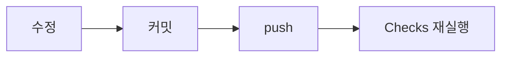

<div class="pt-8 text-xl opacity-75">
같은 PR에서 새 커밋이 올라오면 CI가 다시 돕니다.
</div>

<!--
CI 실패는 끝이 아니라 피드백입니다.

로그를 보고 원인을 고친 뒤 commit하고 같은 branch에 push하면, 같은 PR에서 Checks가 다시 실행됩니다.

이 반복이 짧을수록 작성자도 리뷰어도 훨씬 빠르게 판단할 수 있습니다.
-->

---

# 필수 검사: merge 앞 안전장치

<div class="text-2xl leading-relaxed pt-4">
required checks를 켜면<br>
정해진 CI가 통과하기 전에는 merge할 수 없습니다.
</div>

<div class="pt-6 opacity-75">
건강한 <code>main</code>을 사람의 기억이 아니라 저장소 규칙으로 지킵니다.
</div>

<!--
SECTION 08의 결론입니다.

CI 결과를 보기만 해도 도움이 되지만, 팀에서는 required checks로 연결할 때 효과가 커집니다. 정해진 검사가 통과하기 전에는 merge 버튼이 막히기 때문입니다.

이렇게 하면 건강한 main을 사람의 기억이나 선의에만 맡기지 않고 저장소 규칙으로 지킬 수 있습니다.

다음 섹션에서는 이 자동 검사 기준선 위에서 사람이 무엇을 리뷰해야 하는지로 넘어갑니다.
-->

---
layout: center
---

<div class="text-sm opacity-60 font-mono pb-2">SECTION 09</div>

# 코드 리뷰는 CI 위에서 판단한다

<div class="opacity-75 pb-8 -mt-1">기계가 확인할 수 있는 것과 사람이 판단해야 하는 것을 나누기</div>

<Session3Toc :current="9" class="max-w-2xl" />

<!--
CI가 통과했다고 좋은 코드가 되는 것은 아닙니다.

이 섹션은 자동 검사가 기준선을 만들고, 리뷰어는 의도와 설계와 유지보수성을 판단한다는 메시지로 이어갑니다.
-->

---

# 초록 체크는 시작점일 뿐

<div class="text-3xl leading-relaxed pt-6">
PR Checks가 통과하면<br>
반복 검사의 기준선은 넘은 것입니다.
</div>

<div class="pt-6 text-xl opacity-75">
그 다음 질문은 "이 변경이 좋은 선택인가?"입니다.
</div>

<!--
SECTION 08에서 PR Checks를 만들고 읽는 법을 봤습니다.

초록 체크는 빌드, 테스트, 포맷 같은 자동 검사의 기준선을 통과했다는 뜻입니다. 하지만 그 자체가 좋은 설계, 좋은 사용자 경험, 낮은 운영 위험을 보장하지는 않습니다.

그래서 코드 리뷰는 CI 결과 위에서 시작합니다. 기계가 반복 검사를 맡고, 사람은 판단이 필요한 질문에 집중합니다.
-->

---

# 기계 검사 vs 사람 리뷰

| 기계가 잘 보는 것 | 사람이 봐야 하는 것 |
|---|---|
| 빌드가 되는가 | 왜 이 변경이 필요한가 |
| 테스트가 통과하는가 | 설계가 단순한가 |
| 타입과 규칙을 지켰는가 | 유지보수하기 쉬운가 |
| 명령이 재현되는가 | 사용자 영향과 위험은 어떤가 |

<!--
여기서 CI와 코드 리뷰의 경계를 명확히 나눕니다.

기계 검사는 정해진 명령을 빠르고 반복 가능하게 실행하는 데 강합니다. 그래서 빌드, 테스트, 타입, 포맷 같은 기준을 맡깁니다.

사람 리뷰는 의도, 설계, 유지보수성, 사용자 영향, 위험처럼 맥락이 필요한 판단을 다룹니다. 좋은 팀은 둘 중 하나만 믿지 않고 둘을 연결해서 씁니다.
-->

---

# 좋은 리뷰 요청: 맥락 먼저

```markdown
## 변경 내용
- 회원가입 폼의 이메일 검증을 서버 응답 기준으로 맞춤

## 확인 방법
- `pnpm test`
- 잘못된 이메일로 가입 시 오류 문구 확인

## 집중해서 볼 부분
- 오류 문구와 기존 폼 흐름이 자연스러운지
```

<!--
좋은 리뷰 요청은 리뷰어가 코드를 읽기 전에 판단 기준을 잡게 해 줍니다.

무엇을 바꿨는지, 어떻게 확인했는지, 어디를 집중해서 봐야 하는지를 짧게 적으면 리뷰어가 되묻는 시간이 줄어듭니다.

PR Checks는 확인 명령의 결과를 보여 주고, PR 설명은 그 결과를 어떤 맥락에서 봐야 하는지 알려 줍니다.
-->

---

# 좋은 리뷰 코멘트: 행동 제안

```markdown
이 조건문은 결제 실패와 네트워크 실패를 함께 처리하고 있어요.
사용자에게 보여줄 메시지가 다르니,
`isNetworkError`를 먼저 분리하면 어떨까요?
```

<div class="pt-5 opacity-75">
비난보다 근거, 취향보다 영향, 지적보다 다음 행동이 중요합니다.
</div>

<!--
좋은 리뷰 코멘트는 "별로예요"에서 끝나지 않습니다.

어떤 문제가 있고, 왜 중요한지, 무엇을 바꾸면 좋을지 제안합니다. 그래야 작성자가 방어적으로 반응하기보다 다음 커밋으로 이어갈 수 있습니다.

코드 리뷰는 사람 사이의 대화이기 때문에 표현도 품질의 일부입니다.
-->

---

# 리뷰는 짧은 반복으로 끝낸다

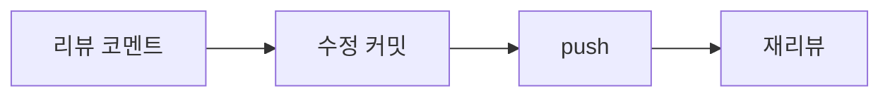

<div class="pt-8 text-xl opacity-75">
새 커밋이 올라오면 PR Checks도 다시 실행됩니다.
</div>

<!--
리뷰 코멘트를 받으면 같은 브랜치에서 수정하고 commit한 뒤 push합니다.

그러면 같은 PR에 새 커밋이 쌓이고, SECTION 08에서 본 PR Checks가 다시 실행됩니다. 리뷰어는 바뀐 코드와 새 검사 결과를 함께 보고 다시 판단합니다.

이 흐름이 짧을수록 대화가 선명하고 수정 비용도 낮아집니다.
-->

---

# 리뷰어: 실패한 체크 먼저

<div class="text-2xl leading-relaxed pt-5">
빨간 체크가 남아 있으면<br>
설계 토론 전에 원인을 좁힙니다.
</div>

```text
PR Checks 실패
-> 실패한 job 확인
-> 실패한 step과 로그 확인
-> 수정 후 다시 push
```

<!--
리뷰와 CI는 따로 놀지 않습니다.

PR Checks가 실패한 상태라면 리뷰어는 먼저 어떤 검사가 실패했는지 확인해야 합니다. 빌드가 깨진 상태에서 세부 설계 토론을 깊게 하면 대화가 흩어질 수 있습니다.

반대로 Checks가 통과한 뒤에는 사람이 봐야 하는 의도, 설계, 유지보수성, 사용자 영향, 위험에 집중할 수 있습니다.
-->

---

# 병합 판단: 두 신호를 함께

<div class="grid grid-cols-2 gap-6 pt-6">
  <div class="s3-card s3-card--emerald p-5">
    <div class="font-mono text-sm opacity-60 pb-2">기계</div>
    <div class="text-2xl font-bold">Checks 통과</div>
    <div class="opacity-70 pt-3">반복 기준선</div>
  </div>
  <div class="s3-card s3-card--amber p-5">
    <div class="font-mono text-sm opacity-60 pb-2">사람</div>
    <div class="text-2xl font-bold">리뷰 승인</div>
    <div class="opacity-70 pt-3">맥락 판단</div>
  </div>
</div>

<div class="pt-6 opacity-75">
좋은 PR은 자동 검사와 사람 판단이 같은 화면에 남습니다.
</div>

<!--
SECTION 09의 결론입니다.

병합 판단은 초록 체크 하나나 승인 하나만으로 끝나지 않습니다. 자동 검사는 반복 가능한 기준선을 만들고, 사람 리뷰는 이 변경이 제품과 코드베이스에 맞는지 판단합니다.

이제 다음 섹션에서는 merge 이후의 질문, 즉 어떤 변경을 언제 릴리스하거나 배포할지로 넘어갑니다.
-->

---
layout: center
---

<div class="text-sm opacity-60 font-mono pb-2">SECTION 10</div>

# CD와 릴리스: 태그로 회수하기

<div class="opacity-75 pb-8 -mt-1">배포 자동화와 tag 기반 릴리스 흐름으로 Git 복습 회수</div>

<Session3Toc :current="10" class="max-w-2xl" />

<!--
후반부에서는 CD와 릴리스를 간단히 다룹니다.

SECTION 01에서 다룬 tag가 여기서 다시 의미를 얻도록 연결합니다.
-->

---

# CD: 변경을 내보낼 준비

<div class="text-3xl leading-relaxed pt-6">
CI가 "합쳐도 되는가"를 묻는다면,<br>
CD는 "내보낼 수 있는가"를 묻습니다.
</div>

<div class="pt-6 opacity-75">
오늘은 배포 구현보다 릴리스 기준을 잡는 관점만 봅니다.
</div>

<!--
CD를 깊은 배포 구현으로 들어가지 않고 개념으로 정리합니다.

CI는 PR 단계에서 합쳐도 되는지 확인하는 자동 피드백입니다. CD는 합쳐진 변경을 사용자에게 내보낼 수 있는 상태로 유지하고, 필요한 순간 릴리스나 배포로 연결하는 흐름입니다.

오늘 목표는 배포 서버를 만드는 것이 아니라 릴리스 기준점과 자동화 트리거를 이해하는 것입니다.
-->

---

# 릴리스: 어느 커밋을 냈는가

<div class="text-2xl leading-relaxed pt-5">
배포 파일, 릴리스 노트, 사용자 공지는<br>
결국 특정 커밋을 기준으로 묶입니다.
</div>

<div class="pt-6 opacity-75">
그래서 릴리스에는 다시 찾을 수 있는 고정 기준점이 필요합니다.
</div>

<!--
릴리스는 단순히 서버에 파일을 올리는 순간만 뜻하지 않습니다.

어느 커밋이 사용자에게 나갔는지, 어떤 변경이 포함됐는지, 문제가 생기면 어디까지 되돌아봐야 하는지를 남기는 기록입니다.

그래서 움직이는 브랜치 이름만으로는 부족하고, 고정된 기준점이 필요합니다.
-->

---

# tag: 릴리스의 고정 이름표

<div class="text-3xl leading-relaxed pt-5">
<code>v1.2.0</code>은 특정 커밋을 가리키는<br>
움직이지 않는 릴리스 라벨입니다.
</div>

```bash
git tag v1.2.0
git push origin v1.2.0
```

<div class="pt-4 opacity-75">
같은 tag 이름은 저장소 안에 두 번 만들 수 없습니다.
</div>

<!--
SECTION 01의 tag 내용을 다시 회수합니다.

tag는 브랜치처럼 계속 움직이는 이름이 아니라 특정 커밋에 붙는 고정 이름표입니다. 그리고 같은 저장소 안에서 같은 tag 이름은 중복해서 만들 수 없습니다.

이 성질 때문에 v1.2.0이라는 이름을 보면 팀은 같은 커밋을 떠올릴 수 있고, 자동화도 같은 기준점에서 릴리스를 만들 수 있습니다.
-->

---

# tag push: 릴리스 자동화 시작

```yaml
name: Release

on:
  push:
    tags:
      - "v*"

jobs:
  release:
    runs-on: ubuntu-latest
    steps:
      - uses: actions/checkout@v4
      - run: pnpm build
```

<!--
tag push를 자동화 트리거로 쓰는 간단한 예입니다.

v로 시작하는 tag가 push되면 release workflow가 실행됩니다. 실제 프로젝트에서는 여기서 빌드 산출물을 업로드하거나, 배포 도구를 호출하거나, 릴리스 노트를 만들 수 있습니다.

오늘은 구현 세부사항보다 "tag가 고정된 릴리스 기준점이고, tag push가 자동화 시작 신호가 될 수 있다"는 연결만 잡습니다.
-->

---

# 릴리스 전 점검은 최소로

<div class="grid grid-cols-2 gap-6 pt-6">
  <div class="s3-card s3-card--emerald p-5">
    <div class="font-bold text-xl">확인</div>
    <div class="opacity-70 pt-3">Checks 통과, 리뷰 승인, 변경 범위</div>
  </div>
  <div class="s3-card s3-card--violet p-5">
    <div class="font-bold text-xl">기록</div>
    <div class="opacity-70 pt-3">tag, 릴리스 노트, 되돌릴 기준</div>
  </div>
</div>

<div class="pt-6 opacity-75">
작은 팀일수록 단순한 기준을 꾸준히 지키는 편이 낫습니다.
</div>

<!--
릴리스 체크리스트를 너무 복잡하게 만들 필요는 없습니다.

우선 PR Checks가 통과했는지, 리뷰가 끝났는지, 이번 릴리스에 들어갈 변경 범위가 맞는지 확인합니다. 그리고 tag와 릴리스 노트처럼 나중에 다시 볼 기록을 남깁니다.

중요한 것은 멋진 배포 시스템보다 같은 기준을 반복하는 습관입니다.
-->

---

# CD는 끝이 아니라 다음 루프

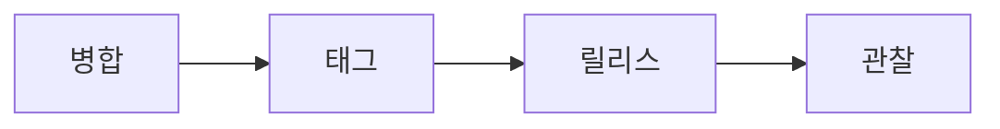

<div class="pt-8 text-xl opacity-75">
릴리스 후의 발견은 다음 Issue와 PR로 돌아옵니다.
</div>

<!--
SECTION 10의 결론입니다.

CD와 릴리스는 Git 흐름의 마지막 점이 아니라 다음 피드백 루프의 시작입니다. 릴리스하고 관찰한 뒤, 발견한 문제나 개선점은 다시 Issue와 PR로 돌아옵니다.

이제 다음 섹션에서는 여러 작업을 동시에 다루기 위한 작업 공간 분리, worktree로 넘어갑니다.
-->

---
layout: center
---

<div class="text-sm opacity-60 font-mono pb-2">SECTION 11</div>

# worktree로 작업 공간 분리하기

<div class="opacity-75 pb-8 -mt-1">한 저장소에서 여러 브랜치를 동시에 안전하게 실험하기</div>

<Session3Toc :current="11" class="max-w-2xl" />

<!--
worktree는 고급 명령어 지도에서 이름만 지나치고, 여기서 별도 섹션으로 다룹니다.

4일차 오픈소스 기여와 AI 도구를 활용한 병렬 실험으로 넘어가는 다리입니다.
-->

---

# 브랜치는 이력, worktree는 폴더

<div class="grid grid-cols-2 gap-6 pt-6">
  <div class="s3-card s3-card--amber p-5">
    <div class="font-mono text-sm opacity-60 pb-2">branch</div>
    <div class="text-2xl font-bold">커밋 이력의 갈래</div>
    <div class="opacity-75 pt-3">어떤 변경 흐름을 만들지 나눕니다.</div>
  </div>
  <div class="s3-card s3-card--violet p-5">
    <div class="font-mono text-sm opacity-60 pb-2">worktree</div>
    <div class="text-2xl font-bold">작업 디렉터리의 갈래</div>
    <div class="opacity-75 pt-3">그 브랜치를 어느 폴더에서 열지 나눕니다.</div>
  </div>
</div>

<!--
가장 중요한 구분입니다.

브랜치는 커밋 이력을 나눕니다. feature/login, fix/button처럼 서로 다른 변경 흐름을 만들 때 씁니다.

worktree는 작업 디렉터리를 나눕니다. 같은 저장소의 다른 브랜치를 별도 폴더에서 동시에 열 수 있게 해줍니다.

즉 브랜치가 "무엇을 만들 것인가"의 갈래라면, worktree는 "어느 작업 공간에서 열 것인가"의 갈래입니다.
-->

---

# worktree: 한 저장소, 여러 작업 공간

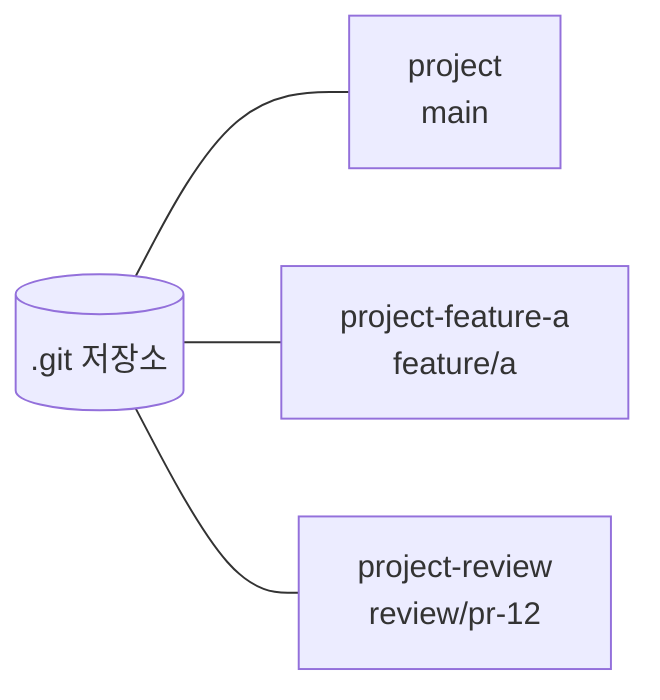

<div class="pt-5 opacity-75">
각 폴더는 서로 다른 브랜치를 체크아웃한 작업 디렉터리입니다.
</div>

<!--
worktree를 쓰면 저장소의 Git 데이터는 공유하면서, 실제 파일을 보는 폴더는 여러 개 둘 수 있습니다.

예를 들어 원래 project 폴더는 main을 열어두고, project-feature-a 폴더는 새 기능 브랜치를 열고, project-review 폴더는 리뷰할 브랜치를 열 수 있습니다.

같은 저장소를 여러 창으로 안정적으로 다루는 방식이라고 이해하면 됩니다.
-->

---

# 기본 명령 세 개면 충분

```bash
git worktree add ../project-feature-a feature/a
git worktree list
git worktree remove ../project-feature-a
```

<div class="pt-5 opacity-75">
추가하고, 목록을 보고, 끝난 작업 공간을 지웁니다.
</div>

<!--
수업에서는 세 명령만 먼저 잡으면 충분합니다.

add는 새 작업 폴더를 만듭니다. 뒤의 feature/a는 그 폴더에서 열 브랜치입니다.

list는 현재 연결된 worktree 목록을 보여줍니다.

remove는 작업이 끝난 폴더를 Git 관점에서도 정리합니다. 그냥 폴더만 지우는 습관보다 worktree remove를 쓰는 편이 안전합니다.
-->

---

# 반복 clone보다 가볍다

<div class="grid grid-cols-2 gap-6 pt-6">
  <div class="s3-card s3-card--sky p-5">
    <div class="font-bold text-xl">반복 clone</div>
    <div class="opacity-75 pt-3">원격 저장소를 폴더마다 다시 받습니다.</div>
    <div class="opacity-60 pt-3">remote, hook, 설정이 흩어지기 쉽습니다.</div>
  </div>
  <div class="s3-card s3-card--emerald p-5">
    <div class="font-bold text-xl">worktree</div>
    <div class="opacity-75 pt-3">하나의 저장소 데이터에 폴더를 더합니다.</div>
    <div class="opacity-60 pt-3">브랜치 작업 공간만 분리합니다.</div>
  </div>
</div>

<!--
여러 폴더가 필요하다고 해서 매번 clone할 수도 있습니다. 하지만 그러면 같은 저장소를 여러 벌로 받게 되고, remote 설정이나 로컬 설정이 폴더마다 흩어질 수 있습니다.

worktree는 저장소 데이터는 한 벌로 공유하고, 작업 디렉터리만 여러 개 둡니다.

그래서 "같은 프로젝트의 여러 브랜치를 동시에 열고 싶다"는 목적에는 반복 clone보다 목적이 분명합니다.
-->

---

# worktree에는 생활 규칙이 필요

<v-clicks>

- 같은 브랜치를 두 worktree에서 동시에 열 수 없습니다.
- 폴더마다 의존성 설치가 다시 필요할 수 있습니다.
- 개발 서버 포트가 서로 충돌할 수 있습니다.
- 끝난 작업 공간은 `git worktree remove`로 정리합니다.

</v-clicks>

<!--
worktree는 편하지만 작업 공간이 늘어나는 만큼 생활 규칙도 필요합니다.

Git은 같은 브랜치를 두 worktree에서 동시에 체크아웃하지 못하게 막습니다. 그래서 지금 어느 브랜치가 어느 폴더에 열려 있는지 확인하는 습관이 필요합니다.

또 Node 프로젝트라면 폴더마다 node_modules가 필요할 수 있고, 개발 서버를 여러 개 켜면 포트가 충돌할 수 있습니다.

마지막으로 끝난 실험 폴더는 그냥 방치하지 말고 worktree remove로 정리합니다.
-->

---

# AI 병렬 작업의 강점: 격리

<div class="grid grid-cols-3 gap-4 pt-6">
  <div class="s3-card s3-card--amber p-4">
    <div class="font-mono text-sm opacity-60 pb-2">agent A</div>
    <div class="font-bold text-xl">UI 개선안</div>
    <div class="opacity-70 pt-2">별도 폴더에서 작업</div>
  </div>
  <div class="s3-card s3-card--violet p-4">
    <div class="font-mono text-sm opacity-60 pb-2">agent B</div>
    <div class="font-bold text-xl">리팩터링안</div>
    <div class="opacity-70 pt-2">별도 폴더에서 작업</div>
  </div>
  <div class="s3-card s3-card--emerald p-4">
    <div class="font-mono text-sm opacity-60 pb-2">human</div>
    <div class="font-bold text-xl">비교와 선택</div>
    <div class="opacity-70 pt-2">검토 후 채택</div>
  </div>
</div>

<!--
AI 도구가 마법처럼 좋은 코드를 만들어서가 아닙니다.

강점은 격리입니다. 서로 다른 아이디어를 서로 다른 작업 공간에서 만들게 하면, 같은 파일을 동시에 건드려도 현재 작업 디렉터리가 뒤섞이지 않습니다.

사람은 결과를 비교하고, 테스트하고, 리뷰해서 채택할 것을 고릅니다.
-->

---

# 안전한 실험은 버리기 쉬워야 한다

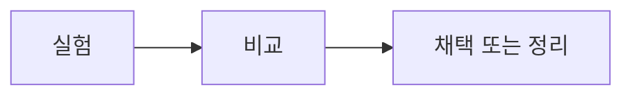

<div class="pt-8 text-xl opacity-75">
worktree는 실험을 작게 만들고, 비교하고, 정리하기 쉽게 합니다.
</div>

<!--
AI 병렬 작업의 핵심은 많이 맡기는 것이 아니라 쉽게 비교하고 쉽게 버릴 수 있게 만드는 것입니다.

한 worktree에서는 구현 A를 만들고, 다른 worktree에서는 구현 B를 만든 뒤 빌드와 리뷰 기준으로 비교할 수 있습니다.

채택하지 않는 쪽은 worktree remove로 정리하면 됩니다. 이 습관이 있으면 실험이 메인 작업 공간을 오염시키는 위험이 줄어듭니다.
-->

---
layout: center
---

<div class="text-sm opacity-60 font-mono pb-2">SECTION 12</div>

# 4일차와 AI 병렬 실험으로 연결하기

<div class="opacity-75 pb-8 -mt-1">오늘 만든 안전장치 위에서 더 큰 기여와 실험으로 넘어가기</div>

<Session3Toc :current="12" class="max-w-2xl" />

<!--
3일차의 끝은 4일차 예고입니다.

되돌리기, 저장소 규칙, 자동 검사, 리뷰, worktree를 모두 연결해 "이제 더 큰 작업을 안전하게 해볼 수 있다"는 상태로 마무리합니다.
-->

---

# 오늘의 안전장치는 4일차 기본 장비

<div class="grid grid-cols-3 gap-4 pt-6">
  <div class="s3-card s3-card--amber p-4">
    <div class="font-bold text-xl">되돌리기</div>
    <div class="opacity-70 pt-2">실수해도 복구 기준을 압니다.</div>
  </div>
  <div class="s3-card s3-card--violet p-4">
    <div class="font-bold text-xl">검사와 리뷰</div>
    <div class="opacity-70 pt-2">합치기 전 기준을 세웁니다.</div>
  </div>
  <div class="s3-card s3-card--emerald p-4">
    <div class="font-bold text-xl">작업 공간 분리</div>
    <div class="opacity-70 pt-2">여러 시도를 안전하게 나눕니다.</div>
  </div>
</div>

<!--
오늘 배운 내용은 각각 따로 떨어진 명령어가 아닙니다.

되돌리기는 실수를 복구하는 기준이고, CI와 리뷰는 합치기 전의 기준이며, worktree는 여러 시도를 안전하게 나누는 방법입니다.

이 세 가지가 있어야 4일차에서 더 큰 저장소, 남의 코드, 오픈소스 기여를 덜 불안하게 다룰 수 있습니다.
-->

---

# 남의 저장소에서도 같은 루프

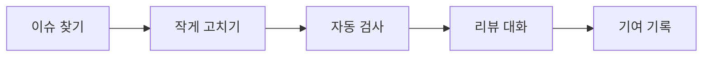

<div class="pt-5 opacity-75">
오픈소스 기여도 결국 작은 변경을 안전하게 합치는 과정입니다.
</div>

<!--
4일차에는 오픈소스 기여 흐름으로 넘어갑니다.

새로운 것은 저장소의 주인이 내가 아닐 수 있다는 점입니다. 하지만 기본 루프는 같습니다.

이슈를 찾고, 작게 고치고, 자동 검사를 통과시키고, 리뷰 대화를 거쳐서 기여 기록을 남깁니다.
-->

---

# AI 병렬 실험: 선택 도구

<div class="text-3xl leading-relaxed pt-5">
유용한 이유는 <span class="font-bold text-amber-300">분리, 비교, 정리</span>가 쉬워지기 때문입니다.
</div>

<div class="pt-6 opacity-75">
결정은 자동화가 아니라 사람의 리뷰와 기준으로 합니다.
</div>

<!--
AI 사용은 필수도 아니고 마법도 아닙니다.

다만 worktree처럼 작업 공간을 나누는 습관이 있으면 AI에게 여러 후보를 만들게 하고, 사람이 빌드와 테스트와 리뷰로 비교한 뒤, 필요 없는 후보를 정리하기 쉬워집니다.

중요한 것은 AI가 대신 판단한다가 아니라, 사람이 더 안전하게 비교할 수 있는 환경을 만든다는 점입니다.
-->

---
layout: center
---

# 나누고, 검사하고, 합친다

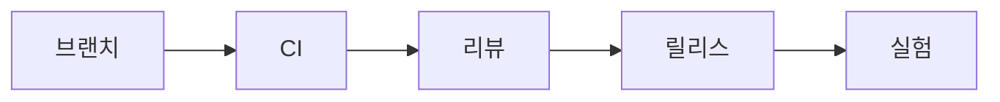

<div class="pt-8 text-xl opacity-75">
4일차에는 이 흐름으로 실제 기여를 다룹니다.
</div>

<!--
3일차의 마지막 문장입니다.

안전하게 나누고, 자동으로 검사하고, 사람이 리뷰하고, 릴리스 기준을 남기고, 다시 실험합니다.

4일차에는 이 흐름을 바탕으로 실제 오픈소스 기여와 포트폴리오로 이어지는 작업을 다룹니다.
-->
