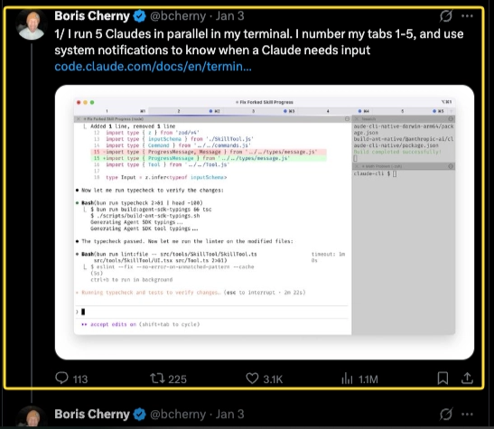

# ▸ 4회차: 오픈소스 기여와 포트폴리오

세상의 코드에 기여하고 내 것으로 남기기

<div class="pt-8 font-mono text-sm opacity-70">
$ gh pr create
</div>

<!--
4회차를 시작하겠습니다. 오늘은 실제 오픈소스 프로젝트에 기여해 보고 여러분의 GitHub 저장소와 프로필을 포트폴리오로 완성합니다. 수업이 끝나면 보여줄 수 있는 실물이 남는 날입니다.
-->

---

# 코드 리뷰는 미래의 유지보수자를 돕습니다

<div class="text-xl opacity-75 -mt-2 pb-4">
버그를 찾는 일만큼, 다른 사람이 코드를 이해할 수 있는지 확인합니다
</div>

```mermaid {scale: 0.48, theme: 'base', themeVariables: {primaryColor: '#27272a', primaryTextColor: '#ffffff', primaryBorderColor: '#f5a524', lineColor: '#f5a524', fontSize: '15px'}}
flowchart LR
  A[작성자 코드] --> B[리뷰어가 이해]
  B --> C[미래의 유지보수]
  A --> D[테스트 · 정적 분석 · 실행 검증]
  D --> E[정확성 확인]
```

<v-clicks>

- **미래의 팀원을 대신합니다**: 리뷰어가 막히는 지점은 다음 팀원도 막힐 수 있습니다
- **이해되지 않는 부분을 표시합니다**: 구조·이름·설명을 지금 개선합니다
- **검증을 나눠 맡습니다**: 정확성은 테스트·정적 분석·실행 검증으로 확인합니다

</v-clicks>

<div v-click class="pt-5 text-lg">
리뷰어의 첫 과제는 <span style="color: var(--lane-main)">코드를 이해해 보는 것</span>입니다
</div>

<!--
3일차에는 코드 리뷰가 버그가 없는지 증명하는 절차만은 아니라고 배웠습니다.

리뷰어는 미래의 유지보수자를 대신합니다. 코드를 따라가다가 이해되지 않는 부분이 있다면, 작성자의 맥락이 남아 있는 지금 구조와 이름과 설명을 개선하는 편이 좋습니다.

버그는 리뷰 과정에서 발견할 수 있지만 리뷰만으로 정확성을 보증할 수는 없습니다. 테스트와 정적 분석과 실행 검증이 반복 검사를 맡고, 리뷰어는 의도와 유지보수성을 살핍니다.
-->

---

# 오늘 배울 것

<v-clicks>

- **작업 공간 분리**: worktree로 브랜치마다 폴더 만들기
- **gh CLI**: 터미널에서 PR·이슈, 코딩 에이전트로 자동화
- **오픈소스 기여**: 이슈 찾기부터 첫 기여 PR까지
- **포트폴리오 저장소**: README, 커밋 히스토리, CI 배지 다듬기
- **GitHub 프로필**: pinned repo와 프로필 README 완성

</v-clicks>

<!--
오늘은 worktree로 작업 공간을 나누는 법부터 익힙니다.

그다음 이슈를 고른 뒤 별도 작업 공간에서 수정하고 PR로 기여하는 흐름을 연결합니다. 마지막에는 저장소와 GitHub 프로필을 포트폴리오 관점에서 다듬습니다.
-->

---

# 여러 작업이 동시에 돌아갑니다

<div class="text-xl opacity-75 -mt-2 pb-3">
탭과 터미널만 늘어나면, 무엇이 어디서 바뀌는지 놓치기 쉽습니다
</div>

<div class="grid grid-cols-2 gap-5 items-start">
  <div>
    <div class="text-sm font-bold pb-2" style="color: var(--lane-main)">여러 에이전트를 병렬로 실행</div>
    
  </div>
  <div>
    <div class="text-sm font-bold pb-2" style="color: var(--lane-main)">작업 상태를 눈에 보이게 관리</div>
    <video class="h-44 w-full rounded-lg border border-white/15 object-contain" controls autoplay muted loop playsinline preload="metadata" aria-label="여러 코딩 에이전트의 상태를 시각화한 영상">
      <source src="./public/s4/worktree-2.mov" type="video/quicktime">
    </video>
  </div>
</div>

<div class="pt-4 text-lg">
이제 각 작업에 <span style="color: var(--lane-main)">브랜치와 작업 폴더</span>를 하나씩 연결해 보겠습니다
</div>

<!--
요즘은 여러 AI 코딩 에이전트와 터미널 작업을 동시에 실행하는 일이 자연스러워졌습니다.

첫 사례처럼 탭을 여러 개 열 수 있고, 두 번째 사례처럼 작업 상태를 시각화할 수도 있습니다. 하지만 각 작업이 어느 브랜치에서 어떤 파일을 바꾸는지까지 분명하게 관리하려면 작업 공간 자체도 나누는 편이 좋습니다.

이제부터 Git의 worktree로 브랜치마다 독립된 작업 폴더를 만드는 방법을 살펴보겠습니다.
-->

---
layout: center
---

# 작업 공간부터 나눕니다

<div class="text-xl opacity-75 -mt-1 pb-6">
4일차 첫 도구: <code>git worktree</code>
</div>

<div class="text-2xl leading-relaxed">
새 작업을 시작할 때<br>
<span style="color: var(--lane-main)" class="font-bold">브랜치와 폴더를 함께 분리</span>합니다
</div>

<!--
3일차에는 worktree의 개념과 장점을 살펴봤습니다.

4일차에는 실제로 명령을 실행하면 무엇이 생기고 어느 폴더에서 어떻게 작업하며 끝난 뒤 무엇을 정리해야 하는지 차례대로 확인합니다.
-->

---

# 브랜치 전환만으로는 비교가 어렵습니다

<div class="grid grid-cols-2 gap-5 pt-5">
  <div class="rounded-lg border border-rose-300/40 p-5">
    <div class="font-mono text-sm opacity-60 pb-2">한 폴더만 사용할 때</div>
    <div class="text-xl font-bold">계속 브랜치를 바꿉니다</div>
    <div class="pt-3 opacity-75 leading-relaxed">
      미완성 변경을 정리하고<br>
      서버를 끄고 다시 켜야 합니다
    </div>
  </div>
  <div class="rounded-lg border border-emerald-300/40 p-5">
    <div class="font-mono text-sm opacity-60 pb-2">폴더를 나눌 때</div>
    <div class="text-xl font-bold">두 브랜치를 함께 엽니다</div>
    <div class="pt-3 opacity-75 leading-relaxed">
      작업을 그대로 둔 채<br>
      결과를 바로 비교할 수 있습니다
    </div>
  </div>
</div>

<!--
브랜치만으로도 이력은 충분히 나눌 수 있습니다. 문제는 작업 디렉터리가 하나라는 점입니다.

한 폴더에서 main과 feature 브랜치를 오가려면 수정 중인 파일을 커밋하거나 stash해야 할 때가 있습니다. 실행 중인 개발 서버도 같은 폴더를 바라봅니다.

worktree를 사용하면 브랜치마다 폴더를 열어 두고 전환 없이 오갈 수 있습니다.
-->

---

# 브랜치는 이력을 나누고, worktree는 폴더를 나눕니다

<div class="grid grid-cols-2 gap-5 pt-5">
  <div class="rounded-lg border border-amber-300/40 p-5">
    <div class="font-mono text-sm opacity-60 pb-2">branch</div>
    <div class="text-2xl font-bold">커밋 이력의 갈래</div>
    <div class="pt-3 opacity-75">무엇을 만들지 나눕니다</div>
    <div class="pt-4 font-mono text-sm">main / feature/profile</div>
  </div>
  <div class="rounded-lg border border-violet-300/40 p-5">
    <div class="font-mono text-sm opacity-60 pb-2">worktree</div>
    <div class="text-2xl font-bold">작업 폴더의 갈래</div>
    <div class="pt-3 opacity-75">어디에서 열지 나눕니다</div>
    <div class="pt-4 font-mono text-sm">project / project-profile</div>
  </div>
</div>

<div class="pt-5 text-lg opacity-80">
브랜치가 먼저 있고 worktree가 그 브랜치를 별도 폴더에 펼칩니다.
</div>

<!--
둘의 역할을 섞으면 명령도 헷갈립니다.

브랜치는 특정 커밋을 가리키는 이름 붙은 포인터입니다. worktree는 그 브랜치의 파일을 별도 폴더에 열어 둡니다.

Git 저장소 데이터는 함께 쓰지만 현재 브랜치와 수정 중인 파일은 폴더마다 따로 관리됩니다.
-->

---

# 시작할 때는 작업 폴더가 하나입니다

```mermaid {scale: 0.46, theme: 'base', themeVariables: {primaryColor: '#27272a', primaryTextColor: '#ffffff', primaryBorderColor: '#f5a524', lineColor: '#f5a524', fontSize: '15px'}}
flowchart LR
  G[(Git 저장소 데이터)] --- M[git-github-101<br/>main]
```

<div class="grid grid-cols-2 gap-5 -mt-2">
  <div class="rounded-lg border border-gray-400/30 p-4">
    <div class="font-mono text-sm opacity-60">현재 폴더</div>
    <div class="font-mono pt-2">~/workspace/git-github-101</div>
  </div>
  <div class="rounded-lg border border-gray-400/30 p-4">
    <div class="font-mono text-sm opacity-60">현재 브랜치</div>
    <div class="font-mono pt-2">main</div>
  </div>
</div>

<!--
처음에는 평소처럼 clone한 폴더 하나가 있고 이 폴더에서 main 브랜치를 열었다고 가정합니다.

지금은 Git 저장소와 작업 폴더가 하나씩 연결돼 있습니다.

main 폴더는 그대로 두고 feature/profile 브랜치를 열기 위한 두 번째 폴더를 옆에 만들겠습니다.
-->

---

# 새 브랜치와 폴더를 한 번에 만듭니다

```bash
git worktree add -b feature/profile ../git-github-101-profile main
```

<div class="grid grid-cols-4 gap-3 pt-5 text-center">
  <div class="rounded-lg border border-amber-300/40 p-3">
    <div class="font-mono text-sm font-bold">worktree add</div>
    <div class="text-sm opacity-70 pt-2">작업 폴더 추가</div>
  </div>
  <div class="rounded-lg border border-violet-300/40 p-3">
    <div class="font-mono text-sm font-bold">-b feature/profile</div>
    <div class="text-sm opacity-70 pt-2">새 브랜치 생성</div>
  </div>
  <div class="rounded-lg border border-sky-300/40 p-3">
    <div class="font-mono text-sm font-bold">../git-github-101-profile</div>
    <div class="text-sm opacity-70 pt-2">새 폴더 위치</div>
  </div>
  <div class="rounded-lg border border-emerald-300/40 p-3">
    <div class="font-mono text-sm font-bold">main</div>
    <div class="text-sm opacity-70 pt-2">시작 기준</div>
  </div>
</div>

<!--
이 명령은 새 브랜치와 작업 폴더를 함께 만듭니다.

add 다음에는 새 폴더의 경로를 적습니다. -b 뒤에는 새로 만들 브랜치 이름이 옵니다. 마지막 main은 브랜치를 시작할 기준입니다.

이미 존재하는 브랜치를 열 때는 -b 없이 `git worktree add 폴더경로 브랜치이름`을 사용합니다.
-->

---

# 실행하면 옆에 새 폴더가 생깁니다

<div class="font-mono text-xs opacity-60 pb-1">예시 출력</div>

```text
Preparing worktree (new branch 'feature/profile')
HEAD is now at a1b2c3d chore: start project
```

```mermaid {scale: 0.4, theme: 'base', themeVariables: {primaryColor: '#27272a', primaryTextColor: '#ffffff', primaryBorderColor: '#f5a524', lineColor: '#f5a524', fontSize: '14px'}}
flowchart LR
  G[(공유하는 Git 데이터)] --- M[git-github-101<br/>main]
  G --- F[git-github-101-profile<br/>feature/profile]
```

<div class="text-center text-sm opacity-75 -mt-5">
SHA와 커밋 메시지는 저장소마다 다르게 표시됩니다.
</div>

<!--
첫 줄에는 feature/profile 브랜치를 만들었다는 안내가 나옵니다. 다음 줄에는 새 폴더의 HEAD가 가리키는 커밋이 표시됩니다.

실행이 끝나면 원래 폴더와 같은 상위 폴더 아래에 git-github-101-profile이 생깁니다.

두 폴더는 Git 객체와 커밋 이력을 공유하지만 각각 main과 feature/profile을 체크아웃하고 있습니다.
-->

---

# Git은 연결된 작업 공간을 기억합니다

```bash
git worktree list
```

<div class="font-mono text-xs opacity-60 pt-3 pb-1">예시 출력</div>

<pre class="rounded-lg border border-gray-500/30 bg-black/30 p-4 text-[13px] leading-relaxed"><code>/work/git-github-101          a1b2c3d [main]
/work/git-github-101-profile  a1b2c3d [feature/profile]</code></pre>

<div class="grid grid-cols-3 gap-4 pt-4 text-sm">
  <div><span class="font-bold text-amber-300">경로</span><br><span class="opacity-70">어느 폴더인지</span></div>
  <div><span class="font-bold text-violet-300">커밋</span><br><span class="opacity-70">현재 HEAD가 어디인지</span></div>
  <div><span class="font-bold text-emerald-300">브랜치</span><br><span class="opacity-70">무엇을 열었는지</span></div>
</div>

<!--
git worktree list는 Git에 연결된 모든 작업 폴더를 보여 줍니다.

한 줄이 worktree 하나입니다. 왼쪽부터 폴더 경로, 현재 커밋의 짧은 SHA, 체크아웃한 브랜치 이름입니다.

실제 출력의 경로는 절대 경로로 표시됩니다. 슬라이드에서는 읽기 쉽도록 /work 아래의 예시 경로를 사용했습니다.
-->

---

# 두 폴더는 다른 브랜치를 보고 있습니다

<div class="grid grid-cols-2 gap-5 pt-4">
  <div>
    <div class="font-mono text-sm opacity-60 pb-2">원래 폴더</div>
    <pre class="rounded-lg border border-amber-300/40 bg-black/30 p-4 text-sm leading-relaxed"><code>$ cd ~/workspace/git-github-101
$ git branch --show-current
main</code></pre>
  </div>
  <div>
    <div class="font-mono text-sm opacity-60 pb-2">새 worktree</div>
    <pre class="rounded-lg border border-violet-300/40 bg-black/30 p-4 text-sm leading-relaxed"><code>$ cd ~/workspace/git-github-101-profile
$ git branch --show-current
feature/profile</code></pre>
  </div>
</div>

<div class="pt-5 text-lg opacity-80">
브랜치를 전환하지 않아도 두 작업 상태를 동시에 열어 둘 수 있습니다.
</div>

<!--
각 폴더에서 git branch --show-current를 실행하면 서로 다른 결과가 나옵니다.

원래 폴더는 계속 main을 보고 있고 새 worktree는 feature/profile을 보고 있습니다.

에디터도 폴더별로 하나씩 열 수 있습니다. main 화면과 새 기능 화면을 오가며 바로 비교할 수 있습니다.
-->

---

# 파일 변경도 폴더별로 나뉩니다

<div class="grid grid-cols-2 gap-5 pt-4">
  <div>
    <div class="font-mono text-sm opacity-60 pb-2">feature/profile에서 README 수정</div>
    <pre class="rounded-lg border border-violet-300/40 bg-black/30 p-4 text-sm leading-relaxed"><code>$ git status --short
 M README.md</code></pre>
  </div>
  <div>
    <div class="font-mono text-sm opacity-60 pb-2">main 폴더에서 확인</div>
    <pre class="rounded-lg border border-amber-300/40 bg-black/30 p-4 text-sm leading-relaxed"><code>$ git status --short
(출력 없음)</code></pre>
  </div>
</div>

<div class="pt-5 text-lg opacity-80">
커밋 데이터는 공유하지만 작업 파일과 스테이징 영역은 폴더마다 따로 관리합니다.
</div>

<!--
feature/profile 폴더에서 README를 수정했다고 가정해 봅니다. 이 폴더의 status에는 수정 파일이 나타납니다.

main 폴더로 돌아가 같은 명령을 실행하면 아무것도 나오지 않습니다. main의 작업 파일은 바뀌지 않았기 때문입니다.

작업 디렉터리와 스테이징 영역은 worktree마다 따로 관리합니다. 한쪽의 미완성 변경이 다른 쪽의 작업 화면을 어지럽히지 않습니다.
-->

---

# 커밋과 PR은 평소와 같습니다

```bash
git add README.md
git commit -m "docs: 소개 문구 추가"
git push -u origin feature/profile
```

<div class="flex items-center justify-center gap-3 pt-6 text-lg">
  <div class="rounded-lg border border-violet-300/40 px-4 py-3">로컬 worktree</div>
  <div class="opacity-50">-></div>
  <div class="rounded-lg border border-sky-300/40 px-4 py-3">원격 브랜치</div>
  <div class="opacity-50">-></div>
  <div class="rounded-lg border border-emerald-300/40 px-4 py-3">Pull Request</div>
</div>

<div class="pt-5 text-center text-sm opacity-70">
worktree는 로컬 폴더만 추가합니다. push와 PR은 직접 진행합니다.
</div>

<!--
새 worktree 안에서도 add, commit, push는 평소와 완전히 같습니다.

worktree를 만들었다고 GitHub에 브랜치가 생기는 것은 아닙니다. push해야 원격 브랜치가 생기고 그다음 PR을 만들 수 있습니다.

worktree가 바꾸는 것은 협업 절차가 아니라 로컬 작업 공간입니다.
-->

---

# 작업이 끝나면 폴더부터 정리합니다

<div class="font-mono text-sm opacity-60 pt-2 pb-2">PR이 병합되고 변경 파일이 없는지 확인한 뒤</div>

<pre class="rounded-lg border border-gray-400/30 bg-black/30 p-3 text-[13px] leading-relaxed"><code>$ cd ~/workspace/git-github-101
$ git pull --ff-only
$ git worktree remove ../git-github-101-profile
$ git branch -d feature/profile
$ git worktree list</code></pre>

<div class="grid grid-cols-4 gap-3 pt-3 text-center text-sm">
  <div class="rounded-lg border border-gray-400/30 px-2 py-2">
    <span class="font-bold text-amber-300">1.</span> main 갱신
  </div>
  <div class="rounded-lg border border-gray-400/30 px-2 py-2">
    <span class="font-bold text-violet-300">2.</span> worktree 제거
  </div>
  <div class="rounded-lg border border-gray-400/30 px-2 py-2">
    <span class="font-bold text-sky-300">3.</span> 브랜치 제거
  </div>
  <div class="rounded-lg border border-gray-400/30 px-2 py-2">
    <span class="font-bold text-emerald-300">4.</span> 목록 재확인
  </div>
</div>

<div class="pt-3 text-xs opacity-70">
수정 파일이 남아 있으면 Git이 제거를 막습니다. <code>git status</code>로 확인한 뒤 정리합니다.
</div>

<!--
작업이 끝나면 폴더를 Finder나 rm으로 바로 지우지 말고 git worktree remove를 사용합니다. 그래야 Git의 연결 정보와 폴더가 함께 정리됩니다.

PR이 병합됐다면 pull --ff-only로 로컬 main을 갱신합니다. worktree를 제거한 뒤에는 branch -d로 로컬 브랜치를 지웁니다. -d는 병합되지 않은 커밋이 있으면 삭제를 거부하므로 초보자에게 더 안전합니다.

worktree list를 다시 실행해 원래 main 폴더만 남았는지 확인합니다.
-->

---

# worktree에서 자주 막히는 네 지점

<div class="grid grid-cols-2 gap-4 pt-4 text-base">
  <div class="rounded-lg border border-rose-300/40 p-4">
    <div class="font-bold">같은 브랜치를 또 열 수 없음</div>
    <div class="opacity-70 pt-2"><code>git worktree list</code>로 이미 열린 폴더를 찾습니다.</div>
  </div>
  <div class="rounded-lg border border-amber-300/40 p-4">
    <div class="font-bold">수정 파일이 있으면 제거되지 않음</div>
    <div class="opacity-70 pt-2"><code>git status</code>로 커밋하거나 버릴 내용을 먼저 판단합니다.</div>
  </div>
  <div class="rounded-lg border border-sky-300/40 p-4">
    <div class="font-bold">의존성은 폴더마다 필요할 수 있음</div>
    <div class="opacity-70 pt-2"><code>node_modules</code>처럼 추적하지 않는 파일은 공유되지 않습니다.</div>
  </div>
  <div class="rounded-lg border border-violet-300/40 p-4">
    <div class="font-bold">개발 서버 포트가 충돌할 수 있음</div>
    <div class="opacity-70 pt-2">두 서버를 함께 켤 때 서로 다른 포트를 사용합니다.</div>
  </div>
</div>

<!--
같은 브랜치는 두 worktree에서 동시에 열 수 없습니다. list로 어느 폴더에서 사용 중인지 찾습니다.

수정하거나 새로 만든 파일이 남아 있으면 remove가 실패합니다. --force부터 쓰지 말고 status로 보존할 작업인지 판단합니다.

node_modules와 빌드 결과처럼 Git이 추적하지 않는 파일은 새 폴더에 자동으로 생기지 않습니다. 필요한 설치를 다시 실행합니다.

개발 서버를 두 개 켜면 같은 포트를 쓰려다 충돌할 수 있습니다. 두 작업을 함께 실행할 때는 포트를 나눕니다.
-->

---

# Issue마다 작업 공간을 나눌 수 있습니다

<div class="flex items-center justify-center gap-1.5 pt-6 text-sm">
  <div class="shrink-0 whitespace-nowrap rounded-lg border border-amber-300/40 px-3 py-3 text-center">Issue 선택</div>
  <div class="opacity-50">-></div>
  <div class="shrink-0 whitespace-nowrap rounded-lg border border-violet-300/40 px-3 py-3 text-center">branch + worktree</div>
  <div class="opacity-50">-></div>
  <div class="shrink-0 whitespace-nowrap rounded-lg border border-sky-300/40 px-3 py-3 text-center">수정과 검사</div>
  <div class="opacity-50">-></div>
  <div class="shrink-0 whitespace-nowrap rounded-lg border border-emerald-300/40 px-3 py-3 text-center">push + PR</div>
  <div class="opacity-50">-></div>
  <div class="shrink-0 whitespace-nowrap rounded-lg border border-gray-400/40 px-3 py-3 text-center">정리</div>
</div>

<div class="pt-8 text-2xl leading-relaxed text-center">
한 기여가 한 폴더에 머물면<br>
<span style="color: var(--lane-main)" class="font-bold">여러 작업을 섞지 않고 끝까지 추적</span>할 수 있습니다.
</div>

<!--
worktree를 4일차 오픈소스 기여 흐름에 연결합니다.

기여할 Issue를 하나 고르고 그 Issue를 위한 브랜치와 worktree를 만듭니다. 해당 폴더에서만 수정하고 검사한 뒤 push와 PR을 진행합니다.

PR이 끝나면 worktree와 로컬 브랜치를 정리합니다. 이 루프를 기억한 상태에서 실제 오픈소스 기여 과정을 살펴보겠습니다.
-->

---
layout: center
---

<div class="text-sm opacity-60 font-mono pb-2">GITHUB CLI</div>

# gh: 터미널에서 다루는 GitHub

<div class="opacity-75 pb-6 -mt-1">방금 본 기여 루프의 push와 PR을 브라우저 대신 명령 한 줄로</div>

<div class="grid grid-cols-2 gap-6 max-w-3xl mx-auto">
  <div class="s3-card s3-card--violet p-5">
    <div class="font-mono text-sm opacity-60 pb-2">브라우저</div>
    <div class="text-xl font-bold">클릭 여러 번</div>
    <div class="opacity-75 pt-2">탭 열고 버튼 찾고 폼 채우기</div>
  </div>
  <div class="s3-card s3-card--amber p-5">
    <div class="font-mono text-sm opacity-60 pb-2">gh</div>
    <div class="text-xl font-bold">명령 한 줄</div>
    <div class="opacity-75 pt-2">터미널에서 그대로 이어서</div>
  </div>
</div>

<!--
worktree로 작업 공간을 나눴다면 그 작업을 GitHub에 올려 PR로 만들 차례입니다.

여기서 쓰는 게 gh, GitHub 공식 CLI입니다. 브라우저로 하던 PR 생성, 이슈 확인, 릴리스, Actions 상태 확인을 터미널에서 바로 합니다.

특히 코딩 에이전트와 함께 쓰면 자연어 지시만으로 이 명령들을 대신 실행하게 만들 수 있습니다.
-->

---

# 설치와 로그인은 한 번

```bash
brew install gh        # macOS (Windows: winget install GitHub.cli)
gh auth login          # 브라우저로 인증, 토큰은 로컬에 저장
gh auth status         # 연결 확인
```

<div class="pt-5 text-xl opacity-75">
인증은 처음 한 번만 하면 됩니다. 토큰은 내 컴퓨터에만 남습니다.
</div>

<!--
설치는 OS마다 다릅니다. macOS는 Homebrew, Windows는 winget, 리눅스는 apt나 dnf를 씁니다. 자세한 방법은 cli.github.com에 있습니다.

gh auth login을 한 번 실행하면 브라우저로 GitHub에 로그인하고 토큰이 내 컴퓨터에 저장됩니다. 이후 gh 명령은 이 인증을 그대로 씁니다.

코딩 에이전트도 이 인증을 함께 씁니다. 한 번 로그인해 두면 에이전트가 gh를 실행할 때 다시 인증하지 않아도 됩니다.
-->

---

# gh 기능 지도

<div class="grid grid-cols-3 gap-3 pt-4 text-left">
  <div class="s3-card s3-card--amber p-4">
    <div class="font-bold pb-1">인증·설정</div>
    <div class="font-mono text-xs opacity-80">auth · config · alias · extension</div>
    <div class="text-xs opacity-70 pt-2">로그인과 개인화</div>
  </div>
  <div class="s3-card s3-card--sky p-4">
    <div class="font-bold pb-1">저장소</div>
    <div class="font-mono text-xs opacity-80">repo · browse · search</div>
    <div class="text-xs opacity-70 pt-2">만들기·클론·포크·검색</div>
  </div>
  <div class="s3-card s3-card--violet p-4">
    <div class="font-bold pb-1">협업 PR·이슈</div>
    <div class="font-mono text-xs opacity-80">pr · issue · label · project</div>
    <div class="text-xs opacity-70 pt-2">리뷰와 이슈 트래킹</div>
  </div>
  <div class="s3-card s3-card--emerald p-4">
    <div class="font-bold pb-1">Actions·자동화</div>
    <div class="font-mono text-xs opacity-80">run · workflow · secret · cache</div>
    <div class="text-xs opacity-70 pt-2">CI 확인·트리거</div>
  </div>
  <div class="s3-card s3-card--rose p-4">
    <div class="font-bold pb-1">릴리스·공유</div>
    <div class="font-mono text-xs opacity-80">release · gist</div>
    <div class="text-xs opacity-70 pt-2">배포 기준점과 코드 조각</div>
  </div>
  <div class="s3-card s3-card--sky p-4">
    <div class="font-bold pb-1">고급</div>
    <div class="font-mono text-xs opacity-80">api · codespace · ssh-key · status</div>
    <div class="text-xs opacity-70 pt-2">원시 API·클라우드 환경</div>
  </div>
</div>

<div class="pt-5 opacity-75 text-center">외우지 말고 필요할 때 그룹만 떠올리면 됩니다.</div>

<!--
gh의 기능은 이렇게 그룹으로 묶어서 기억하는 게 좋습니다.

로그인은 auth, 저장소를 만들거나 포크할 때는 repo, PR과 이슈는 pr·issue, CI 실행 확인은 run·workflow, 릴리스는 release입니다.

전부 외울 필요는 없습니다. "이런 종류의 일은 gh로 되겠구나"만 떠올리면 나머지는 gh --help나 에이전트가 채워줍니다.
-->

---
layout: center
---

<div class="text-sm opacity-60 font-mono pb-2">실습</div>

# 실습: 에이전트에게 gh를 맡깁니다

<div class="opacity-75 pb-5 -mt-1">자연어로 지시하면 코딩 에이전트가 gh를 대신 실행합니다</div>

<div class="text-left max-w-2xl mx-auto pb-4">

- 각 실습은 **명령어 → 기대 결과 → 흔한 오류** 순서로 봅니다.
- Claude Code가 아니어도 gh를 실행할 수 있는 에이전트면 됩니다.
- 명령마다 승인을 묻지 않게 하려면 허용할 gh 명령을 미리 지정합니다.

</div>

```json
{ "permissions": { "allow": ["Bash(gh pr:*)", "Bash(gh issue:*)"] } }
```

<!--
gh 문법을 모두 외울 필요는 없습니다. 하고 싶은 일을 자연어로 말하면 에이전트가 알맞은 gh 명령으로 옮겨 실행합니다.

다만 에이전트가 셸 명령을 실행할 때마다 승인을 물으면 흐름이 끊깁니다. settings.json의 permissions.allow에 gh 관련 명령을 미리 등록하면 반복 승인 없이 진행됩니다.

세 가지 실습을 명령어·기대 결과·흔한 오류 순서로 보겠습니다.
-->

---

# 실습 ①: 브랜치 → PR 생성

```bash
# 에이전트에게: "docs 브랜치 만들고 README에 한 줄 추가한 뒤 main으로 PR 올려줘"
gh pr create --fill --base main
```

<div class="grid grid-cols-2 gap-4 pt-5">
  <div class="s3-card s3-card--emerald p-4">
    <div class="font-bold pb-1">기대 결과</div>
    <div class="text-sm opacity-80">PR이 생기고 URL이 출력됩니다.</div>
    <div class="font-mono text-xs opacity-70 pt-2">github.com/내계정/저장소/pull/1</div>
  </div>
  <div class="s3-card s3-card--rose p-4">
    <div class="font-bold pb-1">흔한 오류</div>
    <div class="text-sm opacity-80">커밋 없이 실행, 브랜치를 안 바꿈, 인증 만료</div>
    <div class="font-mono text-xs opacity-70 pt-2">→ 먼저 commit / gh auth login</div>
  </div>
</div>

<!--
브랜치에서 변경을 커밋했다면 PR을 만들 차례입니다.

브랜치를 만들고 변경을 커밋한 상태에서 gh pr create --fill을 실행하면, 커밋 메시지를 제목과 본문으로 채워 PR을 만듭니다. --base main은 어느 브랜치로 합칠지 정합니다.

흔한 오류는 대부분 순서 문제입니다. 커밋을 안 했거나, 아직 main에 있거나, 인증이 풀린 경우입니다. 에이전트에게 "먼저 커밋부터" 또는 "gh auth login 먼저"라고 안내합니다.
-->

---

# 실습 ②: PR 체크 읽기

```bash
# 에이전트에게: "방금 올린 PR의 CI 체크 상태 확인해줘"
gh pr checks          # 체크 목록과 통과 여부
gh run watch          # 진행 중인 실행을 실시간으로
```

<div class="grid grid-cols-2 gap-4 pt-5">
  <div class="s3-card s3-card--emerald p-4">
    <div class="font-bold pb-1">기대 결과</div>
    <div class="text-sm opacity-80">각 체크의 통과·실패 여부와 실패 로그 위치가 보입니다.</div>
  </div>
  <div class="s3-card s3-card--rose p-4">
    <div class="font-bold pb-1">흔한 오류</div>
    <div class="text-sm opacity-80">워크플로가 없어 "no checks reported", 또는 pending으로 대기</div>
  </div>
</div>

<!--
PR을 올렸으면 자동 검사가 어떻게 됐는지 봐야 합니다.

gh pr checks는 그 PR에 붙은 체크의 통과 여부를 한눈에 보여줍니다. gh run watch는 실행이 끝날 때까지 실시간으로 상태를 따라갑니다.

체크가 안 보이면 대개 저장소에 워크플로가 없어서입니다. 3일차에서 만든 CI 워크플로가 있어야 체크가 붙습니다. pending이면 잠시 기다리면 됩니다.
-->

---

# 실습 ③: 리뷰 코멘트 대응

```bash
# 에이전트에게: "이 PR에 달린 코멘트 보여주고, 요청대로 고쳐서 다시 push해줘"
gh pr view --comments   # 리뷰 코멘트 확인
# 수정 후
git push                # PR이 자동으로 업데이트됨
```

<div class="grid grid-cols-2 gap-4 pt-5">
  <div class="s3-card s3-card--emerald p-4">
    <div class="font-bold pb-1">기대 결과</div>
    <div class="text-sm opacity-80">코멘트 확인 → 수정 커밋 → PR 자동 업데이트 → 체크 재실행</div>
  </div>
  <div class="s3-card s3-card--rose p-4">
    <div class="font-bold pb-1">흔한 오류</div>
    <div class="text-sm opacity-80">브랜치가 어긋나 push 대상이 틀리거나, 체크 재실행을 기다려야 함</div>
  </div>
</div>

<!--
리뷰 코멘트가 달리면 내용을 읽고 고쳐 다시 push합니다.

gh pr view --comments로 코멘트를 확인하고 에이전트에게 요청대로 수정하게 한 뒤 push합니다. PR은 같은 브랜치를 계속 추적하므로 자동으로 갱신되고 체크도 다시 실행됩니다.

새 PR을 만들 필요는 없습니다. 같은 브랜치에 push하면 기존 PR이 갱신됩니다.
-->

---
layout: center
---

# 정리: 터미널에서 끝나는 협업 루프

<div class="text-left max-w-2xl mx-auto pt-2">

<v-clicks>

- 브라우저 왕복 없이 **PR·이슈·체크를 명령으로**
- 자연어 지시로 **에이전트가 gh를 대신 실행**
- **명령어·기대 결과·흔한 오류를 읽고 직접 판단**

</v-clicks>

</div>

<div class="pt-6 text-xl opacity-75 text-center">
worktree로 나눈 작업 공간 + gh로 만드는 PR = 오픈소스 기여의 실전 도구.
</div>

<!--
gh는 GitHub 작업을 터미널에서 처리하고 코딩 에이전트는 자연어 지시를 gh 명령으로 옮깁니다.

명령어보다 먼저 익힐 것은 결과와 오류를 읽는 법입니다. 그래야 에이전트가 무엇을 했는지 직접 판단할 수 있습니다.

worktree로 작업을 나누고 gh로 PR을 올리는 이 조합은 다음에 볼 실제 오픈소스 기여에서도 그대로 쓰입니다.
-->

---

<div class="text-sm opacity-60 font-mono pb-2">CLAUDE CODE</div>

# Claude Code는 어디서나 쓸 수 있습니다

<div class="text-xl opacity-75 -mt-1 pb-5">
가장 완전한 건 CLI, 나머지는 익숙한 환경에서 여는 창구입니다
</div>

<div class="grid grid-cols-3 gap-4">
  <div class="s3-card s3-card--amber p-4">
    <div class="font-mono text-xs opacity-60 pb-2">터미널 · CLI</div>
    <div class="font-bold pb-1">Claude Code CLI</div>
    <div class="text-sm opacity-75">터미널·스크립트·원격 서버.<br>가장 완전한 기능.</div>
  </div>
  <div class="s3-card s3-card--sky p-4">
    <div class="font-mono text-xs opacity-60 pb-2">에디터·데스크톱 · GUI</div>
    <div class="text-sm leading-relaxed">
      <div class="font-bold">VS Code · Cursor</div>
      <div class="opacity-70 pb-2">호환 에디터 확장</div>
      <div class="font-bold">JetBrains</div>
      <div class="opacity-70 pb-2">IntelliJ·PyCharm·WebStorm</div>
      <div class="font-bold">Claude Desktop</div>
      <div class="opacity-70">시각적 diff·병렬 세션</div>
    </div>
  </div>
  <div class="s3-card s3-card--violet p-4">
    <div class="font-mono text-xs opacity-60 pb-2">클라우드 · GUI</div>
    <div class="text-sm leading-relaxed">
      <div class="font-bold">웹 · claude.ai/code</div>
      <div class="opacity-70 pb-2">장시간·병렬 작업</div>
      <div class="font-bold">모바일 · iOS·Android</div>
      <div class="opacity-70">작업 시작·모니터링·원격 제어</div>
    </div>
  </div>
</div>

<div class="pt-5 text-center opacity-80">
익숙한 환경부터 시작하고, 익숙해지면 <span style="color: var(--lane-main)">CLI</span>로 넓히면 됩니다
</div>

<!--
gh 실습에서 "코딩 에이전트"라고 부른 그 도구가 Claude Code입니다. Claude Code는 한 곳에만 있지 않고, 여러 환경에서 같은 작업을 이어서 할 수 있습니다.

터미널의 CLI가 가장 완전합니다. 모든 기능을 쓸 수 있고 스크립트나 원격 서버에서도 돌릴 수 있습니다. (docs: code.claude.com/docs/en/overview)

익숙한 자리에서 쓰고 싶다면 에디터 통합이 있습니다. VS Code와 Cursor 같은 호환 에디터는 확장으로, IntelliJ·PyCharm·WebStorm 같은 JetBrains 제품은 플러그인으로 씁니다. Claude Desktop은 시각적 diff 검토와 병렬 세션이 강점입니다. (docs: vs-code / jetbrains / desktop)

클라우드도 있습니다. 웹(claude.ai/code)은 장시간·병렬 작업을 맡기기 좋고, 모바일 앱으로는 작업을 시작하고 진행 상황을 모니터링하며 원격으로 제어합니다. (docs: claude-code-on-the-web)

초보자에게는 익숙한 환경부터 권합니다. 손에 익으면 가장 완전한 CLI로 넓혀 가면 됩니다.
-->

---

# CLAUDE.md: 프로젝트 규칙을 기억시킵니다

<div class="text-xl opacity-75 -mt-1 pb-4">
한 번 적어두면 매 세션 자동으로 읽습니다
</div>

```md
# CLAUDE.md
- 빌드·검증: pnpm build && pnpm test
- API 핸들러는 src/api/handlers/ 에 있음
- 커밋 메시지는 conventional commits 규격
```

<div class="grid grid-cols-3 gap-3 pt-4 text-sm">
  <div class="s3-card s3-card--amber p-3">
    <div class="font-bold pb-1">어디에</div>
    <div class="opacity-75">프로젝트 <span class="font-mono">./CLAUDE.md</span><br>전역 <span class="font-mono">~/.claude/CLAUDE.md</span></div>
  </div>
  <div class="s3-card s3-card--sky p-3">
    <div class="font-bold pb-1">어떻게 시작</div>
    <div class="opacity-75"><span class="font-mono">/init</span>로 저장소를 훑어 자동 생성</div>
  </div>
  <div class="s3-card s3-card--violet p-3">
    <div class="font-bold pb-1">연결</div>
    <div class="opacity-75"><span class="font-mono">@경로</span>로 다른 문서 import</div>
  </div>
</div>

<!--
Claude에게 매번 설명하기 번거로운 프로젝트 규칙을 CLAUDE.md에 한 번 적어두면, 세션을 시작할 때마다 자동으로 읽습니다.

빌드·테스트 명령, 폴더 구조, 커밋 규칙 같은 걸 적어두면 Claude가 물어보지 않고 맞춰서 움직입니다. 이 저장소에도 AGENTS.md가 같은 역할을 합니다. 말하자면 "AI에게 주는 README"입니다.

위치는 프로젝트 루트의 CLAUDE.md, 그리고 모든 프로젝트에 적용되는 ~/.claude/CLAUDE.md가 있습니다. 빈 파일부터 막막하면 /init이 저장소를 훑어 초안을 만들어 줍니다. @경로를 쓰면 다른 문서를 끌어와 함께 읽습니다.
-->

---

# 계획 모드: 고치기 전에 계획부터 봅니다

<div class="text-xl opacity-75 -mt-1 pb-5">
<span class="font-mono">Shift+Tab</span>으로 모드를 바꿉니다 (default → acceptEdits → plan)
</div>

<div class="flex items-stretch justify-center gap-2 text-center text-sm">
  <div class="s3-card s3-card--sky p-4 flex-1">
    <div class="font-bold pb-1">1. 탐색·계획</div>
    <div class="opacity-75">읽고 조사만, 소스는 안 고침</div>
  </div>
  <div class="flex items-center opacity-50">→</div>
  <div class="s3-card s3-card--amber p-4 flex-1">
    <div class="font-bold pb-1">2. 검토</div>
    <div class="opacity-75">제안한 계획을 확인·수정</div>
  </div>
  <div class="flex items-center opacity-50">→</div>
  <div class="s3-card s3-card--emerald p-4 flex-1">
    <div class="font-bold pb-1">3. 승인 후 실행</div>
    <div class="opacity-75">그때부터 파일을 고침</div>
  </div>
</div>

<div class="pt-5 text-lg text-center">
커밋·PR 전에 <span style="color: var(--lane-main)">diff를 먼저 보는 것</span>과 같은 습관입니다
</div>

<!--
계획 모드는 Claude가 바로 코드를 고치지 않고, 무엇을 어떻게 할지 계획을 먼저 보여주는 모드입니다.

Shift+Tab을 누르면 모드가 default, acceptEdits, plan 순으로 바뀝니다. 계획 모드에서는 파일을 읽고 명령으로 조사만 하지 소스는 건드리지 않습니다. 계획을 확인하고 승인하면 그때부터 실행합니다.

낯선 코드베이스나 큰 변경일수록 유용합니다. 커밋이나 PR 전에 git diff로 먼저 확인하는 습관과 같은 결입니다. 초보자가 통제감을 갖고 안전하게 쓰는 첫걸음입니다.
-->

---

# 되돌리기: Claude의 변경을 되감습니다

<div class="text-center py-3">
<span class="font-mono text-3xl font-bold" style="color: var(--lane-main)">Esc</span>
<span class="text-2xl opacity-60"> 두 번</span>
<span class="text-xl opacity-75"> → 이전 지점으로 되감기</span>
</div>

<div class="grid grid-cols-2 gap-4 pt-2">
  <div class="s3-card s3-card--emerald p-4">
    <div class="font-bold pb-1">되돌아갑니다</div>
    <div class="text-sm opacity-80">고치기 전 자동 저장된 파일 상태로 복원.<br>대화 내용은 그대로 남아 이어서 시도.</div>
  </div>
  <div class="s3-card s3-card--rose p-4">
    <div class="font-bold pb-1">되돌아가지 않습니다</div>
    <div class="text-sm opacity-80">git commit·push, 이미 실행한 셸 명령,<br>원격·DB 같은 바깥 변경.</div>
  </div>
</div>

<div class="pt-5 text-lg text-center">
Git은 <span style="color: var(--lane-main)">커밋 이력</span>을, Claude는 <span style="color: var(--lane-main)">방금 편집</span>을 되돌립니다
</div>

<!--
Claude Code는 파일을 고치기 전마다 그 상태를 자동으로 저장해 둡니다. 마음에 안 드는 변경이 생기면 Esc를 두 번 눌러 이전 지점으로 되감을 수 있습니다.

중요한 구분이 있습니다. 되돌리기는 파일 편집만 복원하고, 대화 내용은 그대로 남습니다. 그래서 무엇을 시도했는지 보면서 다른 방향으로 다시 요청할 수 있습니다. 반면 git commit이나 push, 이미 실행된 셸 명령, 원격이나 데이터베이스 같은 바깥 변경은 되돌리지 않습니다. 체크포인트는 git과 별개로 로컬에만 저장됩니다.

이 과정 내내 강조한 "안전하게 되돌릴 수 있다"가 여기서도 이어집니다. Git이 커밋 이력을 되돌린다면, Claude Code는 방금 만든 편집을 되돌립니다.
-->

---

# 이미지: 스크린샷·목업을 그대로 보여줍니다

<div class="grid grid-cols-2 gap-5 pt-4">
  <div class="s3-card s3-card--rose p-5">
    <div class="font-bold pb-2">에러 스크린샷</div>
    <div class="opacity-80">"이 에러 왜 나는지 봐줘" → 화면을 보고 원인 분석</div>
  </div>
  <div class="s3-card s3-card--sky p-5">
    <div class="font-bold pb-2">디자인 목업</div>
    <div class="opacity-80">"이 화면처럼 만들어줘" → 목업을 보고 HTML·CSS 생성</div>
  </div>
</div>

<div class="pt-5 text-center opacity-80">
터미널에 <span style="color: var(--lane-main)">드래그 앤 드롭</span> · 붙여넣기(<span class="font-mono">Ctrl+V</span>) · 경로 입력
</div>

<!--
Claude에게 글로 설명하기 어려운 건 이미지로 보여주면 됩니다. 대표적으로 두 가지입니다.

에러 스크린샷을 주면 화면을 읽고 원인을 짚습니다. 디자인 목업을 주면 그 화면에 맞춰 HTML과 CSS를 만들어 줍니다.

터미널에서는 이미지를 창에 끌어다 놓거나, 복사한 이미지를 Ctrl+V로 붙여넣거나, 파일 경로를 그대로 적어 주면 됩니다. macOS에서도 Cmd+V가 아니라 Ctrl+V인 점만 기억하세요. VS Code나 데스크톱 앱에서는 드래그나 첨부 아이콘을 씁니다.
-->

---

# 슬래시 커맨드와 @파일로 빠르게 지시합니다

<div class="grid grid-cols-2 gap-5 pt-4">
  <div class="s3-card s3-card--amber p-5">
    <div class="font-mono text-sm opacity-60 pb-2">슬래시 커맨드</div>
    <div class="text-sm leading-relaxed">
      <span class="font-mono">/init</span> CLAUDE.md 만들기<br>
      <span class="font-mono">/clear</span> 대화 비우기<br>
      <span class="font-mono">/compact</span> 맥락 압축<br>
      <span class="font-mono">/review</span> PR 리뷰 · <span class="font-mono">/help</span> 목록
    </div>
  </div>
  <div class="s3-card s3-card--sky p-5">
    <div class="font-mono text-sm opacity-60 pb-2">@파일 참조</div>
    <div class="text-sm leading-relaxed">
      <span class="font-mono">@src/auth.js</span> 버그 고쳐줘<br>
      <span class="font-mono">@src/components</span> 구조 보여줘
      <div class="opacity-70 pt-2">파일·폴더를 프롬프트에서 바로 지목</div>
    </div>
  </div>
</div>

<div class="pt-5 text-center opacity-80">
경로를 길게 설명할 필요 없이 <span style="color: var(--lane-main)">@</span>로 콕 집습니다
</div>

<!--
자주 쓰는 조작은 슬래시 커맨드로 빠르게 부릅니다. /init은 CLAUDE.md 초안을 만들고, /clear는 대화를 비우고, /compact는 길어진 맥락을 압축합니다. /review는 PR을 리뷰하고, /help는 전체 목록을 보여줍니다.

파일을 가리킬 때는 @를 씁니다. @src/auth.js처럼 파일을 지목하면 그 내용을 프롬프트에 넣고, @src/components처럼 폴더를 지목하면 구조를 보여줍니다. 경로를 길게 설명하지 않아도 되니 편합니다. 자주 쓰는 나만의 커맨드는 .claude/commands/에 만들 수 있는데, 이건 익숙해진 뒤에 봐도 됩니다.
-->

---

# 더 나아가면: 서브에이전트와 훅

<div class="text-xl opacity-75 -mt-1 pb-4">
지금 다 몰라도 되는, 한 걸음 더 나아간 도구들
</div>

<div class="grid grid-cols-2 gap-5">
  <div class="s3-card s3-card--violet p-5">
    <div class="font-bold pb-1">서브에이전트</div>
    <div class="opacity-80 text-sm">큰 조사를 별도 에이전트에 위임해 메인 대화를 깔끔하게, 여러 작업을 병렬로.</div>
    <div class="font-mono text-xs opacity-60 pt-3">.claude/agents/</div>
  </div>
  <div class="s3-card s3-card--emerald p-5">
    <div class="font-bold pb-1">훅(hooks)</div>
    <div class="opacity-80 text-sm">이벤트에 셸 명령을 자동 실행. 편집 후 포매터, 커밋 전 테스트처럼.</div>
    <div class="font-mono text-xs opacity-60 pt-3">.claude/settings.json</div>
  </div>
</div>

<div class="pt-5 text-lg text-center">
반복은 <span style="color: var(--lane-main)">훅에게</span>, 큰 조사는 <span style="color: var(--lane-main)">서브에이전트에게</span> 맡깁니다
</div>

<!--
여기부터는 지금 다 몰라도 되는, 익숙해지면 유용한 도구입니다.

서브에이전트는 큰 조사나 특정 작업을 별도 에이전트에 맡기는 기능입니다. 결과 요약만 돌아오니 메인 대화가 깔끔하게 유지되고, 여러 작업을 병렬로 돌릴 수도 있습니다. 이 강의 자료를 만들 때도 서브에이전트를 썼습니다.

훅은 특정 이벤트가 생길 때 정해둔 셸 명령을 자동으로 실행합니다. 편집이 끝나면 포매터를 돌리거나, 커밋 전에 테스트를 실행하는 식입니다. Claude에게 매번 부탁하지 않아도 되는, 잊어버리지 않는 자동화입니다.
-->
